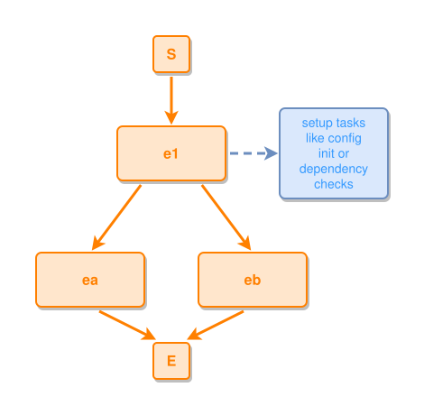

<!-- AUTO-GENERATED FILE - DO NOT EDIT -->
<!-- Generated by: gen-test-md -->
<!-- Command: go run ./cmd-dev/gen-test-md -->

# fork-keeps-siblings-on-one-row-with-a-tall-aux

> **⚠️ Warning:** This file is auto-generated. Manual changes will be lost when tests are regenerated.

**Source:** gl:docs/dev/layout-gen/layout-alg.md#L215-L217 | [docs/dev/layout-gen/layout-alg.md](../../docs/dev/layout-gen/layout-alg.md#fork-keeps-siblings-on-one-row-with-a-tall-aux)

## ipmt Content

```ipmt
e1 ::e --::L--> ea ::e, eb ::e
e1 --::X "used for"--> "setup tasks like config init or dependency checks" ::c
```

## Generated Files

- [fork-keeps-siblings-on-one-row-with-a-tall-aux.ipmt](fork-keeps-siblings-on-one-row-with-a-tall-aux.ipmt) - ipmt input
- [fork-keeps-siblings-on-one-row-with-a-tall-aux.json](fork-keeps-siblings-on-one-row-with-a-tall-aux.json) - Parsed structure
- [fork-keeps-siblings-on-one-row-with-a-tall-aux.layout.json](fork-keeps-siblings-on-one-row-with-a-tall-aux.layout.json) - Layout coordinates
- [fork-keeps-siblings-on-one-row-with-a-tall-aux.ipm.svg](fork-keeps-siblings-on-one-row-with-a-tall-aux.ipm.svg) - Rendered diagram

## Layout Validation Rules

Test line: 215

✅ All 6 rules passed

- ✓ [Line 53](gl:docs/dev/layout-gen/layout-alg.md#L53): `each edge has max-bends=0` ([edges-run-straight-by-default.dsl](../layout-gen-rules/edges-run-straight-by-default.dsl))
- ✓ [Line 82](gl:docs/dev/layout-gen/layout-alg.md#L82): `type=event has width=120` ([one-event.dsl](../layout-gen-rules/one-event.dsl))
- ✓ [Line 83](gl:docs/dev/layout-gen/layout-alg.md#L83): `type=event has min-gap-to-others>=10` ([one-event-02.dsl](../layout-gen-rules/one-event-02.dsl))
- ✓ [Line 84](gl:docs/dev/layout-gen/layout-alg.md#L84): `type=boundary has size=40x40` ([one-event-03.dsl](../layout-gen-rules/one-event-03.dsl))
- ✓ [Line 236](gl:docs/dev/layout-gen/layout-alg.md#L236): `#ea,#eb have same y` ([fork-keeps-siblings-on-one-row-with-a-tall-aux.dsl](../layout-gen-rules/fork-keeps-siblings-on-one-row-with-a-tall-aux.dsl))
- ✓ [Line 237](gl:docs/dev/layout-gen/layout-alg.md#L237): `#ea is below #e1 with gap=80` ([fork-keeps-siblings-on-one-row-with-a-tall-aux-02.dsl](../layout-gen-rules/fork-keeps-siblings-on-one-row-with-a-tall-aux-02.dsl))

## Rendered Diagram



This test case was automatically generated from the specification document.

The ipmt code block was extracted using [sync-test-cases](../../docs/dev/testing.md) and saved to [fork-keeps-siblings-on-one-row-with-a-tall-aux.ipmt](fork-keeps-siblings-on-one-row-with-a-tall-aux.ipmt), then parsed into the [JSON structure](fork-keeps-siblings-on-one-row-with-a-tall-aux.json) and laid out into [layout coordinates](fork-keeps-siblings-on-one-row-with-a-tall-aux.layout.json). The [SVG diagram](fork-keeps-siblings-on-one-row-with-a-tall-aux.ipm.svg) was rendered using [ipmsvg-gen](../../docs/ipmsvg-gen.md).
