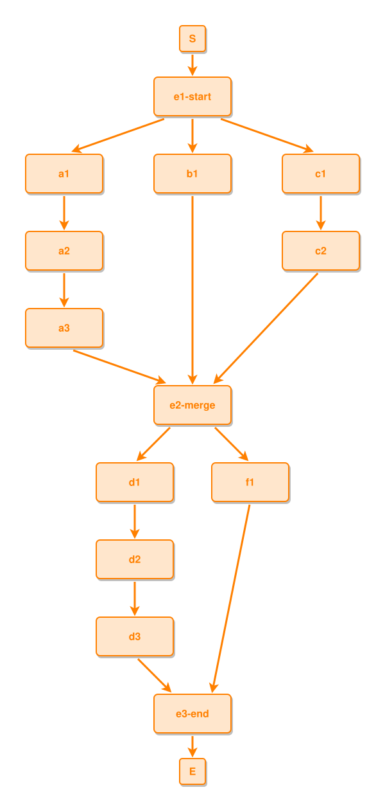

<!-- AUTO-GENERATED FILE - DO NOT EDIT -->
<!-- Generated by: gen-test-md -->
<!-- Command: go run ./cmd-dev/gen-test-md -->

# fork-merge-fork-keeps-a-vertical-spine

> **⚠️ Warning:** This file is auto-generated. Manual changes will be lost when tests are regenerated.

**Source:** gl:docs/dev/layout-gen/layout-alg.md#L569-L582 | [docs/dev/layout-gen/layout-alg.md](../../docs/dev/layout-gen/layout-alg.md#fork-merge-fork-keeps-a-vertical-spine)

## ipmt Content

```ipmt
e1-start ::e --> a1 ::e
e1-start --> b1 ::e
e1-start --> c1 ::e
a1 --> a2 ::e --> a3 ::e
c1 --> c2 ::e
a3 --> e2-merge ::e
b1 --> e2-merge
c2 --> e2-merge
e2-merge --> d1 ::e
e2-merge --> f1 ::e
d1 --> d2 ::e --> d3 ::e
d3 --> e3-end ::e
f1 --> e3-end
```

## Generated Files

- [fork-merge-fork-keeps-a-vertical-spine.ipmt](fork-merge-fork-keeps-a-vertical-spine.ipmt) - ipmt input
- [fork-merge-fork-keeps-a-vertical-spine.json](fork-merge-fork-keeps-a-vertical-spine.json) - Parsed structure
- [fork-merge-fork-keeps-a-vertical-spine.layout.json](fork-merge-fork-keeps-a-vertical-spine.layout.json) - Layout coordinates
- [fork-merge-fork-keeps-a-vertical-spine.ipm.svg](fork-merge-fork-keeps-a-vertical-spine.ipm.svg) - Rendered diagram

## Layout Validation Rules

Test line: 569

✅ All 12 rules passed

- ✓ [Line 53](gl:docs/dev/layout-gen/layout-alg.md#L53): `each edge has max-bends=0` ([edges-run-straight-by-default.dsl](../layout-gen-rules/edges-run-straight-by-default.dsl))
- ✓ [Line 82](gl:docs/dev/layout-gen/layout-alg.md#L82): `type=event has width=120` ([one-event.dsl](../layout-gen-rules/one-event.dsl))
- ✓ [Line 83](gl:docs/dev/layout-gen/layout-alg.md#L83): `type=event has min-gap-to-others>=10` ([one-event-02.dsl](../layout-gen-rules/one-event-02.dsl))
- ✓ [Line 84](gl:docs/dev/layout-gen/layout-alg.md#L84): `type=boundary has size=40x40` ([one-event-03.dsl](../layout-gen-rules/one-event-03.dsl))
- ✓ [Line 603](gl:docs/dev/layout-gen/layout-alg.md#L603): `#S,#e1-start,#b1,#e2-merge,#e3-end,#E have same center-x` ([fork-merge-fork-keeps-a-vertical-spine.dsl](../layout-gen-rules/fork-merge-fork-keeps-a-vertical-spine.dsl))
- ✓ [Line 604](gl:docs/dev/layout-gen/layout-alg.md#L604): `#a1,#a2,#a3 have same center-x` ([fork-merge-fork-keeps-a-vertical-spine-02.dsl](../layout-gen-rules/fork-merge-fork-keeps-a-vertical-spine-02.dsl))
- ✓ [Line 605](gl:docs/dev/layout-gen/layout-alg.md#L605): `#c1,#c2 have same center-x` ([fork-merge-fork-keeps-a-vertical-spine-03.dsl](../layout-gen-rules/fork-merge-fork-keeps-a-vertical-spine-03.dsl))
- ✓ [Line 606](gl:docs/dev/layout-gen/layout-alg.md#L606): `#d1,#d2,#d3 have same center-x` ([fork-merge-fork-keeps-a-vertical-spine-04.dsl](../layout-gen-rules/fork-merge-fork-keeps-a-vertical-spine-04.dsl))
- ✓ [Line 607](gl:docs/dev/layout-gen/layout-alg.md#L607): `#a1,#b1,#c1 have same y` ([fork-merge-fork-keeps-a-vertical-spine-05.dsl](../layout-gen-rules/fork-merge-fork-keeps-a-vertical-spine-05.dsl))
- ✓ [Line 608](gl:docs/dev/layout-gen/layout-alg.md#L608): `#a1 is left-of #b1 with gap=80` ([fork-merge-fork-keeps-a-vertical-spine-06.dsl](../layout-gen-rules/fork-merge-fork-keeps-a-vertical-spine-06.dsl))
- ✓ [Line 609](gl:docs/dev/layout-gen/layout-alg.md#L609): `#b1 is left-of #c1 with gap=80` ([fork-merge-fork-keeps-a-vertical-spine-07.dsl](../layout-gen-rules/fork-merge-fork-keeps-a-vertical-spine-07.dsl))
- ✓ [Line 610](gl:docs/dev/layout-gen/layout-alg.md#L610): `#d1,#f1 have same y` ([fork-merge-fork-keeps-a-vertical-spine-08.dsl](../layout-gen-rules/fork-merge-fork-keeps-a-vertical-spine-08.dsl))

## Rendered Diagram



This test case was automatically generated from the specification document.

The ipmt code block was extracted using [sync-test-cases](../../docs/dev/testing.md) and saved to [fork-merge-fork-keeps-a-vertical-spine.ipmt](fork-merge-fork-keeps-a-vertical-spine.ipmt), then parsed into the [JSON structure](fork-merge-fork-keeps-a-vertical-spine.json) and laid out into [layout coordinates](fork-merge-fork-keeps-a-vertical-spine.layout.json). The [SVG diagram](fork-merge-fork-keeps-a-vertical-spine.ipm.svg) was rendered using [ipmsvg-gen](../../docs/ipmsvg-gen.md).
