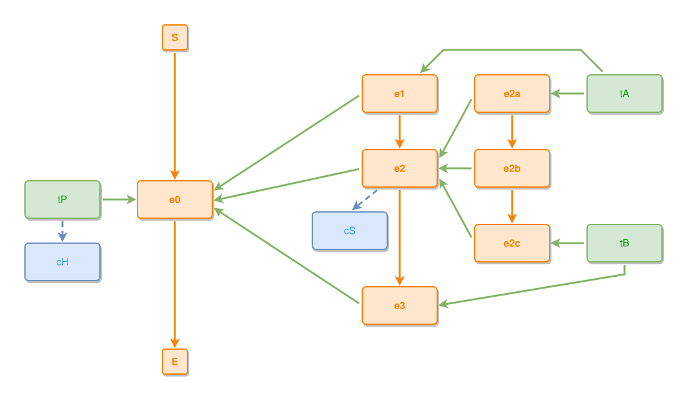

<!-- AUTO-GENERATED FILE - DO NOT EDIT -->
<!-- Generated by: gen-test-md -->
<!-- Command: go run ./cmd-dev/gen-test-md -->

# forks-at-two-layers-with-aux-everywhere

> **⚠️ Warning:** This file is auto-generated. Manual changes will be lost when tests are regenerated.

**Source:** gl:docs/dev/layout-gen/layout-alg.md#L1358-L1372 | [docs/dev/layout-gen/layout-alg.md](../../docs/dev/layout-gen/layout-alg.md#forks-at-two-layers-with-aux-everywhere)

## ipmt Content

```ipmt
e1 ::e --> e2 ::e --> e3 ::e
e1, e2, e3 --::P--> e0 ::e
tA ::t --> e1
tB ::t --> e3

e2a ::e --::P--> e2
e2b ::e --::P--> e2
e2c ::e --::P--> e2
e2a --> e2b --> e2c
e2 --> cS ::c

tP ::t --> e0, cH ::c
tA --> e2a
tB --> e2c
```

## Generated Files

- [forks-at-two-layers-with-aux-everywhere.ipmt](forks-at-two-layers-with-aux-everywhere.ipmt) - ipmt input
- [forks-at-two-layers-with-aux-everywhere.json](forks-at-two-layers-with-aux-everywhere.json) - Parsed structure
- [forks-at-two-layers-with-aux-everywhere.layout.json](forks-at-two-layers-with-aux-everywhere.layout.json) - Layout coordinates
- [forks-at-two-layers-with-aux-everywhere.ipm.svg](forks-at-two-layers-with-aux-everywhere.ipm.svg) - Rendered diagram

## Layout Validation Rules

Test line: 1358

⚠️ 22/23 rules passed

- ✗ [Line 53](gl:docs/dev/layout-gen/layout-alg.md#L53): `each edge has max-bends=0` - **edge tA->e1 has 2 bends > max-bends 0 (each-edge default; if the detour is intended, add it to `except` and pin it with `edge #tA,#e1 has max-bends=2`)** ([edges-run-straight-by-default.dsl](../layout-gen-rules/edges-run-straight-by-default.dsl))
- ✓ [Line 1397](gl:docs/dev/layout-gen/layout-alg.md#L1397): `each edge has max-bends=0 except #tA,#e1 #tB,#e3` ([forks-at-two-layers-with-aux-everywhere.dsl](../layout-gen-rules/forks-at-two-layers-with-aux-everywhere.dsl))
- ✓ [Line 1398](gl:docs/dev/layout-gen/layout-alg.md#L1398): `edge #tA,#e1 has max-bends=2` ([forks-at-two-layers-with-aux-everywhere-02.dsl](../layout-gen-rules/forks-at-two-layers-with-aux-everywhere-02.dsl))
- ✓ [Line 1399](gl:docs/dev/layout-gen/layout-alg.md#L1399): `edge #tB,#e3 has max-bends=2` ([forks-at-two-layers-with-aux-everywhere-03.dsl](../layout-gen-rules/forks-at-two-layers-with-aux-everywhere-03.dsl))
- ✓ [Line 1400](gl:docs/dev/layout-gen/layout-alg.md#L1400): `edge #tA,#e1 has visibility=visible` ([forks-at-two-layers-with-aux-everywhere-04.dsl](../layout-gen-rules/forks-at-two-layers-with-aux-everywhere-04.dsl))
- ✓ [Line 1401](gl:docs/dev/layout-gen/layout-alg.md#L1401): `edge #tB,#e3 has visibility=visible` ([forks-at-two-layers-with-aux-everywhere-05.dsl](../layout-gen-rules/forks-at-two-layers-with-aux-everywhere-05.dsl))
- ✓ [Line 1402](gl:docs/dev/layout-gen/layout-alg.md#L1402): `#e1,#e2,#e3 have same center-x` ([forks-at-two-layers-with-aux-everywhere-06.dsl](../layout-gen-rules/forks-at-two-layers-with-aux-everywhere-06.dsl))
- ✓ [Line 1403](gl:docs/dev/layout-gen/layout-alg.md#L1403): `#e2a,#e2b,#e2c have same center-x` ([forks-at-two-layers-with-aux-everywhere-07.dsl](../layout-gen-rules/forks-at-two-layers-with-aux-everywhere-07.dsl))
- ✓ [Line 1404](gl:docs/dev/layout-gen/layout-alg.md#L1404): `#e2 is below #e1 with gap=60` ([forks-at-two-layers-with-aux-everywhere-08.dsl](../layout-gen-rules/forks-at-two-layers-with-aux-everywhere-08.dsl))
- ✓ [Line 1405](gl:docs/dev/layout-gen/layout-alg.md#L1405): `#e2,#e2b have same y` ([forks-at-two-layers-with-aux-everywhere-09.dsl](../layout-gen-rules/forks-at-two-layers-with-aux-everywhere-09.dsl))
- ✓ [Line 1406](gl:docs/dev/layout-gen/layout-alg.md#L1406): `#e0 is vertically-centered-between #e1,#e3` ([forks-at-two-layers-with-aux-everywhere-10.dsl](../layout-gen-rules/forks-at-two-layers-with-aux-everywhere-10.dsl))
- ✓ [Line 1407](gl:docs/dev/layout-gen/layout-alg.md#L1407): `#e2 is vertically-centered-between #e2a,#e2c` ([forks-at-two-layers-with-aux-everywhere-11.dsl](../layout-gen-rules/forks-at-two-layers-with-aux-everywhere-11.dsl))
- ✓ [Line 1408](gl:docs/dev/layout-gen/layout-alg.md#L1408): `#tA,#e2a,#e1 have same y` ([forks-at-two-layers-with-aux-everywhere-12.dsl](../layout-gen-rules/forks-at-two-layers-with-aux-everywhere-12.dsl))
- ✓ [Line 1409](gl:docs/dev/layout-gen/layout-alg.md#L1409): `#tB,#e2c have same y` ([forks-at-two-layers-with-aux-everywhere-13.dsl](../layout-gen-rules/forks-at-two-layers-with-aux-everywhere-13.dsl))
- ✓ [Line 1410](gl:docs/dev/layout-gen/layout-alg.md#L1410): `#tA is right-of #e2a with gap=60` ([forks-at-two-layers-with-aux-everywhere-14.dsl](../layout-gen-rules/forks-at-two-layers-with-aux-everywhere-14.dsl))
- ✓ [Line 1411](gl:docs/dev/layout-gen/layout-alg.md#L1411): `#tB is right-of #e2c with gap=60` ([forks-at-two-layers-with-aux-everywhere-15.dsl](../layout-gen-rules/forks-at-two-layers-with-aux-everywhere-15.dsl))
- ✓ [Line 1412](gl:docs/dev/layout-gen/layout-alg.md#L1412): `#cS is below #e2 with gap=40` ([forks-at-two-layers-with-aux-everywhere-16.dsl](../layout-gen-rules/forks-at-two-layers-with-aux-everywhere-16.dsl))
- ✓ [Line 1413](gl:docs/dev/layout-gen/layout-alg.md#L1413): `edge #e2,#cS does not cross edge #e3,#e0` ([forks-at-two-layers-with-aux-everywhere-17.dsl](../layout-gen-rules/forks-at-two-layers-with-aux-everywhere-17.dsl))
- ✓ [Line 1414](gl:docs/dev/layout-gen/layout-alg.md#L1414): `edge #e3,#e0 does not cross edge #tP,#e0` ([forks-at-two-layers-with-aux-everywhere-18.dsl](../layout-gen-rules/forks-at-two-layers-with-aux-everywhere-18.dsl))
- ✓ [Line 1415](gl:docs/dev/layout-gen/layout-alg.md#L1415): `#tP is left-of #e0 with gap=60` ([forks-at-two-layers-with-aux-everywhere-19.dsl](../layout-gen-rules/forks-at-two-layers-with-aux-everywhere-19.dsl))
- ✓ [Line 1416](gl:docs/dev/layout-gen/layout-alg.md#L1416): `#cH,#tP have same center-x` ([forks-at-two-layers-with-aux-everywhere-20.dsl](../layout-gen-rules/forks-at-two-layers-with-aux-everywhere-20.dsl))
- ✓ [Line 1417](gl:docs/dev/layout-gen/layout-alg.md#L1417): `#cH is below #tP with gap=40` ([forks-at-two-layers-with-aux-everywhere-21.dsl](../layout-gen-rules/forks-at-two-layers-with-aux-everywhere-21.dsl))
- ✓ [Line 1418](gl:docs/dev/layout-gen/layout-alg.md#L1418): `node #cS does not straddle edge #e2a,#e2` ([forks-at-two-layers-with-aux-everywhere-22.dsl](../layout-gen-rules/forks-at-two-layers-with-aux-everywhere-22.dsl))

## Rendered Diagram



This test case was automatically generated from the specification document.

The ipmt code block was extracted using [sync-test-cases](../../docs/dev/testing.md) and saved to [forks-at-two-layers-with-aux-everywhere.ipmt](forks-at-two-layers-with-aux-everywhere.ipmt), then parsed into the [JSON structure](forks-at-two-layers-with-aux-everywhere.json) and laid out into [layout coordinates](forks-at-two-layers-with-aux-everywhere.layout.json). The [SVG diagram](forks-at-two-layers-with-aux-everywhere.ipm.svg) was rendered using [ipmsvg-gen](../../docs/ipmsvg-gen.md).
