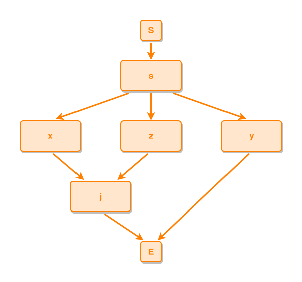

<!-- AUTO-GENERATED FILE - DO NOT EDIT -->
<!-- Generated by: gen-test-md -->
<!-- Command: go run ./cmd-dev/gen-test-md -->

# join-sharing-fork-branches-cluster-adjacent

> **⚠️ Warning:** This file is auto-generated. Manual changes will be lost when tests are regenerated.

**Source:** gl:docs/dev/layout-gen/layout-alg.md#L341-L346 | [docs/dev/layout-gen/layout-alg.md](../../docs/dev/layout-gen/layout-alg.md#join-sharing-fork-branches-cluster-adjacent)

## ipmt Content

```ipmt
s ::e --> x ::e
s --> y ::e
s --> z ::e
x --> j ::e
z --> j
```

## Generated Files

- [join-sharing-fork-branches-cluster-adjacent.ipmt](join-sharing-fork-branches-cluster-adjacent.ipmt) - ipmt input
- [join-sharing-fork-branches-cluster-adjacent.json](join-sharing-fork-branches-cluster-adjacent.json) - Parsed structure
- [join-sharing-fork-branches-cluster-adjacent.layout.json](join-sharing-fork-branches-cluster-adjacent.layout.json) - Layout coordinates
- [join-sharing-fork-branches-cluster-adjacent.ipm.svg](join-sharing-fork-branches-cluster-adjacent.ipm.svg) - Rendered diagram

## Layout Validation Rules

Test line: 341

✅ All 10 rules passed

- ✓ [Line 53](gl:docs/dev/layout-gen/layout-alg.md#L53): `each edge has max-bends=0` ([edges-run-straight-by-default.dsl](../layout-gen-rules/edges-run-straight-by-default.dsl))
- ✓ [Line 82](gl:docs/dev/layout-gen/layout-alg.md#L82): `type=event has width=120` ([one-event.dsl](../layout-gen-rules/one-event.dsl))
- ✓ [Line 83](gl:docs/dev/layout-gen/layout-alg.md#L83): `type=event has min-gap-to-others>=10` ([one-event-02.dsl](../layout-gen-rules/one-event-02.dsl))
- ✓ [Line 84](gl:docs/dev/layout-gen/layout-alg.md#L84): `type=boundary has size=40x40` ([one-event-03.dsl](../layout-gen-rules/one-event-03.dsl))
- ✓ [Line 361](gl:docs/dev/layout-gen/layout-alg.md#L361): `#x,#z,#y have same y` ([join-sharing-fork-branches-cluster-adjacent.dsl](../layout-gen-rules/join-sharing-fork-branches-cluster-adjacent.dsl))
- ✓ [Line 362](gl:docs/dev/layout-gen/layout-alg.md#L362): `#z is right-of #x with gap=80` ([join-sharing-fork-branches-cluster-adjacent-02.dsl](../layout-gen-rules/join-sharing-fork-branches-cluster-adjacent-02.dsl))
- ✓ [Line 363](gl:docs/dev/layout-gen/layout-alg.md#L363): `#y is right-of #z with gap=80` ([join-sharing-fork-branches-cluster-adjacent-03.dsl](../layout-gen-rules/join-sharing-fork-branches-cluster-adjacent-03.dsl))
- ✓ [Line 364](gl:docs/dev/layout-gen/layout-alg.md#L364): `#j is horizontally-centered-between #x,#z` ([join-sharing-fork-branches-cluster-adjacent-04.dsl](../layout-gen-rules/join-sharing-fork-branches-cluster-adjacent-04.dsl))
- ✓ [Line 365](gl:docs/dev/layout-gen/layout-alg.md#L365): `edge #y,#E does not cross edge #x,#j` ([join-sharing-fork-branches-cluster-adjacent-05.dsl](../layout-gen-rules/join-sharing-fork-branches-cluster-adjacent-05.dsl))
- ✓ [Line 366](gl:docs/dev/layout-gen/layout-alg.md#L366): `edge #y,#E does not cross edge #z,#j` ([join-sharing-fork-branches-cluster-adjacent-06.dsl](../layout-gen-rules/join-sharing-fork-branches-cluster-adjacent-06.dsl))

## Rendered Diagram



This test case was automatically generated from the specification document.

The ipmt code block was extracted using [sync-test-cases](../../docs/dev/testing.md) and saved to [join-sharing-fork-branches-cluster-adjacent.ipmt](join-sharing-fork-branches-cluster-adjacent.ipmt), then parsed into the [JSON structure](join-sharing-fork-branches-cluster-adjacent.json) and laid out into [layout coordinates](join-sharing-fork-branches-cluster-adjacent.layout.json). The [SVG diagram](join-sharing-fork-branches-cluster-adjacent.ipm.svg) was rendered using [ipmsvg-gen](../../docs/ipmsvg-gen.md).
