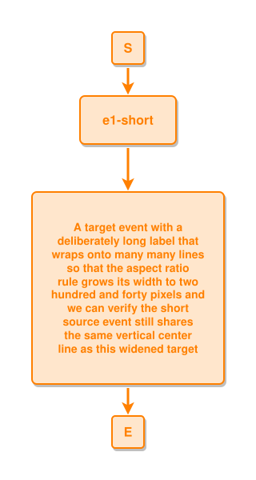

<!-- AUTO-GENERATED FILE - DO NOT EDIT -->
<!-- Generated by: gen-test-md -->
<!-- Command: go run ./cmd-dev/gen-test-md -->

# long-event-widens-and-stays-centered

> **⚠️ Warning:** This file is auto-generated. Manual changes will be lost when tests are regenerated.

**Source:** gl:docs/dev/layout-gen/layout-alg.md#L2887-L2888 | [docs/dev/layout-gen/layout-alg.md](../../docs/dev/layout-gen/layout-alg.md#long-event-widens-and-stays-centered)

## ipmt Content

```ipmt
e1-short ::e --::L--> A target event with a deliberately long label that wraps onto many many lines so that the aspect ratio rule grows its width to two hundred and forty pixels and we can verify the short source event still shares the same vertical center line as this widened target ::e
```

## Generated Files

- [long-event-widens-and-stays-centered.ipmt](long-event-widens-and-stays-centered.ipmt) - ipmt input
- [long-event-widens-and-stays-centered.json](long-event-widens-and-stays-centered.json) - Parsed structure
- [long-event-widens-and-stays-centered.layout.json](long-event-widens-and-stays-centered.layout.json) - Layout coordinates
- [long-event-widens-and-stays-centered.ipm.svg](long-event-widens-and-stays-centered.ipm.svg) - Rendered diagram

## Layout Validation Rules

Test line: 2887

✅ All 4 rules passed

- ✓ [Line 53](gl:docs/dev/layout-gen/layout-alg.md#L53): `each edge has max-bends=0` ([edges-run-straight-by-default.dsl](../layout-gen-rules/edges-run-straight-by-default.dsl))
- ✓ [Line 2899](gl:docs/dev/layout-gen/layout-alg.md#L2899): `type=event text-len>=190 has width>=240` ([long-event-widens-and-stays-centered.dsl](../layout-gen-rules/long-event-widens-and-stays-centered.dsl))
- ✓ [Line 2900](gl:docs/dev/layout-gen/layout-alg.md#L2900): `type=event text-len<190 has width=120` ([long-event-widens-and-stays-centered-02.dsl](../layout-gen-rules/long-event-widens-and-stays-centered-02.dsl))
- ✓ [Line 2901](gl:docs/dev/layout-gen/layout-alg.md#L2901): `each $a(type=event) ~L~ $b(type=event) has $a,$b same center-x` ([long-event-widens-and-stays-centered-03.dsl](../layout-gen-rules/long-event-widens-and-stays-centered-03.dsl))

## Rendered Diagram



This test case was automatically generated from the specification document.

The ipmt code block was extracted using [sync-test-cases](../../docs/dev/testing.md) and saved to [long-event-widens-and-stays-centered.ipmt](long-event-widens-and-stays-centered.ipmt), then parsed into the [JSON structure](long-event-widens-and-stays-centered.json) and laid out into [layout coordinates](long-event-widens-and-stays-centered.layout.json). The [SVG diagram](long-event-widens-and-stays-centered.ipm.svg) was rendered using [ipmsvg-gen](../../docs/ipmsvg-gen.md).
