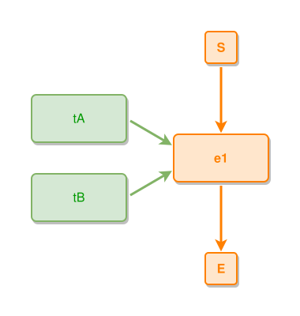

<!-- AUTO-GENERATED FILE - DO NOT EDIT -->
<!-- Generated by: gen-test-md -->
<!-- Command: go run ./cmd-dev/gen-test-md -->

# multiple-things-part-of-event

> **⚠️ Warning:** This file is auto-generated. Manual changes will be lost when tests are regenerated.

**Source:** gl:docs/dev/layout-gen/layout-alg.md#L1865-L1867 | [docs/dev/layout-gen/layout-alg.md](../../docs/dev/layout-gen/layout-alg.md#multiple-things-part-of-event)

## ipmt Content

```ipmt
tA --> e1 ::e
tB --> e1
```

## Generated Files

- [multiple-things-part-of-event.ipmt](multiple-things-part-of-event.ipmt) - ipmt input
- [multiple-things-part-of-event.json](multiple-things-part-of-event.json) - Parsed structure
- [multiple-things-part-of-event.layout.json](multiple-things-part-of-event.layout.json) - Layout coordinates
- [multiple-things-part-of-event.ipm.svg](multiple-things-part-of-event.ipm.svg) - Rendered diagram

## Layout Validation Rules

Test line: 1865

✅ All 6 rules passed

- ✓ [Line 53](gl:docs/dev/layout-gen/layout-alg.md#L53): `each edge has max-bends=0` ([edges-run-straight-by-default.dsl](../layout-gen-rules/edges-run-straight-by-default.dsl))
- ✓ [Line 1877](gl:docs/dev/layout-gen/layout-alg.md#L1877): `#tA is left-of #e1 with gap=60` ([multiple-things-part-of-event.dsl](../layout-gen-rules/multiple-things-part-of-event.dsl))
- ✓ [Line 1878](gl:docs/dev/layout-gen/layout-alg.md#L1878): `#tB is left-of #e1 with gap=60` ([multiple-things-part-of-event-02.dsl](../layout-gen-rules/multiple-things-part-of-event-02.dsl))
- ✓ [Line 1879](gl:docs/dev/layout-gen/layout-alg.md#L1879): `#tA,#tB have same center-x` ([multiple-things-part-of-event-03.dsl](../layout-gen-rules/multiple-things-part-of-event-03.dsl))
- ✓ [Line 1880](gl:docs/dev/layout-gen/layout-alg.md#L1880): `#tB is below #tA with gap=40` ([multiple-things-part-of-event-04.dsl](../layout-gen-rules/multiple-things-part-of-event-04.dsl))
- ✓ [Line 1881](gl:docs/dev/layout-gen/layout-alg.md#L1881): `#e1 is vertically-centered-between #tA,#tB` ([multiple-things-part-of-event-05.dsl](../layout-gen-rules/multiple-things-part-of-event-05.dsl))

## Rendered Diagram



This test case was automatically generated from the specification document.

The ipmt code block was extracted using [sync-test-cases](../../docs/dev/testing.md) and saved to [multiple-things-part-of-event.ipmt](multiple-things-part-of-event.ipmt), then parsed into the [JSON structure](multiple-things-part-of-event.json) and laid out into [layout coordinates](multiple-things-part-of-event.layout.json). The [SVG diagram](multiple-things-part-of-event.ipm.svg) was rendered using [ipmsvg-gen](../../docs/ipmsvg-gen.md).
