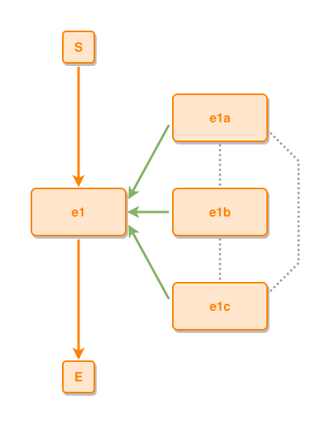

<!-- AUTO-GENERATED FILE - DO NOT EDIT -->
<!-- Generated by: gen-test-md -->
<!-- Command: go run ./cmd-dev/gen-test-md -->

# near-to-peers-in-a-column-neighbours-link-spanning-ties-hide

> **⚠️ Warning:** This file is auto-generated. Manual changes will be lost when tests are regenerated.

**Source:** gl:docs/dev/layout-gen/layout-alg.md#L3053-L3063 | [docs/dev/layout-gen/layout-alg.md](../../docs/dev/layout-gen/layout-alg.md#near-to-peers-in-a-column-neighbours-link-spanning-ties-hide)

## ipmt Content

```ipmt
e1a ::e
e1b ::e
e1c ::e
e1 ::e
e1a --::P--> e1
e1b --::P--> e1
e1c --::P--> e1
e1a --- e1b
e1b --- e1c
e1a --- e1c
```

## Generated Files

- [near-to-peers-in-a-column-neighbours-link-spanning-ties-hide.ipmt](near-to-peers-in-a-column-neighbours-link-spanning-ties-hide.ipmt) - ipmt input
- [near-to-peers-in-a-column-neighbours-link-spanning-ties-hide.json](near-to-peers-in-a-column-neighbours-link-spanning-ties-hide.json) - Parsed structure
- [near-to-peers-in-a-column-neighbours-link-spanning-ties-hide.layout.json](near-to-peers-in-a-column-neighbours-link-spanning-ties-hide.layout.json) - Layout coordinates
- [near-to-peers-in-a-column-neighbours-link-spanning-ties-hide.ipm.svg](near-to-peers-in-a-column-neighbours-link-spanning-ties-hide.ipm.svg) - Rendered diagram

## Layout Validation Rules

Test line: 3053

⚠️ 17/18 rules passed

- ✗ [Line 53](gl:docs/dev/layout-gen/layout-alg.md#L53): `each edge has max-bends=0` - **edge e1a->e1c has 2 bends > max-bends 0 (each-edge default; if the detour is intended, add it to `except` and pin it with `edge #e1a,#e1c has max-bends=2`)** ([edges-run-straight-by-default.dsl](../layout-gen-rules/edges-run-straight-by-default.dsl))
- ✓ [Line 3100](gl:docs/dev/layout-gen/layout-alg.md#L3100): `#e1a,#e1b,#e1c have same center-x` ([near-to-peers-in-a-column-neighbours-link-spanning-ties-hide.dsl](../layout-gen-rules/near-to-peers-in-a-column-neighbours-link-spanning-ties-hide.dsl))
- ✓ [Line 3101](gl:docs/dev/layout-gen/layout-alg.md#L3101): `#e1 is left-of #e1a with gap=60` ([near-to-peers-in-a-column-neighbours-link-spanning-ties-hide-02.dsl](../layout-gen-rules/near-to-peers-in-a-column-neighbours-link-spanning-ties-hide-02.dsl))
- ✓ [Line 3102](gl:docs/dev/layout-gen/layout-alg.md#L3102): `edge #e1a,#e1b is vertical` ([near-to-peers-in-a-column-neighbours-link-spanning-ties-hide-03.dsl](../layout-gen-rules/near-to-peers-in-a-column-neighbours-link-spanning-ties-hide-03.dsl))
- ✓ [Line 3103](gl:docs/dev/layout-gen/layout-alg.md#L3103): `edge #e1a,#e1b has visibility=visible` ([near-to-peers-in-a-column-neighbours-link-spanning-ties-hide-04.dsl](../layout-gen-rules/near-to-peers-in-a-column-neighbours-link-spanning-ties-hide-04.dsl))
- ✓ [Line 3104](gl:docs/dev/layout-gen/layout-alg.md#L3104): `edge #e1a,#e1b has source-position=0.5` ([near-to-peers-in-a-column-neighbours-link-spanning-ties-hide-05.dsl](../layout-gen-rules/near-to-peers-in-a-column-neighbours-link-spanning-ties-hide-05.dsl))
- ✓ [Line 3105](gl:docs/dev/layout-gen/layout-alg.md#L3105): `edge #e1a,#e1b has target-position=0.5` ([near-to-peers-in-a-column-neighbours-link-spanning-ties-hide-06.dsl](../layout-gen-rules/near-to-peers-in-a-column-neighbours-link-spanning-ties-hide-06.dsl))
- ✓ [Line 3106](gl:docs/dev/layout-gen/layout-alg.md#L3106): `edge #e1b,#e1c is vertical` ([near-to-peers-in-a-column-neighbours-link-spanning-ties-hide-07.dsl](../layout-gen-rules/near-to-peers-in-a-column-neighbours-link-spanning-ties-hide-07.dsl))
- ✓ [Line 3107](gl:docs/dev/layout-gen/layout-alg.md#L3107): `edge #e1b,#e1c has visibility=visible` ([near-to-peers-in-a-column-neighbours-link-spanning-ties-hide-08.dsl](../layout-gen-rules/near-to-peers-in-a-column-neighbours-link-spanning-ties-hide-08.dsl))
- ✓ [Line 3108](gl:docs/dev/layout-gen/layout-alg.md#L3108): `edge #e1b,#e1c has source-position=0.5` ([near-to-peers-in-a-column-neighbours-link-spanning-ties-hide-09.dsl](../layout-gen-rules/near-to-peers-in-a-column-neighbours-link-spanning-ties-hide-09.dsl))
- ✓ [Line 3109](gl:docs/dev/layout-gen/layout-alg.md#L3109): `edge #e1b,#e1c has target-position=0.5` ([near-to-peers-in-a-column-neighbours-link-spanning-ties-hide-10.dsl](../layout-gen-rules/near-to-peers-in-a-column-neighbours-link-spanning-ties-hide-10.dsl))
- ✓ [Line 3110](gl:docs/dev/layout-gen/layout-alg.md#L3110): `each edge has max-bends=0 except #e1a,#e1c` ([near-to-peers-in-a-column-neighbours-link-spanning-ties-hide-11.dsl](../layout-gen-rules/near-to-peers-in-a-column-neighbours-link-spanning-ties-hide-11.dsl))
- ✓ [Line 3111](gl:docs/dev/layout-gen/layout-alg.md#L3111): `edge #e1a,#e1c has visibility=visible` ([near-to-peers-in-a-column-neighbours-link-spanning-ties-hide-12.dsl](../layout-gen-rules/near-to-peers-in-a-column-neighbours-link-spanning-ties-hide-12.dsl))
- ✓ [Line 3112](gl:docs/dev/layout-gen/layout-alg.md#L3112): `edge #e1a,#e1c has source-side=right` ([near-to-peers-in-a-column-neighbours-link-spanning-ties-hide-13.dsl](../layout-gen-rules/near-to-peers-in-a-column-neighbours-link-spanning-ties-hide-13.dsl))
- ✓ [Line 3113](gl:docs/dev/layout-gen/layout-alg.md#L3113): `edge #e1a,#e1c has source-position=0.75` ([near-to-peers-in-a-column-neighbours-link-spanning-ties-hide-14.dsl](../layout-gen-rules/near-to-peers-in-a-column-neighbours-link-spanning-ties-hide-14.dsl))
- ✓ [Line 3114](gl:docs/dev/layout-gen/layout-alg.md#L3114): `edge #e1a,#e1c has target-side=right` ([near-to-peers-in-a-column-neighbours-link-spanning-ties-hide-15.dsl](../layout-gen-rules/near-to-peers-in-a-column-neighbours-link-spanning-ties-hide-15.dsl))
- ✓ [Line 3115](gl:docs/dev/layout-gen/layout-alg.md#L3115): `edge #e1a,#e1c has target-position=0.25` ([near-to-peers-in-a-column-neighbours-link-spanning-ties-hide-16.dsl](../layout-gen-rules/near-to-peers-in-a-column-neighbours-link-spanning-ties-hide-16.dsl))
- ✓ [Line 3116](gl:docs/dev/layout-gen/layout-alg.md#L3116): `edge #e1a,#e1c has max-bends=2` ([near-to-peers-in-a-column-neighbours-link-spanning-ties-hide-17.dsl](../layout-gen-rules/near-to-peers-in-a-column-neighbours-link-spanning-ties-hide-17.dsl))

## Rendered Diagram



This test case was automatically generated from the specification document.

The ipmt code block was extracted using [sync-test-cases](../../docs/dev/testing.md) and saved to [near-to-peers-in-a-column-neighbours-link-spanning-ties-hide.ipmt](near-to-peers-in-a-column-neighbours-link-spanning-ties-hide.ipmt), then parsed into the [JSON structure](near-to-peers-in-a-column-neighbours-link-spanning-ties-hide.json) and laid out into [layout coordinates](near-to-peers-in-a-column-neighbours-link-spanning-ties-hide.layout.json). The [SVG diagram](near-to-peers-in-a-column-neighbours-link-spanning-ties-hide.ipm.svg) was rendered using [ipmsvg-gen](../../docs/ipmsvg-gen.md).
