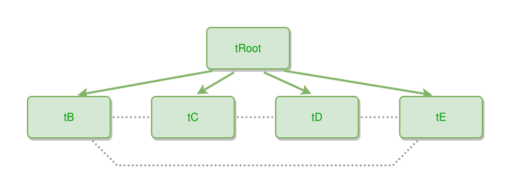

<!-- AUTO-GENERATED FILE - DO NOT EDIT -->
<!-- Generated by: gen-test-md -->
<!-- Command: go run ./cmd-dev/gen-test-md -->

# near-to-peers-in-a-row-neighbours-link-the-spanning-tie-dips-below

> **⚠️ Warning:** This file is auto-generated. Manual changes will be lost when tests are regenerated.

**Source:** gl:docs/dev/layout-gen/layout-alg.md#L3216-L3221 | [docs/dev/layout-gen/layout-alg.md](../../docs/dev/layout-gen/layout-alg.md#near-to-peers-in-a-row-neighbours-link-the-spanning-tie-dips-below)

## ipmt Content

```ipmt
tRoot --> tB, tC, tD, tE
tB --- tC
tC --- tD
tD --- tE
tB --- tE
```

## Generated Files

- [near-to-peers-in-a-row-neighbours-link-the-spanning-tie-dips-below.ipmt](near-to-peers-in-a-row-neighbours-link-the-spanning-tie-dips-below.ipmt) - ipmt input
- [near-to-peers-in-a-row-neighbours-link-the-spanning-tie-dips-below.json](near-to-peers-in-a-row-neighbours-link-the-spanning-tie-dips-below.json) - Parsed structure
- [near-to-peers-in-a-row-neighbours-link-the-spanning-tie-dips-below.layout.json](near-to-peers-in-a-row-neighbours-link-the-spanning-tie-dips-below.layout.json) - Layout coordinates
- [near-to-peers-in-a-row-neighbours-link-the-spanning-tie-dips-below.ipm.svg](near-to-peers-in-a-row-neighbours-link-the-spanning-tie-dips-below.ipm.svg) - Rendered diagram

## Layout Validation Rules

Test line: 3216

⚠️ 14/15 rules passed

- ✗ [Line 53](gl:docs/dev/layout-gen/layout-alg.md#L53): `each edge has max-bends=0` - **edge tB->tE has 2 bends > max-bends 0 (each-edge default; if the detour is intended, add it to `except` and pin it with `edge #tB,#tE has max-bends=2`)** ([edges-run-straight-by-default.dsl](../layout-gen-rules/edges-run-straight-by-default.dsl))
- ✓ [Line 3239](gl:docs/dev/layout-gen/layout-alg.md#L3239): `#tB,#tC,#tD,#tE have same y` ([near-to-peers-in-a-row-neighbours-link-the-spanning-tie-dips-below.dsl](../layout-gen-rules/near-to-peers-in-a-row-neighbours-link-the-spanning-tie-dips-below.dsl))
- ✓ [Line 3240](gl:docs/dev/layout-gen/layout-alg.md#L3240): `edge #tB,#tC is horizontal` ([near-to-peers-in-a-row-neighbours-link-the-spanning-tie-dips-below-02.dsl](../layout-gen-rules/near-to-peers-in-a-row-neighbours-link-the-spanning-tie-dips-below-02.dsl))
- ✓ [Line 3241](gl:docs/dev/layout-gen/layout-alg.md#L3241): `edge #tB,#tC has visibility=visible` ([near-to-peers-in-a-row-neighbours-link-the-spanning-tie-dips-below-03.dsl](../layout-gen-rules/near-to-peers-in-a-row-neighbours-link-the-spanning-tie-dips-below-03.dsl))
- ✓ [Line 3242](gl:docs/dev/layout-gen/layout-alg.md#L3242): `edge #tC,#tD is horizontal` ([near-to-peers-in-a-row-neighbours-link-the-spanning-tie-dips-below-04.dsl](../layout-gen-rules/near-to-peers-in-a-row-neighbours-link-the-spanning-tie-dips-below-04.dsl))
- ✓ [Line 3243](gl:docs/dev/layout-gen/layout-alg.md#L3243): `edge #tC,#tD has visibility=visible` ([near-to-peers-in-a-row-neighbours-link-the-spanning-tie-dips-below-05.dsl](../layout-gen-rules/near-to-peers-in-a-row-neighbours-link-the-spanning-tie-dips-below-05.dsl))
- ✓ [Line 3244](gl:docs/dev/layout-gen/layout-alg.md#L3244): `edge #tD,#tE is horizontal` ([near-to-peers-in-a-row-neighbours-link-the-spanning-tie-dips-below-06.dsl](../layout-gen-rules/near-to-peers-in-a-row-neighbours-link-the-spanning-tie-dips-below-06.dsl))
- ✓ [Line 3245](gl:docs/dev/layout-gen/layout-alg.md#L3245): `edge #tD,#tE has visibility=visible` ([near-to-peers-in-a-row-neighbours-link-the-spanning-tie-dips-below-07.dsl](../layout-gen-rules/near-to-peers-in-a-row-neighbours-link-the-spanning-tie-dips-below-07.dsl))
- ✓ [Line 3246](gl:docs/dev/layout-gen/layout-alg.md#L3246): `each edge has max-bends=0 except #tB,#tE` ([near-to-peers-in-a-row-neighbours-link-the-spanning-tie-dips-below-08.dsl](../layout-gen-rules/near-to-peers-in-a-row-neighbours-link-the-spanning-tie-dips-below-08.dsl))
- ✓ [Line 3247](gl:docs/dev/layout-gen/layout-alg.md#L3247): `edge #tB,#tE has max-bends=2` ([near-to-peers-in-a-row-neighbours-link-the-spanning-tie-dips-below-09.dsl](../layout-gen-rules/near-to-peers-in-a-row-neighbours-link-the-spanning-tie-dips-below-09.dsl))
- ✓ [Line 3248](gl:docs/dev/layout-gen/layout-alg.md#L3248): `edge #tB,#tE has visibility=visible` ([near-to-peers-in-a-row-neighbours-link-the-spanning-tie-dips-below-10.dsl](../layout-gen-rules/near-to-peers-in-a-row-neighbours-link-the-spanning-tie-dips-below-10.dsl))
- ✓ [Line 3249](gl:docs/dev/layout-gen/layout-alg.md#L3249): `edge #tB,#tE has source-side=bottom` ([near-to-peers-in-a-row-neighbours-link-the-spanning-tie-dips-below-11.dsl](../layout-gen-rules/near-to-peers-in-a-row-neighbours-link-the-spanning-tie-dips-below-11.dsl))
- ✓ [Line 3250](gl:docs/dev/layout-gen/layout-alg.md#L3250): `edge #tB,#tE has source-position=0.75` ([near-to-peers-in-a-row-neighbours-link-the-spanning-tie-dips-below-12.dsl](../layout-gen-rules/near-to-peers-in-a-row-neighbours-link-the-spanning-tie-dips-below-12.dsl))
- ✓ [Line 3251](gl:docs/dev/layout-gen/layout-alg.md#L3251): `edge #tB,#tE has target-side=bottom` ([near-to-peers-in-a-row-neighbours-link-the-spanning-tie-dips-below-13.dsl](../layout-gen-rules/near-to-peers-in-a-row-neighbours-link-the-spanning-tie-dips-below-13.dsl))
- ✓ [Line 3252](gl:docs/dev/layout-gen/layout-alg.md#L3252): `edge #tB,#tE has target-position=0.25` ([near-to-peers-in-a-row-neighbours-link-the-spanning-tie-dips-below-14.dsl](../layout-gen-rules/near-to-peers-in-a-row-neighbours-link-the-spanning-tie-dips-below-14.dsl))

## Rendered Diagram



This test case was automatically generated from the specification document.

The ipmt code block was extracted using [sync-test-cases](../../docs/dev/testing.md) and saved to [near-to-peers-in-a-row-neighbours-link-the-spanning-tie-dips-below.ipmt](near-to-peers-in-a-row-neighbours-link-the-spanning-tie-dips-below.ipmt), then parsed into the [JSON structure](near-to-peers-in-a-row-neighbours-link-the-spanning-tie-dips-below.json) and laid out into [layout coordinates](near-to-peers-in-a-row-neighbours-link-the-spanning-tie-dips-below.layout.json). The [SVG diagram](near-to-peers-in-a-row-neighbours-link-the-spanning-tie-dips-below.ipm.svg) was rendered using [ipmsvg-gen](../../docs/ipmsvg-gen.md).
