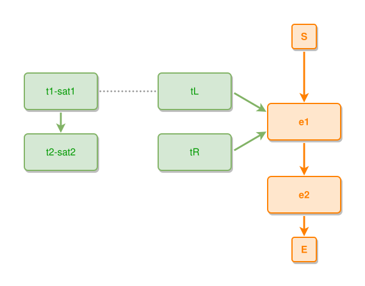

<!-- AUTO-GENERATED FILE - DO NOT EDIT -->
<!-- Generated by: gen-test-md -->
<!-- Command: go run ./cmd-dev/gen-test-md -->

# near-to-satellite-hoists-to-the-left-of-its-anchor

> **⚠️ Warning:** This file is auto-generated. Manual changes will be lost when tests are regenerated.

**Source:** gl:docs/dev/layout-gen/layout-alg.md#L2227-L2232 | [docs/dev/layout-gen/layout-alg.md](../../docs/dev/layout-gen/layout-alg.md#near-to-satellite-hoists-to-the-left-of-its-anchor)

## ipmt Content

```ipmt
e1 ::e --> e2 ::e
tL ::t --> e1
tR ::t --> e1
t1-sat1 ::t --> t2-sat2 ::t
t1-sat1 --- tL
```

## Generated Files

- [near-to-satellite-hoists-to-the-left-of-its-anchor.ipmt](near-to-satellite-hoists-to-the-left-of-its-anchor.ipmt) - ipmt input
- [near-to-satellite-hoists-to-the-left-of-its-anchor.json](near-to-satellite-hoists-to-the-left-of-its-anchor.json) - Parsed structure
- [near-to-satellite-hoists-to-the-left-of-its-anchor.layout.json](near-to-satellite-hoists-to-the-left-of-its-anchor.layout.json) - Layout coordinates
- [near-to-satellite-hoists-to-the-left-of-its-anchor.ipm.svg](near-to-satellite-hoists-to-the-left-of-its-anchor.ipm.svg) - Rendered diagram

## Layout Validation Rules

Test line: 2227

✅ All 12 rules passed

- ✓ [Line 53](gl:docs/dev/layout-gen/layout-alg.md#L53): `each edge has max-bends=0` ([edges-run-straight-by-default.dsl](../layout-gen-rules/edges-run-straight-by-default.dsl))
- ✓ [Line 2249](gl:docs/dev/layout-gen/layout-alg.md#L2249): `each edge has max-bends=0` ([near-to-satellite-hoists-to-the-left-of-its-anchor.dsl](../layout-gen-rules/near-to-satellite-hoists-to-the-left-of-its-anchor.dsl))
- ✓ [Line 2250](gl:docs/dev/layout-gen/layout-alg.md#L2250): `#e1 is vertically-centered-between #tL,#tR` ([near-to-satellite-hoists-to-the-left-of-its-anchor-02.dsl](../layout-gen-rules/near-to-satellite-hoists-to-the-left-of-its-anchor-02.dsl))
- ✓ [Line 2251](gl:docs/dev/layout-gen/layout-alg.md#L2251): `#tR is below #tL with gap=40` ([near-to-satellite-hoists-to-the-left-of-its-anchor-03.dsl](../layout-gen-rules/near-to-satellite-hoists-to-the-left-of-its-anchor-03.dsl))
- ✓ [Line 2252](gl:docs/dev/layout-gen/layout-alg.md#L2252): `#tL is left-of #e1 with gap=60` ([near-to-satellite-hoists-to-the-left-of-its-anchor-04.dsl](../layout-gen-rules/near-to-satellite-hoists-to-the-left-of-its-anchor-04.dsl))
- ✓ [Line 2253](gl:docs/dev/layout-gen/layout-alg.md#L2253): `#t1-sat1,#t2-sat2 have same center-x` ([near-to-satellite-hoists-to-the-left-of-its-anchor-05.dsl](../layout-gen-rules/near-to-satellite-hoists-to-the-left-of-its-anchor-05.dsl))
- ✓ [Line 2254](gl:docs/dev/layout-gen/layout-alg.md#L2254): `#t2-sat2 is below #t1-sat1 with gap=40` ([near-to-satellite-hoists-to-the-left-of-its-anchor-06.dsl](../layout-gen-rules/near-to-satellite-hoists-to-the-left-of-its-anchor-06.dsl))
- ✓ [Line 2255](gl:docs/dev/layout-gen/layout-alg.md#L2255): `#t1-sat1,#tL have same y` ([near-to-satellite-hoists-to-the-left-of-its-anchor-07.dsl](../layout-gen-rules/near-to-satellite-hoists-to-the-left-of-its-anchor-07.dsl))
- ✓ [Line 2256](gl:docs/dev/layout-gen/layout-alg.md#L2256): `#t1-sat1 is left-of #tL with gap=100` ([near-to-satellite-hoists-to-the-left-of-its-anchor-08.dsl](../layout-gen-rules/near-to-satellite-hoists-to-the-left-of-its-anchor-08.dsl))
- ✓ [Line 2257](gl:docs/dev/layout-gen/layout-alg.md#L2257): `edge #t1-sat1,#tL is horizontal` ([near-to-satellite-hoists-to-the-left-of-its-anchor-09.dsl](../layout-gen-rules/near-to-satellite-hoists-to-the-left-of-its-anchor-09.dsl))
- ✓ [Line 2258](gl:docs/dev/layout-gen/layout-alg.md#L2258): `edge #t1-sat1,#tL has visibility=visible` ([near-to-satellite-hoists-to-the-left-of-its-anchor-10.dsl](../layout-gen-rules/near-to-satellite-hoists-to-the-left-of-its-anchor-10.dsl))
- ✓ [Line 2259](gl:docs/dev/layout-gen/layout-alg.md#L2259): `edge #t1-sat1,#tL does not cross edge #S,#e1` ([near-to-satellite-hoists-to-the-left-of-its-anchor-11.dsl](../layout-gen-rules/near-to-satellite-hoists-to-the-left-of-its-anchor-11.dsl))

## Rendered Diagram



This test case was automatically generated from the specification document.

The ipmt code block was extracted using [sync-test-cases](../../docs/dev/testing.md) and saved to [near-to-satellite-hoists-to-the-left-of-its-anchor.ipmt](near-to-satellite-hoists-to-the-left-of-its-anchor.ipmt), then parsed into the [JSON structure](near-to-satellite-hoists-to-the-left-of-its-anchor.json) and laid out into [layout coordinates](near-to-satellite-hoists-to-the-left-of-its-anchor.layout.json). The [SVG diagram](near-to-satellite-hoists-to-the-left-of-its-anchor.ipm.svg) was rendered using [ipmsvg-gen](../../docs/ipmsvg-gen.md).
