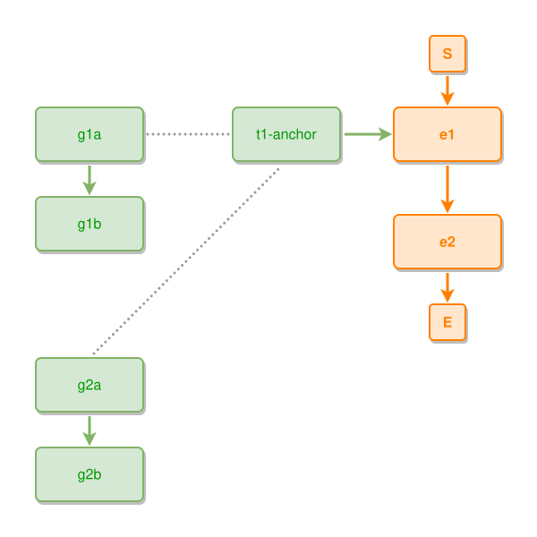

<!-- AUTO-GENERATED FILE - DO NOT EDIT -->
<!-- Generated by: gen-test-md -->
<!-- Command: go run ./cmd-dev/gen-test-md -->

# near-to-sibling-components-stack-in-one-column

> **⚠️ Warning:** This file is auto-generated. Manual changes will be lost when tests are regenerated.

**Source:** gl:docs/dev/layout-gen/layout-alg.md#L2185-L2191 | [docs/dev/layout-gen/layout-alg.md](../../docs/dev/layout-gen/layout-alg.md#near-to-sibling-components-stack-in-one-column)

## ipmt Content

```ipmt
e1 ::e --> e2 ::e
t1-anchor --> e1
g1a ::t --> g1b ::t
g2a ::t --> g2b ::t
g1a --- t1-anchor
g2a --- t1-anchor
```

## Generated Files

- [near-to-sibling-components-stack-in-one-column.ipmt](near-to-sibling-components-stack-in-one-column.ipmt) - ipmt input
- [near-to-sibling-components-stack-in-one-column.json](near-to-sibling-components-stack-in-one-column.json) - Parsed structure
- [near-to-sibling-components-stack-in-one-column.layout.json](near-to-sibling-components-stack-in-one-column.layout.json) - Layout coordinates
- [near-to-sibling-components-stack-in-one-column.ipm.svg](near-to-sibling-components-stack-in-one-column.ipm.svg) - Rendered diagram

## Layout Validation Rules

Test line: 2185

✅ All 9 rules passed

- ✓ [Line 53](gl:docs/dev/layout-gen/layout-alg.md#L53): `each edge has max-bends=0` ([edges-run-straight-by-default.dsl](../layout-gen-rules/edges-run-straight-by-default.dsl))
- ✓ [Line 2208](gl:docs/dev/layout-gen/layout-alg.md#L2208): `each edge has max-bends=0` ([near-to-sibling-components-stack-in-one-column.dsl](../layout-gen-rules/near-to-sibling-components-stack-in-one-column.dsl))
- ✓ [Line 2209](gl:docs/dev/layout-gen/layout-alg.md#L2209): `#g1a,#g1b,#g2a,#g2b have same center-x` ([near-to-sibling-components-stack-in-one-column-02.dsl](../layout-gen-rules/near-to-sibling-components-stack-in-one-column-02.dsl))
- ✓ [Line 2210](gl:docs/dev/layout-gen/layout-alg.md#L2210): `#g1b is below #g1a with gap=40` ([near-to-sibling-components-stack-in-one-column-03.dsl](../layout-gen-rules/near-to-sibling-components-stack-in-one-column-03.dsl))
- ✓ [Line 2211](gl:docs/dev/layout-gen/layout-alg.md#L2211): `#g2b is below #g2a with gap=40` ([near-to-sibling-components-stack-in-one-column-04.dsl](../layout-gen-rules/near-to-sibling-components-stack-in-one-column-04.dsl))
- ✓ [Line 2212](gl:docs/dev/layout-gen/layout-alg.md#L2212): `#g2a is below #g1b with gap=120` ([near-to-sibling-components-stack-in-one-column-05.dsl](../layout-gen-rules/near-to-sibling-components-stack-in-one-column-05.dsl))
- ✓ [Line 2213](gl:docs/dev/layout-gen/layout-alg.md#L2213): `#g1a is left-of #t1-anchor with gap=100` ([near-to-sibling-components-stack-in-one-column-06.dsl](../layout-gen-rules/near-to-sibling-components-stack-in-one-column-06.dsl))
- ✓ [Line 2214](gl:docs/dev/layout-gen/layout-alg.md#L2214): `edge #g1a,#t1-anchor has visibility=visible` ([near-to-sibling-components-stack-in-one-column-07.dsl](../layout-gen-rules/near-to-sibling-components-stack-in-one-column-07.dsl))
- ✓ [Line 2215](gl:docs/dev/layout-gen/layout-alg.md#L2215): `edge #g2a,#t1-anchor has visibility=visible` ([near-to-sibling-components-stack-in-one-column-08.dsl](../layout-gen-rules/near-to-sibling-components-stack-in-one-column-08.dsl))

## Rendered Diagram



This test case was automatically generated from the specification document.

The ipmt code block was extracted using [sync-test-cases](../../docs/dev/testing.md) and saved to [near-to-sibling-components-stack-in-one-column.ipmt](near-to-sibling-components-stack-in-one-column.ipmt), then parsed into the [JSON structure](near-to-sibling-components-stack-in-one-column.json) and laid out into [layout coordinates](near-to-sibling-components-stack-in-one-column.layout.json). The [SVG diagram](near-to-sibling-components-stack-in-one-column.ipm.svg) was rendered using [ipmsvg-gen](../../docs/ipmsvg-gen.md).
