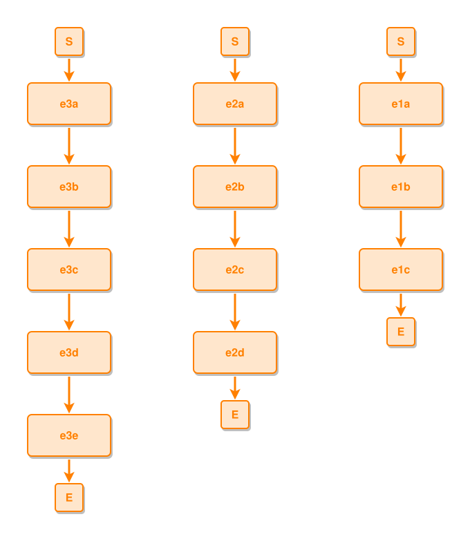

<!-- AUTO-GENERATED FILE - DO NOT EDIT -->
<!-- Generated by: gen-test-md -->
<!-- Command: go run ./cmd-dev/gen-test-md -->

# not-connected-many-events

> **⚠️ Warning:** This file is auto-generated. Manual changes will be lost when tests are regenerated.

**Source:** gl:docs/dev/layout-gen/layout-alg.md#L2316-L2319 | [docs/dev/layout-gen/layout-alg.md](../../docs/dev/layout-gen/layout-alg.md#not-connected-many-events)

## ipmt Content

```ipmt
e1a ::e --> e1b ::e --> e1c ::e
e2a ::e --> e2b ::e --> e2c ::e --> e2d ::e
e3a ::e --> e3b ::e --> e3c ::e --> e3d ::e --> e3e ::e
```

## Generated Files

- [not-connected-many-events.ipmt](not-connected-many-events.ipmt) - ipmt input
- [not-connected-many-events.json](not-connected-many-events.json) - Parsed structure
- [not-connected-many-events.layout.json](not-connected-many-events.layout.json) - Layout coordinates
- [not-connected-many-events.ipm.svg](not-connected-many-events.ipm.svg) - Rendered diagram

## Layout Validation Rules

Test line: 2316

✅ All 4 rules passed

- ✓ [Line 53](gl:docs/dev/layout-gen/layout-alg.md#L53): `each edge has max-bends=0` ([edges-run-straight-by-default.dsl](../layout-gen-rules/edges-run-straight-by-default.dsl))
- ✓ [Line 2331](gl:docs/dev/layout-gen/layout-alg.md#L2331): `#e1a,#e1b,#e1c have same center-x` ([not-connected-many-events.dsl](../layout-gen-rules/not-connected-many-events.dsl))
- ✓ [Line 2332](gl:docs/dev/layout-gen/layout-alg.md#L2332): `#e2a,#e2b,#e2c,#e2d have same center-x` ([not-connected-many-events-02.dsl](../layout-gen-rules/not-connected-many-events-02.dsl))
- ✓ [Line 2333](gl:docs/dev/layout-gen/layout-alg.md#L2333): `#e3a,#e3b,#e3c,#e3d,#e3e have same center-x` ([not-connected-many-events-03.dsl](../layout-gen-rules/not-connected-many-events-03.dsl))

## Rendered Diagram



This test case was automatically generated from the specification document.

The ipmt code block was extracted using [sync-test-cases](../../docs/dev/testing.md) and saved to [not-connected-many-events.ipmt](not-connected-many-events.ipmt), then parsed into the [JSON structure](not-connected-many-events.json) and laid out into [layout coordinates](not-connected-many-events.layout.json). The [SVG diagram](not-connected-many-events.ipm.svg) was rendered using [ipmsvg-gen](../../docs/ipmsvg-gen.md).
