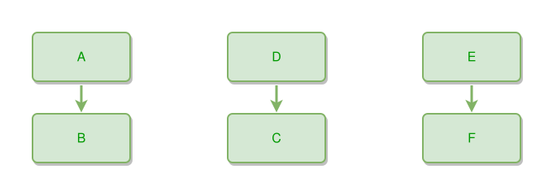

<!-- AUTO-GENERATED FILE - DO NOT EDIT -->
<!-- Generated by: gen-test-md -->
<!-- Command: go run ./cmd-dev/gen-test-md -->

# not-connected-things

> **⚠️ Warning:** This file is auto-generated. Manual changes will be lost when tests are regenerated.

**Source:** gl:docs/dev/layout-gen/layout-alg.md#L2356-L2359 | [docs/dev/layout-gen/layout-alg.md](../../docs/dev/layout-gen/layout-alg.md#not-connected-things)

## ipmt Content

```ipmt
A --> B
C <-- D
E --> F
```

## Generated Files

- [not-connected-things.ipmt](not-connected-things.ipmt) - ipmt input
- [not-connected-things.json](not-connected-things.json) - Parsed structure
- [not-connected-things.layout.json](not-connected-things.layout.json) - Layout coordinates
- [not-connected-things.ipm.svg](not-connected-things.ipm.svg) - Rendered diagram

## Layout Validation Rules

Test line: 2356

✅ All 10 rules passed

- ✓ [Line 53](gl:docs/dev/layout-gen/layout-alg.md#L53): `each edge has max-bends=0` ([edges-run-straight-by-default.dsl](../layout-gen-rules/edges-run-straight-by-default.dsl))
- ✓ [Line 2373](gl:docs/dev/layout-gen/layout-alg.md#L2373): `edge #A,#B has type=partof` ([not-connected-things.dsl](../layout-gen-rules/not-connected-things.dsl))
- ✓ [Line 2374](gl:docs/dev/layout-gen/layout-alg.md#L2374): `edge #D,#C has type=partof` ([not-connected-things-02.dsl](../layout-gen-rules/not-connected-things-02.dsl))
- ✓ [Line 2375](gl:docs/dev/layout-gen/layout-alg.md#L2375): `edge #E,#F has type=partof` ([not-connected-things-03.dsl](../layout-gen-rules/not-connected-things-03.dsl))
- ✓ [Line 2376](gl:docs/dev/layout-gen/layout-alg.md#L2376): `#B is below #A with gap=40` ([not-connected-things-04.dsl](../layout-gen-rules/not-connected-things-04.dsl))
- ✓ [Line 2377](gl:docs/dev/layout-gen/layout-alg.md#L2377): `#A,#B have same center-x` ([not-connected-things-05.dsl](../layout-gen-rules/not-connected-things-05.dsl))
- ✓ [Line 2378](gl:docs/dev/layout-gen/layout-alg.md#L2378): `#D is above #C with gap=40` ([not-connected-things-06.dsl](../layout-gen-rules/not-connected-things-06.dsl))
- ✓ [Line 2379](gl:docs/dev/layout-gen/layout-alg.md#L2379): `#D,#C have same center-x` ([not-connected-things-07.dsl](../layout-gen-rules/not-connected-things-07.dsl))
- ✓ [Line 2380](gl:docs/dev/layout-gen/layout-alg.md#L2380): `#E is above #F with gap=40` ([not-connected-things-08.dsl](../layout-gen-rules/not-connected-things-08.dsl))
- ✓ [Line 2381](gl:docs/dev/layout-gen/layout-alg.md#L2381): `#E,#F have same center-x` ([not-connected-things-09.dsl](../layout-gen-rules/not-connected-things-09.dsl))

## Rendered Diagram



This test case was automatically generated from the specification document.

The ipmt code block was extracted using [sync-test-cases](../../docs/dev/testing.md) and saved to [not-connected-things.ipmt](not-connected-things.ipmt), then parsed into the [JSON structure](not-connected-things.json) and laid out into [layout coordinates](not-connected-things.layout.json). The [SVG diagram](not-connected-things.ipm.svg) was rendered using [ipmsvg-gen](../../docs/ipmsvg-gen.md).
