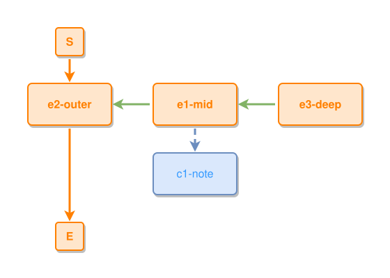

<!-- AUTO-GENERATED FILE - DO NOT EDIT -->
<!-- Generated by: gen-test-md -->
<!-- Command: go run ./cmd-dev/gen-test-md -->

# one-concept-on-the-inner-layer

> **⚠️ Warning:** This file is auto-generated. Manual changes will be lost when tests are regenerated.

**Source:** gl:docs/dev/layout-gen/layout-alg.md#L1183-L1186 | [docs/dev/layout-gen/layout-alg.md](../../docs/dev/layout-gen/layout-alg.md#one-concept-on-the-inner-layer)

## ipmt Content

```ipmt
e1-mid ::e --::P--> e2-outer ::e
e3-deep ::e --::P--> e1-mid
e1-mid --> c1-note ::c
```

## Generated Files

- [one-concept-on-the-inner-layer.ipmt](one-concept-on-the-inner-layer.ipmt) - ipmt input
- [one-concept-on-the-inner-layer.json](one-concept-on-the-inner-layer.json) - Parsed structure
- [one-concept-on-the-inner-layer.layout.json](one-concept-on-the-inner-layer.layout.json) - Layout coordinates
- [one-concept-on-the-inner-layer.ipm.svg](one-concept-on-the-inner-layer.ipm.svg) - Rendered diagram

## Layout Validation Rules

Test line: 1183

✅ All 8 rules passed

- ✓ [Line 53](gl:docs/dev/layout-gen/layout-alg.md#L53): `each edge has max-bends=0` ([edges-run-straight-by-default.dsl](../layout-gen-rules/edges-run-straight-by-default.dsl))
- ✓ [Line 1200](gl:docs/dev/layout-gen/layout-alg.md#L1200): `#e2-outer,#e1-mid,#e3-deep have same y` ([one-concept-on-the-inner-layer.dsl](../layout-gen-rules/one-concept-on-the-inner-layer.dsl))
- ✓ [Line 1201](gl:docs/dev/layout-gen/layout-alg.md#L1201): `#c1-note,#e1-mid have same center-x` ([one-concept-on-the-inner-layer-02.dsl](../layout-gen-rules/one-concept-on-the-inner-layer-02.dsl))
- ✓ [Line 1202](gl:docs/dev/layout-gen/layout-alg.md#L1202): `#c1-note is below #e1-mid with gap=40` ([one-concept-on-the-inner-layer-03.dsl](../layout-gen-rules/one-concept-on-the-inner-layer-03.dsl))
- ✓ [Line 1203](gl:docs/dev/layout-gen/layout-alg.md#L1203): `#e3-deep is right-of #e1-mid with gap=60` ([one-concept-on-the-inner-layer-04.dsl](../layout-gen-rules/one-concept-on-the-inner-layer-04.dsl))
- ✓ [Line 1204](gl:docs/dev/layout-gen/layout-alg.md#L1204): `node #c1-note does not straddle edge #e3-deep,#e1-mid` ([one-concept-on-the-inner-layer-05.dsl](../layout-gen-rules/one-concept-on-the-inner-layer-05.dsl))
- ✓ [Line 1205](gl:docs/dev/layout-gen/layout-alg.md#L1205): `node #c1-note does not straddle edge #e1-mid,#e2-outer` ([one-concept-on-the-inner-layer-06.dsl](../layout-gen-rules/one-concept-on-the-inner-layer-06.dsl))
- ✓ [Line 1206](gl:docs/dev/layout-gen/layout-alg.md#L1206): `#E is below #c1-note with gap=40` ([one-concept-on-the-inner-layer-07.dsl](../layout-gen-rules/one-concept-on-the-inner-layer-07.dsl))

## Rendered Diagram



This test case was automatically generated from the specification document.

The ipmt code block was extracted using [sync-test-cases](../../docs/dev/testing.md) and saved to [one-concept-on-the-inner-layer.ipmt](one-concept-on-the-inner-layer.ipmt), then parsed into the [JSON structure](one-concept-on-the-inner-layer.json) and laid out into [layout coordinates](one-concept-on-the-inner-layer.layout.json). The [SVG diagram](one-concept-on-the-inner-layer.ipm.svg) was rendered using [ipmsvg-gen](../../docs/ipmsvg-gen.md).
