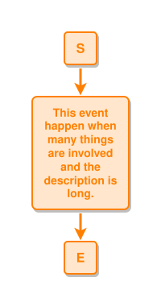

<!-- AUTO-GENERATED FILE - DO NOT EDIT -->
<!-- Generated by: gen-test-md -->
<!-- Command: go run ./cmd-dev/gen-test-md -->

# one-event-with-long-text

> **⚠️ Warning:** This file is auto-generated. Manual changes will be lost when tests are regenerated.

**Source:** gl:docs/dev/layout-gen/layout-alg.md#L109-L110 | [docs/dev/layout-gen/layout-alg.md](../../docs/dev/layout-gen/layout-alg.md#one-event-with-long-text)

## ipmt Content

```ipmt
This event happen when many things are involved and the description is long. ::e
```

## Generated Files

- [one-event-with-long-text.ipmt](one-event-with-long-text.ipmt) - ipmt input
- [one-event-with-long-text.json](one-event-with-long-text.json) - Parsed structure
- [one-event-with-long-text.layout.json](one-event-with-long-text.layout.json) - Layout coordinates
- [one-event-with-long-text.ipm.svg](one-event-with-long-text.ipm.svg) - Rendered diagram

## Layout Validation Rules

Test line: 109

✅ All 5 rules passed

- ✓ [Line 53](gl:docs/dev/layout-gen/layout-alg.md#L53): `each edge has max-bends=0` ([edges-run-straight-by-default.dsl](../layout-gen-rules/edges-run-straight-by-default.dsl))
- ✓ [Line 82](gl:docs/dev/layout-gen/layout-alg.md#L82): `type=event has width=120` ([one-event.dsl](../layout-gen-rules/one-event.dsl))
- ✓ [Line 83](gl:docs/dev/layout-gen/layout-alg.md#L83): `type=event has min-gap-to-others>=10` ([one-event-02.dsl](../layout-gen-rules/one-event-02.dsl))
- ✓ [Line 84](gl:docs/dev/layout-gen/layout-alg.md#L84): `type=boundary has size=40x40` ([one-event-03.dsl](../layout-gen-rules/one-event-03.dsl))
- ✓ [Line 122](gl:docs/dev/layout-gen/layout-alg.md#L122): `type=event text-len>72 has height>=140` ([one-event-with-long-text.dsl](../layout-gen-rules/one-event-with-long-text.dsl))

## Rendered Diagram



This test case was automatically generated from the specification document.

The ipmt code block was extracted using [sync-test-cases](../../docs/dev/testing.md) and saved to [one-event-with-long-text.ipmt](one-event-with-long-text.ipmt), then parsed into the [JSON structure](one-event-with-long-text.json) and laid out into [layout coordinates](one-event-with-long-text.layout.json). The [SVG diagram](one-event-with-long-text.ipm.svg) was rendered using [ipmsvg-gen](../../docs/ipmsvg-gen.md).
