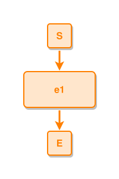

<!-- AUTO-GENERATED FILE - DO NOT EDIT -->
<!-- Generated by: gen-test-md -->
<!-- Command: go run ./cmd-dev/gen-test-md -->

# one-event

> **⚠️ Warning:** This file is auto-generated. Manual changes will be lost when tests are regenerated.

**Source:** gl:docs/dev/layout-gen/layout-alg.md#L61-L62 | [docs/dev/layout-gen/layout-alg.md](../../docs/dev/layout-gen/layout-alg.md#one-event)

## ipmt Content

```ipmt
e1 ::e
```

## Generated Files

- [one-event.ipmt](one-event.ipmt) - ipmt input
- [one-event.json](one-event.json) - Parsed structure
- [one-event.layout.json](one-event.layout.json) - Layout coordinates
- [one-event.ipm.svg](one-event.ipm.svg) - Rendered diagram

## Layout Validation Rules

Test line: 61

✅ All 10 rules passed

- ✓ [Line 53](gl:docs/dev/layout-gen/layout-alg.md#L53): `each edge has max-bends=0` ([edges-run-straight-by-default.dsl](../layout-gen-rules/edges-run-straight-by-default.dsl))
- ✓ [Line 82](gl:docs/dev/layout-gen/layout-alg.md#L82): `type=event has width=120` ([one-event.dsl](../layout-gen-rules/one-event.dsl))
- ✓ [Line 83](gl:docs/dev/layout-gen/layout-alg.md#L83): `type=event has min-gap-to-others>=10` ([one-event-02.dsl](../layout-gen-rules/one-event-02.dsl))
- ✓ [Line 84](gl:docs/dev/layout-gen/layout-alg.md#L84): `type=boundary has size=40x40` ([one-event-03.dsl](../layout-gen-rules/one-event-03.dsl))
- ✓ [Line 98](gl:docs/dev/layout-gen/layout-alg.md#L98): `type=event has height=60` ([one-event-04.dsl](../layout-gen-rules/one-event-04.dsl))
- ✓ [Line 99](gl:docs/dev/layout-gen/layout-alg.md#L99): `#S,#e1,#E have same center-x` ([one-event-05.dsl](../layout-gen-rules/one-event-05.dsl))
- ✓ [Line 100](gl:docs/dev/layout-gen/layout-alg.md#L100): `edge #S,#e1 has type=leadsto` ([one-event-06.dsl](../layout-gen-rules/one-event-06.dsl))
- ✓ [Line 101](gl:docs/dev/layout-gen/layout-alg.md#L101): `edge #e1,#E has type=leadsto` ([one-event-07.dsl](../layout-gen-rules/one-event-07.dsl))
- ✓ [Line 102](gl:docs/dev/layout-gen/layout-alg.md#L102): `#e1 is below #S with gap=40` ([one-event-08.dsl](../layout-gen-rules/one-event-08.dsl))
- ✓ [Line 103](gl:docs/dev/layout-gen/layout-alg.md#L103): `#E is below #e1 with gap=40` ([one-event-09.dsl](../layout-gen-rules/one-event-09.dsl))

## Rendered Diagram



This test case was automatically generated from the specification document.

The ipmt code block was extracted using [sync-test-cases](../../docs/dev/testing.md) and saved to [one-event.ipmt](one-event.ipmt), then parsed into the [JSON structure](one-event.json) and laid out into [layout coordinates](one-event.layout.json). The [SVG diagram](one-event.ipm.svg) was rendered using [ipmsvg-gen](../../docs/ipmsvg-gen.md).
