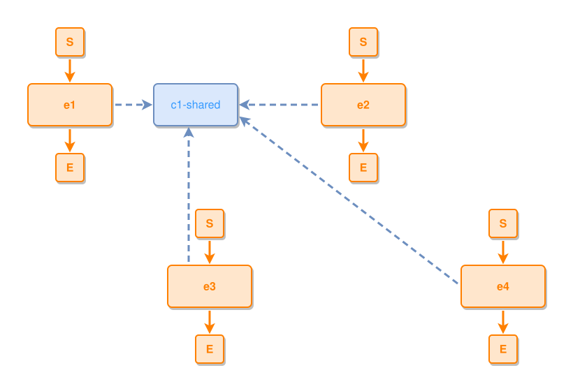

<!-- AUTO-GENERATED FILE - DO NOT EDIT -->
<!-- Generated by: gen-test-md -->
<!-- Command: go run ./cmd-dev/gen-test-md -->

# s-and-e-boundaries-connect-on-their-bottom-and-top

> **⚠️ Warning:** This file is auto-generated. Manual changes will be lost when tests are regenerated.

**Source:** gl:docs/dev/layout-gen/layout-alg.md#L3001-L3005 | [docs/dev/layout-gen/layout-alg.md](../../docs/dev/layout-gen/layout-alg.md#s-and-e-boundaries-connect-on-their-bottom-and-top)

## ipmt Content

```ipmt
e1 ::e --::X--> c1-shared ::c
e2 ::e --::X--> c1-shared
e3 ::e --::X--> c1-shared
e4 ::e --::X--> c1-shared
```

## Generated Files

- [s-and-e-boundaries-connect-on-their-bottom-and-top.ipmt](s-and-e-boundaries-connect-on-their-bottom-and-top.ipmt) - ipmt input
- [s-and-e-boundaries-connect-on-their-bottom-and-top.json](s-and-e-boundaries-connect-on-their-bottom-and-top.json) - Parsed structure
- [s-and-e-boundaries-connect-on-their-bottom-and-top.layout.json](s-and-e-boundaries-connect-on-their-bottom-and-top.layout.json) - Layout coordinates
- [s-and-e-boundaries-connect-on-their-bottom-and-top.ipm.svg](s-and-e-boundaries-connect-on-their-bottom-and-top.ipm.svg) - Rendered diagram

## Layout Validation Rules

Test line: 3001

✅ All 14 rules passed

- ✓ [Line 53](gl:docs/dev/layout-gen/layout-alg.md#L53): `each edge has max-bends=0` ([edges-run-straight-by-default.dsl](../layout-gen-rules/edges-run-straight-by-default.dsl))
- ✓ [Line 3032](gl:docs/dev/layout-gen/layout-alg.md#L3032): `edge #S,#e1 has source-side=bottom` ([s-and-e-boundaries-connect-on-their-bottom-and-top.dsl](../layout-gen-rules/s-and-e-boundaries-connect-on-their-bottom-and-top.dsl))
- ✓ [Line 3033](gl:docs/dev/layout-gen/layout-alg.md#L3033): `edge #S,#e3 has source-side=bottom` ([s-and-e-boundaries-connect-on-their-bottom-and-top-02.dsl](../layout-gen-rules/s-and-e-boundaries-connect-on-their-bottom-and-top-02.dsl))
- ✓ [Line 3034](gl:docs/dev/layout-gen/layout-alg.md#L3034): `edge #e3,#E has target-side=top` ([s-and-e-boundaries-connect-on-their-bottom-and-top-03.dsl](../layout-gen-rules/s-and-e-boundaries-connect-on-their-bottom-and-top-03.dsl))
- ✓ [Line 3035](gl:docs/dev/layout-gen/layout-alg.md#L3035): `type=event has min-gap-to-others>=10` ([s-and-e-boundaries-connect-on-their-bottom-and-top-04.dsl](../layout-gen-rules/s-and-e-boundaries-connect-on-their-bottom-and-top-04.dsl))
- ✓ [Line 3036](gl:docs/dev/layout-gen/layout-alg.md#L3036): `edge #e1,#c1-shared is horizontal` ([s-and-e-boundaries-connect-on-their-bottom-and-top-05.dsl](../layout-gen-rules/s-and-e-boundaries-connect-on-their-bottom-and-top-05.dsl))
- ✓ [Line 3037](gl:docs/dev/layout-gen/layout-alg.md#L3037): `edge #e2,#c1-shared is horizontal` ([s-and-e-boundaries-connect-on-their-bottom-and-top-06.dsl](../layout-gen-rules/s-and-e-boundaries-connect-on-their-bottom-and-top-06.dsl))
- ✓ [Line 3038](gl:docs/dev/layout-gen/layout-alg.md#L3038): `each edge has max-bends=0` ([s-and-e-boundaries-connect-on-their-bottom-and-top-07.dsl](../layout-gen-rules/s-and-e-boundaries-connect-on-their-bottom-and-top-07.dsl))
- ✓ [Line 3039](gl:docs/dev/layout-gen/layout-alg.md#L3039): `edge #e3,#c1-shared is vertical` ([s-and-e-boundaries-connect-on-their-bottom-and-top-08.dsl](../layout-gen-rules/s-and-e-boundaries-connect-on-their-bottom-and-top-08.dsl))
- ✓ [Line 3040](gl:docs/dev/layout-gen/layout-alg.md#L3040): `edge #e3,#c1-shared has source-side=top` ([s-and-e-boundaries-connect-on-their-bottom-and-top-09.dsl](../layout-gen-rules/s-and-e-boundaries-connect-on-their-bottom-and-top-09.dsl))
- ✓ [Line 3041](gl:docs/dev/layout-gen/layout-alg.md#L3041): `edge #e3,#c1-shared has target-side=bottom` ([s-and-e-boundaries-connect-on-their-bottom-and-top-10.dsl](../layout-gen-rules/s-and-e-boundaries-connect-on-their-bottom-and-top-10.dsl))
- ✓ [Line 3042](gl:docs/dev/layout-gen/layout-alg.md#L3042): `edge #e4,#c1-shared has source-side=left` ([s-and-e-boundaries-connect-on-their-bottom-and-top-11.dsl](../layout-gen-rules/s-and-e-boundaries-connect-on-their-bottom-and-top-11.dsl))
- ✓ [Line 3043](gl:docs/dev/layout-gen/layout-alg.md#L3043): `edge #e4,#c1-shared has target-side=right` ([s-and-e-boundaries-connect-on-their-bottom-and-top-12.dsl](../layout-gen-rules/s-and-e-boundaries-connect-on-their-bottom-and-top-12.dsl))
- ✓ [Line 3044](gl:docs/dev/layout-gen/layout-alg.md#L3044): `edge #e4,#c1-shared does not cross edge #e3,#c1-shared` ([s-and-e-boundaries-connect-on-their-bottom-and-top-13.dsl](../layout-gen-rules/s-and-e-boundaries-connect-on-their-bottom-and-top-13.dsl))

## Rendered Diagram



This test case was automatically generated from the specification document.

The ipmt code block was extracted using [sync-test-cases](../../docs/dev/testing.md) and saved to [s-and-e-boundaries-connect-on-their-bottom-and-top.ipmt](s-and-e-boundaries-connect-on-their-bottom-and-top.ipmt), then parsed into the [JSON structure](s-and-e-boundaries-connect-on-their-bottom-and-top.json) and laid out into [layout coordinates](s-and-e-boundaries-connect-on-their-bottom-and-top.layout.json). The [SVG diagram](s-and-e-boundaries-connect-on-their-bottom-and-top.ipm.svg) was rendered using [ipmsvg-gen](../../docs/ipmsvg-gen.md).
