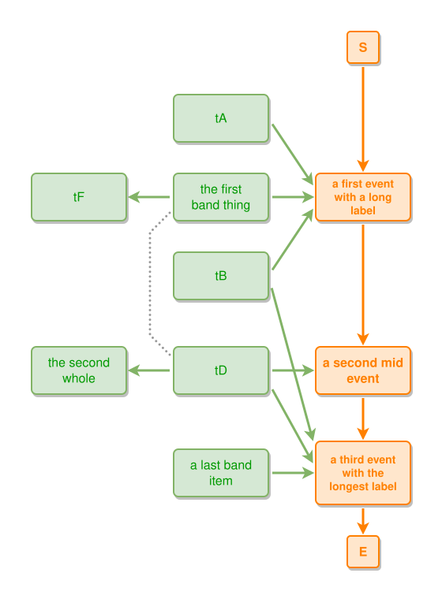

<!-- AUTO-GENERATED FILE - DO NOT EDIT -->
<!-- Generated by: gen-test-md -->
<!-- Command: go run ./cmd-dev/gen-test-md -->

# same-side-entries-keep-their-approach-order

> **⚠️ Warning:** This file is auto-generated. Manual changes will be lost when tests are regenerated.

**Source:** gl:docs/dev/layout-gen/layout-alg.md#L2545-L2554 | [docs/dev/layout-gen/layout-alg.md](../../docs/dev/layout-gen/layout-alg.md#same-side-entries-keep-their-approach-order)

## ipmt Content

```ipmt
e1::a a first event with a long label ::e --> e2::a a second mid event ::e --> e3::a a third event with the longest label ::e
tA, tB --> e1
tC::a the first band thing --> e1
tD --> e2
tE::a a last band item --> e3
tB, tD --> e3
tD --- tC
tC --> tF
tD --> tG::a the second whole
```

## Generated Files

- [same-side-entries-keep-their-approach-order.ipmt](same-side-entries-keep-their-approach-order.ipmt) - ipmt input
- [same-side-entries-keep-their-approach-order.json](same-side-entries-keep-their-approach-order.json) - Parsed structure
- [same-side-entries-keep-their-approach-order.layout.json](same-side-entries-keep-their-approach-order.layout.json) - Layout coordinates
- [same-side-entries-keep-their-approach-order.ipm.svg](same-side-entries-keep-their-approach-order.ipm.svg) - Rendered diagram

## Layout Validation Rules

Test line: 2545

⚠️ 9/10 rules passed

- ✗ [Line 53](gl:docs/dev/layout-gen/layout-alg.md#L53): `each edge has max-bends=0` - **edge tD->tC has 2 bends > max-bends 0 (each-edge default; if the detour is intended, add it to `except` and pin it with `edge #tD,#tC has max-bends=2`)** ([edges-run-straight-by-default.dsl](../layout-gen-rules/edges-run-straight-by-default.dsl))
- ✓ [Line 2579](gl:docs/dev/layout-gen/layout-alg.md#L2579): `each edge has max-bends=0 except #tC,#e1 #tD,#tC` ([same-side-entries-keep-their-approach-order.dsl](../layout-gen-rules/same-side-entries-keep-their-approach-order.dsl))
- ✓ [Line 2580](gl:docs/dev/layout-gen/layout-alg.md#L2580): `edge #tD,#tC has max-bends=2` ([same-side-entries-keep-their-approach-order-02.dsl](../layout-gen-rules/same-side-entries-keep-their-approach-order-02.dsl))
- ✓ [Line 2581](gl:docs/dev/layout-gen/layout-alg.md#L2581): `edge #tB,#e3 has target-side=left` ([same-side-entries-keep-their-approach-order-03.dsl](../layout-gen-rules/same-side-entries-keep-their-approach-order-03.dsl))
- ✓ [Line 2582](gl:docs/dev/layout-gen/layout-alg.md#L2582): `edge #tB,#e3 has target-position=0.15` ([same-side-entries-keep-their-approach-order-04.dsl](../layout-gen-rules/same-side-entries-keep-their-approach-order-04.dsl))
- ✓ [Line 2583](gl:docs/dev/layout-gen/layout-alg.md#L2583): `edge #tD,#e3 has target-side=left` ([same-side-entries-keep-their-approach-order-05.dsl](../layout-gen-rules/same-side-entries-keep-their-approach-order-05.dsl))
- ✓ [Line 2584](gl:docs/dev/layout-gen/layout-alg.md#L2584): `edge #tD,#e3 has target-position=0.4306861128788711` ([same-side-entries-keep-their-approach-order-06.dsl](../layout-gen-rules/same-side-entries-keep-their-approach-order-06.dsl))
- ✓ [Line 2585](gl:docs/dev/layout-gen/layout-alg.md#L2585): `edge #tE,#e3 has target-side=left` ([same-side-entries-keep-their-approach-order-07.dsl](../layout-gen-rules/same-side-entries-keep-their-approach-order-07.dsl))
- ✓ [Line 2586](gl:docs/dev/layout-gen/layout-alg.md#L2586): `edge #tE,#e3 has target-position=0.5` ([same-side-entries-keep-their-approach-order-08.dsl](../layout-gen-rules/same-side-entries-keep-their-approach-order-08.dsl))
- ✓ [Line 2587](gl:docs/dev/layout-gen/layout-alg.md#L2587): `edge #tB,#e3 does not cross edge #tD,#e3` ([same-side-entries-keep-their-approach-order-09.dsl](../layout-gen-rules/same-side-entries-keep-their-approach-order-09.dsl))

## Rendered Diagram



This test case was automatically generated from the specification document.

The ipmt code block was extracted using [sync-test-cases](../../docs/dev/testing.md) and saved to [same-side-entries-keep-their-approach-order.ipmt](same-side-entries-keep-their-approach-order.ipmt), then parsed into the [JSON structure](same-side-entries-keep-their-approach-order.json) and laid out into [layout coordinates](same-side-entries-keep-their-approach-order.layout.json). The [SVG diagram](same-side-entries-keep-their-approach-order.ipm.svg) was rendered using [ipmsvg-gen](../../docs/ipmsvg-gen.md).
