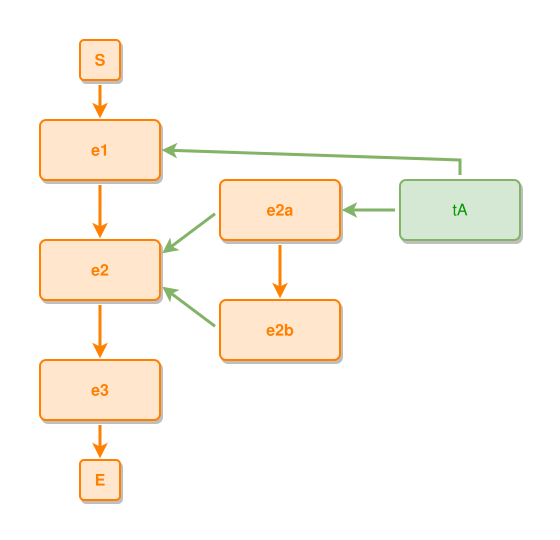

<!-- AUTO-GENERATED FILE - DO NOT EDIT -->
<!-- Generated by: gen-test-md -->
<!-- Command: go run ./cmd-dev/gen-test-md -->

# shared-thing-anchors-to-its-deepest-composite

> **⚠️ Warning:** This file is auto-generated. Manual changes will be lost when tests are regenerated.

**Source:** gl:docs/dev/layout-gen/layout-alg.md#L3112-L3118 | [docs/dev/layout-gen/layout-alg.md](../../docs/dev/layout-gen/layout-alg.md#shared-thing-anchors-to-its-deepest-composite)

## ipmt Content

```ipmt
e1 ::e --::L--> e2 ::e --::L--> e3 ::e
e2a ::e --::P--> e2
e2b ::e --::P--> e2
e2a --::L--> e2b
tA ::t --> e1
tA --> e2a
```

## Generated Files

- [shared-thing-anchors-to-its-deepest-composite.ipmt](shared-thing-anchors-to-its-deepest-composite.ipmt) - ipmt input
- [shared-thing-anchors-to-its-deepest-composite.json](shared-thing-anchors-to-its-deepest-composite.json) - Parsed structure
- [shared-thing-anchors-to-its-deepest-composite.layout.json](shared-thing-anchors-to-its-deepest-composite.layout.json) - Layout coordinates
- [shared-thing-anchors-to-its-deepest-composite.ipm.svg](shared-thing-anchors-to-its-deepest-composite.ipm.svg) - Rendered diagram

## Layout Validation Rules

Test line: 3112

⚠️ 9/10 rules passed

- ✗ [Line 53](gl:docs/dev/layout-gen/layout-alg.md#L53): `each edge has max-bends=0` - **edge tA->e1 has 1 bends > max-bends 0 (each-edge default; if the detour is intended, add it to `except` and pin it with `edge #tA,#e1 has max-bends=1`)** ([edges-run-straight-by-default.dsl](../layout-gen-rules/edges-run-straight-by-default.dsl))
- ✓ [Line 3133](gl:docs/dev/layout-gen/layout-alg.md#L3133): `each edge has max-bends=0 except #tA,#e1` ([shared-thing-anchors-to-its-deepest-composite.dsl](../layout-gen-rules/shared-thing-anchors-to-its-deepest-composite.dsl))
- ✓ [Line 3134](gl:docs/dev/layout-gen/layout-alg.md#L3134): `edge #tA,#e1 has max-bends=1` ([shared-thing-anchors-to-its-deepest-composite-02.dsl](../layout-gen-rules/shared-thing-anchors-to-its-deepest-composite-02.dsl))
- ✓ [Line 3135](gl:docs/dev/layout-gen/layout-alg.md#L3135): `edge #tA,#e1 has visibility=visible` ([shared-thing-anchors-to-its-deepest-composite-03.dsl](../layout-gen-rules/shared-thing-anchors-to-its-deepest-composite-03.dsl))
- ✓ [Line 3136](gl:docs/dev/layout-gen/layout-alg.md#L3136): `edge #tA,#e1 has target-side=right` ([shared-thing-anchors-to-its-deepest-composite-04.dsl](../layout-gen-rules/shared-thing-anchors-to-its-deepest-composite-04.dsl))
- ✓ [Line 3137](gl:docs/dev/layout-gen/layout-alg.md#L3137): `edge #tA,#e2a has visibility=visible` ([shared-thing-anchors-to-its-deepest-composite-05.dsl](../layout-gen-rules/shared-thing-anchors-to-its-deepest-composite-05.dsl))
- ✓ [Line 3138](gl:docs/dev/layout-gen/layout-alg.md#L3138): `#tA,#e2a have same y` ([shared-thing-anchors-to-its-deepest-composite-06.dsl](../layout-gen-rules/shared-thing-anchors-to-its-deepest-composite-06.dsl))
- ✓ [Line 3139](gl:docs/dev/layout-gen/layout-alg.md#L3139): `#tA is right-of #e2a with gap=60` ([shared-thing-anchors-to-its-deepest-composite-07.dsl](../layout-gen-rules/shared-thing-anchors-to-its-deepest-composite-07.dsl))
- ✓ [Line 3140](gl:docs/dev/layout-gen/layout-alg.md#L3140): `node #e2a does not straddle edge #tA,#e1` ([shared-thing-anchors-to-its-deepest-composite-08.dsl](../layout-gen-rules/shared-thing-anchors-to-its-deepest-composite-08.dsl))
- ✓ [Line 3141](gl:docs/dev/layout-gen/layout-alg.md#L3141): `node #e2b does not straddle edge #tA,#e2a` ([shared-thing-anchors-to-its-deepest-composite-09.dsl](../layout-gen-rules/shared-thing-anchors-to-its-deepest-composite-09.dsl))

## Rendered Diagram



This test case was automatically generated from the specification document.

The ipmt code block was extracted using [sync-test-cases](../../docs/dev/testing.md) and saved to [shared-thing-anchors-to-its-deepest-composite.ipmt](shared-thing-anchors-to-its-deepest-composite.ipmt), then parsed into the [JSON structure](shared-thing-anchors-to-its-deepest-composite.json) and laid out into [layout coordinates](shared-thing-anchors-to-its-deepest-composite.layout.json). The [SVG diagram](shared-thing-anchors-to-its-deepest-composite.ipm.svg) was rendered using [ipmsvg-gen](../../docs/ipmsvg-gen.md).
