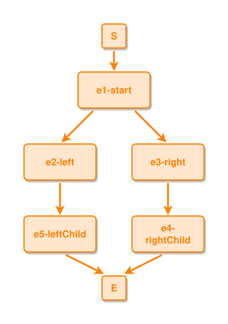

<!-- AUTO-GENERATED FILE - DO NOT EDIT -->
<!-- Generated by: gen-test-md -->
<!-- Command: go run ./cmd-dev/gen-test-md -->

# sibling-events-do-not-cross

> **⚠️ Warning:** This file is auto-generated. Manual changes will be lost when tests are regenerated.

**Source:** gl:docs/dev/layout-gen/layout-alg.md#L469-L473 | [docs/dev/layout-gen/layout-alg.md](../../docs/dev/layout-gen/layout-alg.md#sibling-events-do-not-cross)

## ipmt Content

```ipmt
e1-start ::e --> e2-left ::e
e1-start --> e3-right ::e
e3-right --> e4-rightChild ::e
e2-left --> e5-leftChild ::e
```

## Generated Files

- [sibling-events-do-not-cross.ipmt](sibling-events-do-not-cross.ipmt) - ipmt input
- [sibling-events-do-not-cross.json](sibling-events-do-not-cross.json) - Parsed structure
- [sibling-events-do-not-cross.layout.json](sibling-events-do-not-cross.layout.json) - Layout coordinates
- [sibling-events-do-not-cross.ipm.svg](sibling-events-do-not-cross.ipm.svg) - Rendered diagram

## Layout Validation Rules

Test line: 469

✅ All 9 rules passed

- ✓ [Line 53](gl:docs/dev/layout-gen/layout-alg.md#L53): `each edge has max-bends=0` ([edges-run-straight-by-default.dsl](../layout-gen-rules/edges-run-straight-by-default.dsl))
- ✓ [Line 82](gl:docs/dev/layout-gen/layout-alg.md#L82): `type=event has width=120` ([one-event.dsl](../layout-gen-rules/one-event.dsl))
- ✓ [Line 83](gl:docs/dev/layout-gen/layout-alg.md#L83): `type=event has min-gap-to-others>=10` ([one-event-02.dsl](../layout-gen-rules/one-event-02.dsl))
- ✓ [Line 84](gl:docs/dev/layout-gen/layout-alg.md#L84): `type=boundary has size=40x40` ([one-event-03.dsl](../layout-gen-rules/one-event-03.dsl))
- ✓ [Line 491](gl:docs/dev/layout-gen/layout-alg.md#L491): `#e5-leftChild,#e4-rightChild have same y` ([sibling-events-do-not-cross.dsl](../layout-gen-rules/sibling-events-do-not-cross.dsl))
- ✓ [Line 492](gl:docs/dev/layout-gen/layout-alg.md#L492): `#e5-leftChild is left-of #e4-rightChild with gap=60` ([sibling-events-do-not-cross-02.dsl](../layout-gen-rules/sibling-events-do-not-cross-02.dsl))
- ✓ [Line 493](gl:docs/dev/layout-gen/layout-alg.md#L493): `edge #e2-left,#e5-leftChild has target-side=top` ([sibling-events-do-not-cross-03.dsl](../layout-gen-rules/sibling-events-do-not-cross-03.dsl))
- ✓ [Line 494](gl:docs/dev/layout-gen/layout-alg.md#L494): `edge #e3-right,#e4-rightChild has target-side=top` ([sibling-events-do-not-cross-04.dsl](../layout-gen-rules/sibling-events-do-not-cross-04.dsl))
- ✓ [Line 495](gl:docs/dev/layout-gen/layout-alg.md#L495): `edge #e2-left,#e5-leftChild does not cross edge #e3-right,#e4-rightChild` ([sibling-events-do-not-cross-05.dsl](../layout-gen-rules/sibling-events-do-not-cross-05.dsl))

## Rendered Diagram



This test case was automatically generated from the specification document.

The ipmt code block was extracted using [sync-test-cases](../../docs/dev/testing.md) and saved to [sibling-events-do-not-cross.ipmt](sibling-events-do-not-cross.ipmt), then parsed into the [JSON structure](sibling-events-do-not-cross.json) and laid out into [layout coordinates](sibling-events-do-not-cross.layout.json). The [SVG diagram](sibling-events-do-not-cross.ipm.svg) was rendered using [ipmsvg-gen](../../docs/ipmsvg-gen.md).
