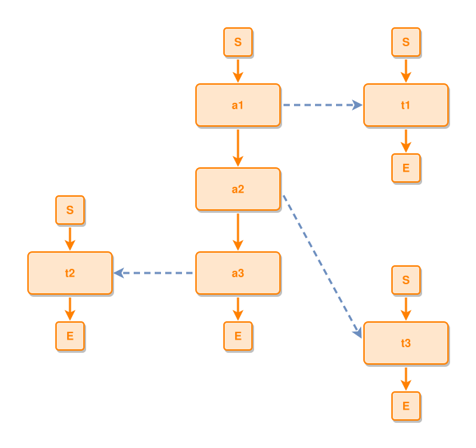

<!-- AUTO-GENERATED FILE - DO NOT EDIT -->
<!-- Generated by: gen-test-md -->
<!-- Command: go run ./cmd-dev/gen-test-md -->

# single-node-ties-ring-their-core-graph

> **⚠️ Warning:** This file is auto-generated. Manual changes will be lost when tests are regenerated.

**Source:** gl:docs/dev/layout-gen/layout-alg.md#L2741-L2748 | [docs/dev/layout-gen/layout-alg.md](../../docs/dev/layout-gen/layout-alg.md#single-node-ties-ring-their-core-graph)

## ipmt Content

```ipmt
a1 ::e --> a2 ::e --> a3 ::e
t1 ::e
t2 ::e
t3 ::e
a1 --::X--> t1
a3 --::X--> t2
a2 --::X--> t3
```

## Generated Files

- [single-node-ties-ring-their-core-graph.ipmt](single-node-ties-ring-their-core-graph.ipmt) - ipmt input
- [single-node-ties-ring-their-core-graph.json](single-node-ties-ring-their-core-graph.json) - Parsed structure
- [single-node-ties-ring-their-core-graph.layout.json](single-node-ties-ring-their-core-graph.layout.json) - Layout coordinates
- [single-node-ties-ring-their-core-graph.ipm.svg](single-node-ties-ring-their-core-graph.ipm.svg) - Rendered diagram

## Layout Validation Rules

Test line: 2741

✅ All 8 rules passed

- ✓ [Line 53](gl:docs/dev/layout-gen/layout-alg.md#L53): `each edge has max-bends=0` ([edges-run-straight-by-default.dsl](../layout-gen-rules/edges-run-straight-by-default.dsl))
- ✓ [Line 2764](gl:docs/dev/layout-gen/layout-alg.md#L2764): `#a1,#a2,#a3 have same center-x` ([single-node-ties-ring-their-core-graph.dsl](../layout-gen-rules/single-node-ties-ring-their-core-graph.dsl))
- ✓ [Line 2765](gl:docs/dev/layout-gen/layout-alg.md#L2765): `#a1,#t1 have same y` ([single-node-ties-ring-their-core-graph-02.dsl](../layout-gen-rules/single-node-ties-ring-their-core-graph-02.dsl))
- ✓ [Line 2766](gl:docs/dev/layout-gen/layout-alg.md#L2766): `#a1 is left-of #t1 with gap=120` ([single-node-ties-ring-their-core-graph-03.dsl](../layout-gen-rules/single-node-ties-ring-their-core-graph-03.dsl))
- ✓ [Line 2767](gl:docs/dev/layout-gen/layout-alg.md#L2767): `#t2,#a3 have same y` ([single-node-ties-ring-their-core-graph-04.dsl](../layout-gen-rules/single-node-ties-ring-their-core-graph-04.dsl))
- ✓ [Line 2768](gl:docs/dev/layout-gen/layout-alg.md#L2768): `#t2 is left-of #a3 with gap=120` ([single-node-ties-ring-their-core-graph-05.dsl](../layout-gen-rules/single-node-ties-ring-their-core-graph-05.dsl))
- ✓ [Line 2769](gl:docs/dev/layout-gen/layout-alg.md#L2769): `#t1,#t3 have same center-x` ([single-node-ties-ring-their-core-graph-06.dsl](../layout-gen-rules/single-node-ties-ring-their-core-graph-06.dsl))
- ✓ [Line 2770](gl:docs/dev/layout-gen/layout-alg.md#L2770): `#t3 is below #t1 with gap=280` ([single-node-ties-ring-their-core-graph-07.dsl](../layout-gen-rules/single-node-ties-ring-their-core-graph-07.dsl))

## Rendered Diagram



This test case was automatically generated from the specification document.

The ipmt code block was extracted using [sync-test-cases](../../docs/dev/testing.md) and saved to [single-node-ties-ring-their-core-graph.ipmt](single-node-ties-ring-their-core-graph.ipmt), then parsed into the [JSON structure](single-node-ties-ring-their-core-graph.json) and laid out into [layout coordinates](single-node-ties-ring-their-core-graph.layout.json). The [SVG diagram](single-node-ties-ring-their-core-graph.ipm.svg) was rendered using [ipmsvg-gen](../../docs/ipmsvg-gen.md).
