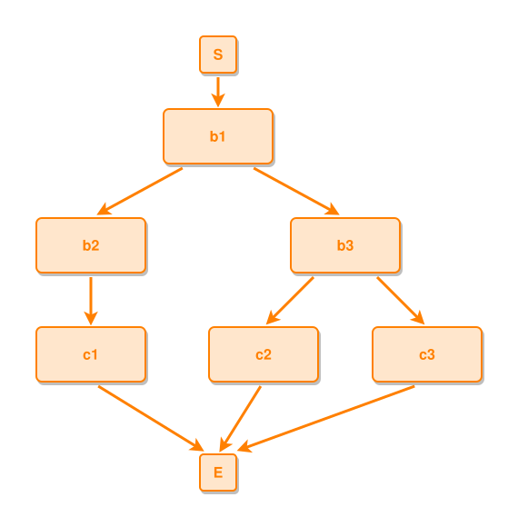

<!-- AUTO-GENERATED FILE - DO NOT EDIT -->
<!-- Generated by: gen-test-md -->
<!-- Command: go run ./cmd-dev/gen-test-md -->

# start-boundary-stays-on-the-start-event-over-an-uneven-fan

> **⚠️ Warning:** This file is auto-generated. Manual changes will be lost when tests are regenerated.

**Source:** gl:docs/dev/layout-gen/layout-alg.md#L539-L542 | [docs/dev/layout-gen/layout-alg.md](../../docs/dev/layout-gen/layout-alg.md#start-boundary-stays-on-the-start-event-over-an-uneven-fan)

## ipmt Content

```ipmt
b1 ::e --> b2 ::e, b3 ::e
b2 --> c1 ::e
b3 --> c2 ::e, c3 ::e
```

## Generated Files

- [start-boundary-stays-on-the-start-event-over-an-uneven-fan.ipmt](start-boundary-stays-on-the-start-event-over-an-uneven-fan.ipmt) - ipmt input
- [start-boundary-stays-on-the-start-event-over-an-uneven-fan.json](start-boundary-stays-on-the-start-event-over-an-uneven-fan.json) - Parsed structure
- [start-boundary-stays-on-the-start-event-over-an-uneven-fan.layout.json](start-boundary-stays-on-the-start-event-over-an-uneven-fan.layout.json) - Layout coordinates
- [start-boundary-stays-on-the-start-event-over-an-uneven-fan.ipm.svg](start-boundary-stays-on-the-start-event-over-an-uneven-fan.ipm.svg) - Rendered diagram

## Layout Validation Rules

Test line: 539

✅ All 9 rules passed

- ✓ [Line 53](gl:docs/dev/layout-gen/layout-alg.md#L53): `each edge has max-bends=0` ([edges-run-straight-by-default.dsl](../layout-gen-rules/edges-run-straight-by-default.dsl))
- ✓ [Line 82](gl:docs/dev/layout-gen/layout-alg.md#L82): `type=event has width=120` ([one-event.dsl](../layout-gen-rules/one-event.dsl))
- ✓ [Line 83](gl:docs/dev/layout-gen/layout-alg.md#L83): `type=event has min-gap-to-others>=10` ([one-event-02.dsl](../layout-gen-rules/one-event-02.dsl))
- ✓ [Line 84](gl:docs/dev/layout-gen/layout-alg.md#L84): `type=boundary has size=40x40` ([one-event-03.dsl](../layout-gen-rules/one-event-03.dsl))
- ✓ [Line 559](gl:docs/dev/layout-gen/layout-alg.md#L559): `#S,#b1,#E have same center-x` ([start-boundary-stays-on-the-start-event-over-an-uneven-fan.dsl](../layout-gen-rules/start-boundary-stays-on-the-start-event-over-an-uneven-fan.dsl))
- ✓ [Line 560](gl:docs/dev/layout-gen/layout-alg.md#L560): `#b1 is horizontally-centered-between #b2,#b3` ([start-boundary-stays-on-the-start-event-over-an-uneven-fan-02.dsl](../layout-gen-rules/start-boundary-stays-on-the-start-event-over-an-uneven-fan-02.dsl))
- ✓ [Line 561](gl:docs/dev/layout-gen/layout-alg.md#L561): `#c1,#c2,#c3 have same y` ([start-boundary-stays-on-the-start-event-over-an-uneven-fan-03.dsl](../layout-gen-rules/start-boundary-stays-on-the-start-event-over-an-uneven-fan-03.dsl))
- ✓ [Line 562](gl:docs/dev/layout-gen/layout-alg.md#L562): `#b2,#c1 have same center-x` ([start-boundary-stays-on-the-start-event-over-an-uneven-fan-04.dsl](../layout-gen-rules/start-boundary-stays-on-the-start-event-over-an-uneven-fan-04.dsl))
- ✓ [Line 563](gl:docs/dev/layout-gen/layout-alg.md#L563): `#b3 is horizontally-centered-between #c2,#c3` ([start-boundary-stays-on-the-start-event-over-an-uneven-fan-05.dsl](../layout-gen-rules/start-boundary-stays-on-the-start-event-over-an-uneven-fan-05.dsl))

## Rendered Diagram



This test case was automatically generated from the specification document.

The ipmt code block was extracted using [sync-test-cases](../../docs/dev/testing.md) and saved to [start-boundary-stays-on-the-start-event-over-an-uneven-fan.ipmt](start-boundary-stays-on-the-start-event-over-an-uneven-fan.ipmt), then parsed into the [JSON structure](start-boundary-stays-on-the-start-event-over-an-uneven-fan.json) and laid out into [layout coordinates](start-boundary-stays-on-the-start-event-over-an-uneven-fan.layout.json). The [SVG diagram](start-boundary-stays-on-the-start-event-over-an-uneven-fan.ipm.svg) was rendered using [ipmsvg-gen](../../docs/ipmsvg-gen.md).
