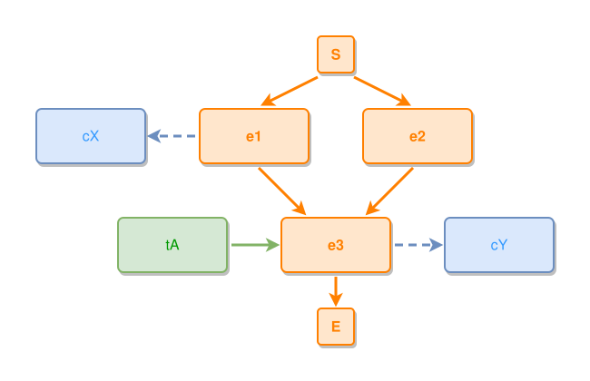

<!-- AUTO-GENERATED FILE - DO NOT EDIT -->
<!-- Generated by: gen-test-md -->
<!-- Command: go run ./cmd-dev/gen-test-md -->

# start-events-with-side-aux-stay-one-gap-apart

> **⚠️ Warning:** This file is auto-generated. Manual changes will be lost when tests are regenerated.

**Source:** gl:docs/dev/layout-gen/layout-alg.md#L2345-L2353 | [docs/dev/layout-gen/layout-alg.md](../../docs/dev/layout-gen/layout-alg.md#start-events-with-side-aux-stay-one-gap-apart)

## ipmt Content

```ipmt
e1 ::e
e2 ::e
e3 ::e
e1 --> e3
e2 --> e3
e1 --::X--> cX ::c
e3 --::X--> cY ::c
e3 <--::P-- tA ::t
```

## Generated Files

- [start-events-with-side-aux-stay-one-gap-apart.ipmt](start-events-with-side-aux-stay-one-gap-apart.ipmt) - ipmt input
- [start-events-with-side-aux-stay-one-gap-apart.json](start-events-with-side-aux-stay-one-gap-apart.json) - Parsed structure
- [start-events-with-side-aux-stay-one-gap-apart.layout.json](start-events-with-side-aux-stay-one-gap-apart.layout.json) - Layout coordinates
- [start-events-with-side-aux-stay-one-gap-apart.ipm.svg](start-events-with-side-aux-stay-one-gap-apart.ipm.svg) - Rendered diagram

## Layout Validation Rules

Test line: 2345

✅ All 5 rules passed

- ✓ [Line 53](gl:docs/dev/layout-gen/layout-alg.md#L53): `each edge has max-bends=0` ([edges-run-straight-by-default.dsl](../layout-gen-rules/edges-run-straight-by-default.dsl))
- ✓ [Line 2367](gl:docs/dev/layout-gen/layout-alg.md#L2367): `#e1,#e2 have same y` ([start-events-with-side-aux-stay-one-gap-apart.dsl](../layout-gen-rules/start-events-with-side-aux-stay-one-gap-apart.dsl))
- ✓ [Line 2368](gl:docs/dev/layout-gen/layout-alg.md#L2368): `#e2 is right-of #e1 with gap=60` ([start-events-with-side-aux-stay-one-gap-apart-02.dsl](../layout-gen-rules/start-events-with-side-aux-stay-one-gap-apart-02.dsl))
- ✓ [Line 2369](gl:docs/dev/layout-gen/layout-alg.md#L2369): `#e3 is horizontally-centered-between #e1,#e2` ([start-events-with-side-aux-stay-one-gap-apart-03.dsl](../layout-gen-rules/start-events-with-side-aux-stay-one-gap-apart-03.dsl))
- ✓ [Line 2370](gl:docs/dev/layout-gen/layout-alg.md#L2370): `#cX is left-of #e1 with gap=60` ([start-events-with-side-aux-stay-one-gap-apart-04.dsl](../layout-gen-rules/start-events-with-side-aux-stay-one-gap-apart-04.dsl))

## Rendered Diagram



This test case was automatically generated from the specification document.

The ipmt code block was extracted using [sync-test-cases](../../docs/dev/testing.md) and saved to [start-events-with-side-aux-stay-one-gap-apart.ipmt](start-events-with-side-aux-stay-one-gap-apart.ipmt), then parsed into the [JSON structure](start-events-with-side-aux-stay-one-gap-apart.json) and laid out into [layout coordinates](start-events-with-side-aux-stay-one-gap-apart.layout.json). The [SVG diagram](start-events-with-side-aux-stay-one-gap-apart.ipm.svg) was rendered using [ipmsvg-gen](../../docs/ipmsvg-gen.md).
