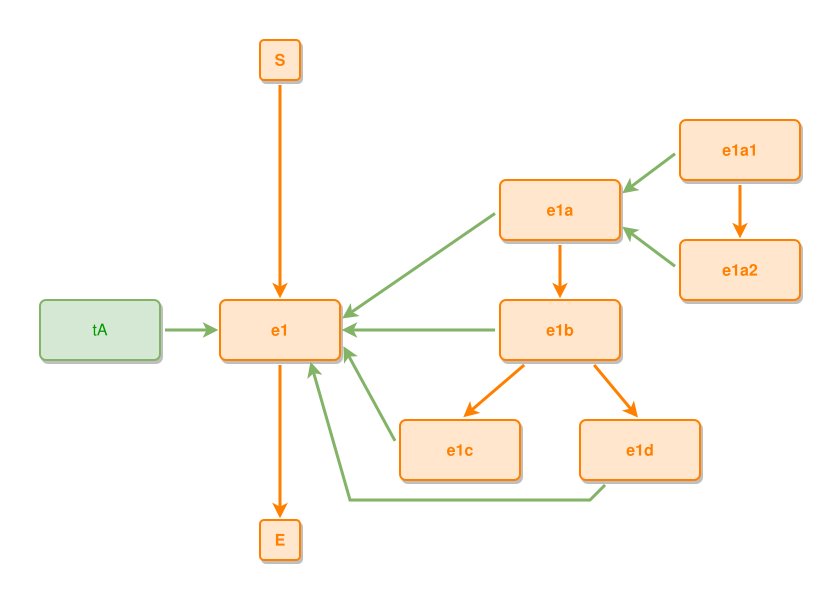

<!-- AUTO-GENERATED FILE - DO NOT EDIT -->
<!-- Generated by: gen-test-md -->
<!-- Command: go run ./cmd-dev/gen-test-md -->

# sub-event-phases-fork-inside-the-composite

> **⚠️ Warning:** This file is auto-generated. Manual changes will be lost when tests are regenerated.

**Source:** gl:docs/dev/layout-gen/layout-alg.md#L1028-L1040 | [docs/dev/layout-gen/layout-alg.md](../../docs/dev/layout-gen/layout-alg.md#sub-event-phases-fork-inside-the-composite)

## ipmt Content

```ipmt
e1 ::e
tA --> e1
e1a ::e --::P--> e1
e1b ::e --::P--> e1
e1c ::e --::P--> e1
e1d ::e --::P--> e1
e1a --> e1b
e1b --> e1c
e1b --> e1d
e1a1 ::e --::P--> e1a
e1a2 ::e --::P--> e1a
e1a1 --> e1a2
```

## Generated Files

- [sub-event-phases-fork-inside-the-composite.ipmt](sub-event-phases-fork-inside-the-composite.ipmt) - ipmt input
- [sub-event-phases-fork-inside-the-composite.json](sub-event-phases-fork-inside-the-composite.json) - Parsed structure
- [sub-event-phases-fork-inside-the-composite.layout.json](sub-event-phases-fork-inside-the-composite.layout.json) - Layout coordinates
- [sub-event-phases-fork-inside-the-composite.ipm.svg](sub-event-phases-fork-inside-the-composite.ipm.svg) - Rendered diagram

## Layout Validation Rules

Test line: 1028

⚠️ 17/18 rules passed

- ✗ [Line 53](gl:docs/dev/layout-gen/layout-alg.md#L53): `each edge has max-bends=0` - **edge e1d->e1 has 2 bends > max-bends 0 (each-edge default; if the detour is intended, add it to `except` and pin it with `edge #e1d,#e1 has max-bends=2`)** ([edges-run-straight-by-default.dsl](../layout-gen-rules/edges-run-straight-by-default.dsl))
- ✓ [Line 82](gl:docs/dev/layout-gen/layout-alg.md#L82): `type=event has width=120` ([one-event.dsl](../layout-gen-rules/one-event.dsl))
- ✓ [Line 83](gl:docs/dev/layout-gen/layout-alg.md#L83): `type=event has min-gap-to-others>=10` ([one-event-02.dsl](../layout-gen-rules/one-event-02.dsl))
- ✓ [Line 84](gl:docs/dev/layout-gen/layout-alg.md#L84): `type=boundary has size=40x40` ([one-event-03.dsl](../layout-gen-rules/one-event-03.dsl))
- ✓ [Line 1054](gl:docs/dev/layout-gen/layout-alg.md#L1054): `each edge has max-bends=0 except #e1d,#e1` ([sub-event-phases-fork-inside-the-composite.dsl](../layout-gen-rules/sub-event-phases-fork-inside-the-composite.dsl))
- ✓ [Line 1055](gl:docs/dev/layout-gen/layout-alg.md#L1055): `edge #e1d,#e1 has max-bends=2` ([sub-event-phases-fork-inside-the-composite-02.dsl](../layout-gen-rules/sub-event-phases-fork-inside-the-composite-02.dsl))
- ✓ [Line 1056](gl:docs/dev/layout-gen/layout-alg.md#L1056): `#e1c,#e1d have same y` ([sub-event-phases-fork-inside-the-composite-03.dsl](../layout-gen-rules/sub-event-phases-fork-inside-the-composite-03.dsl))
- ✓ [Line 1057](gl:docs/dev/layout-gen/layout-alg.md#L1057): `#e1d is right-of #e1c with gap=60` ([sub-event-phases-fork-inside-the-composite-04.dsl](../layout-gen-rules/sub-event-phases-fork-inside-the-composite-04.dsl))
- ✓ [Line 1058](gl:docs/dev/layout-gen/layout-alg.md#L1058): `#e1b is horizontally-centered-between #e1c,#e1d` ([sub-event-phases-fork-inside-the-composite-05.dsl](../layout-gen-rules/sub-event-phases-fork-inside-the-composite-05.dsl))
- ✓ [Line 1059](gl:docs/dev/layout-gen/layout-alg.md#L1059): `#e1a,#e1b have same center-x` ([sub-event-phases-fork-inside-the-composite-06.dsl](../layout-gen-rules/sub-event-phases-fork-inside-the-composite-06.dsl))
- ✓ [Line 1060](gl:docs/dev/layout-gen/layout-alg.md#L1060): `#e1b is below #e1a with gap=60` ([sub-event-phases-fork-inside-the-composite-07.dsl](../layout-gen-rules/sub-event-phases-fork-inside-the-composite-07.dsl))
- ✓ [Line 1061](gl:docs/dev/layout-gen/layout-alg.md#L1061): `#e1c is below #e1b with gap=60` ([sub-event-phases-fork-inside-the-composite-08.dsl](../layout-gen-rules/sub-event-phases-fork-inside-the-composite-08.dsl))
- ✓ [Line 1062](gl:docs/dev/layout-gen/layout-alg.md#L1062): `#e1a1 is right-of #e1a with gap=60` ([sub-event-phases-fork-inside-the-composite-09.dsl](../layout-gen-rules/sub-event-phases-fork-inside-the-composite-09.dsl))
- ✓ [Line 1063](gl:docs/dev/layout-gen/layout-alg.md#L1063): `#e1a1,#e1a2 have same center-x` ([sub-event-phases-fork-inside-the-composite-10.dsl](../layout-gen-rules/sub-event-phases-fork-inside-the-composite-10.dsl))
- ✓ [Line 1064](gl:docs/dev/layout-gen/layout-alg.md#L1064): `#e1a2 is below #e1a1 with gap=60` ([sub-event-phases-fork-inside-the-composite-11.dsl](../layout-gen-rules/sub-event-phases-fork-inside-the-composite-11.dsl))
- ✓ [Line 1065](gl:docs/dev/layout-gen/layout-alg.md#L1065): `#tA is left-of #e1 with gap=60` ([sub-event-phases-fork-inside-the-composite-12.dsl](../layout-gen-rules/sub-event-phases-fork-inside-the-composite-12.dsl))
- ✓ [Line 1066](gl:docs/dev/layout-gen/layout-alg.md#L1066): `edge #e1b,#e1c has visibility=visible` ([sub-event-phases-fork-inside-the-composite-13.dsl](../layout-gen-rules/sub-event-phases-fork-inside-the-composite-13.dsl))
- ✓ [Line 1067](gl:docs/dev/layout-gen/layout-alg.md#L1067): `edge #e1b,#e1d has visibility=visible` ([sub-event-phases-fork-inside-the-composite-14.dsl](../layout-gen-rules/sub-event-phases-fork-inside-the-composite-14.dsl))

## Rendered Diagram



This test case was automatically generated from the specification document.

The ipmt code block was extracted using [sync-test-cases](../../docs/dev/testing.md) and saved to [sub-event-phases-fork-inside-the-composite.ipmt](sub-event-phases-fork-inside-the-composite.ipmt), then parsed into the [JSON structure](sub-event-phases-fork-inside-the-composite.json) and laid out into [layout coordinates](sub-event-phases-fork-inside-the-composite.layout.json). The [SVG diagram](sub-event-phases-fork-inside-the-composite.ipm.svg) was rendered using [ipmsvg-gen](../../docs/ipmsvg-gen.md).
