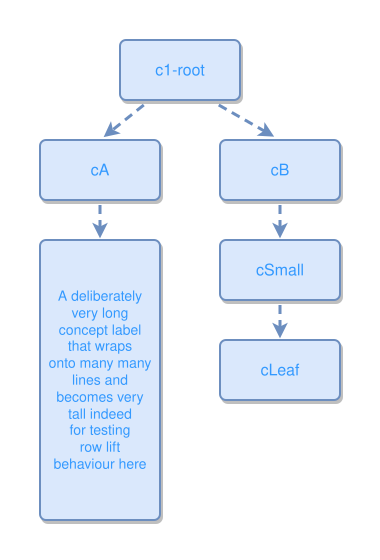

<!-- AUTO-GENERATED FILE - DO NOT EDIT -->
<!-- Generated by: gen-test-md -->
<!-- Command: go run ./cmd-dev/gen-test-md -->

# tall-concept-in-one-column-does-not-inflate-another

> **⚠️ Warning:** This file is auto-generated. Manual changes will be lost when tests are regenerated.

**Source:** gl:docs/dev/layout-gen/layout-alg.md#L1995-L2000 | [docs/dev/layout-gen/layout-alg.md](../../docs/dev/layout-gen/layout-alg.md#tall-concept-in-one-column-does-not-inflate-another)

## ipmt Content

```ipmt
c1-root ::c --> cA ::c
c1-root --> cB ::c
cA --> A deliberately very long concept label that wraps onto many many lines and becomes very tall indeed for testing row lift behaviour here tl::a ::c
cB --> cSmall ::c
cSmall --> cLeaf ::c
```

## Generated Files

- [tall-concept-in-one-column-does-not-inflate-another.ipmt](tall-concept-in-one-column-does-not-inflate-another.ipmt) - ipmt input
- [tall-concept-in-one-column-does-not-inflate-another.json](tall-concept-in-one-column-does-not-inflate-another.json) - Parsed structure
- [tall-concept-in-one-column-does-not-inflate-another.layout.json](tall-concept-in-one-column-does-not-inflate-another.layout.json) - Layout coordinates
- [tall-concept-in-one-column-does-not-inflate-another.ipm.svg](tall-concept-in-one-column-does-not-inflate-another.ipm.svg) - Rendered diagram

## Layout Validation Rules

Test line: 1995

✅ All 5 rules passed

- ✓ [Line 53](gl:docs/dev/layout-gen/layout-alg.md#L53): `each edge has max-bends=0` ([edges-run-straight-by-default.dsl](../layout-gen-rules/edges-run-straight-by-default.dsl))
- ✓ [Line 2010](gl:docs/dev/layout-gen/layout-alg.md#L2010): `type=concept text-len>72 has height>=140` ([tall-concept-in-one-column-does-not-inflate-another.dsl](../layout-gen-rules/tall-concept-in-one-column-does-not-inflate-another.dsl))
- ✓ [Line 2011](gl:docs/dev/layout-gen/layout-alg.md#L2011): `#tl is below #cA with gap=40` ([tall-concept-in-one-column-does-not-inflate-another-02.dsl](../layout-gen-rules/tall-concept-in-one-column-does-not-inflate-another-02.dsl))
- ✓ [Line 2012](gl:docs/dev/layout-gen/layout-alg.md#L2012): `#cLeaf is below #cSmall with gap=40` ([tall-concept-in-one-column-does-not-inflate-another-03.dsl](../layout-gen-rules/tall-concept-in-one-column-does-not-inflate-another-03.dsl))
- ✓ [Line 2013](gl:docs/dev/layout-gen/layout-alg.md#L2013): `#cB,#cSmall,#cLeaf have same center-x` ([tall-concept-in-one-column-does-not-inflate-another-04.dsl](../layout-gen-rules/tall-concept-in-one-column-does-not-inflate-another-04.dsl))

## Rendered Diagram



This test case was automatically generated from the specification document.

The ipmt code block was extracted using [sync-test-cases](../../docs/dev/testing.md) and saved to [tall-concept-in-one-column-does-not-inflate-another.ipmt](tall-concept-in-one-column-does-not-inflate-another.ipmt), then parsed into the [JSON structure](tall-concept-in-one-column-does-not-inflate-another.json) and laid out into [layout coordinates](tall-concept-in-one-column-does-not-inflate-another.layout.json). The [SVG diagram](tall-concept-in-one-column-does-not-inflate-another.ipm.svg) was rendered using [ipmsvg-gen](../../docs/ipmsvg-gen.md).
