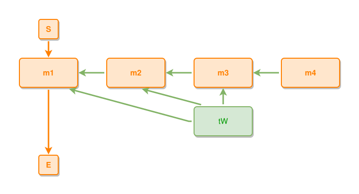

<!-- AUTO-GENERATED FILE - DO NOT EDIT -->
<!-- Generated by: gen-test-md -->
<!-- Command: go run ./cmd-dev/gen-test-md -->

# thing-connected-to-three-layers

> **⚠️ Warning:** This file is auto-generated. Manual changes will be lost when tests are regenerated.

**Source:** gl:docs/dev/layout-gen/layout-alg.md#L1401-L1407 | [docs/dev/layout-gen/layout-alg.md](../../docs/dev/layout-gen/layout-alg.md#thing-connected-to-three-layers)

## ipmt Content

```ipmt
m2 ::e --::P--> m1 ::e
m3 ::e --::P--> m2
m4 ::e --::P--> m3
tW ::t --> m1
tW --> m2
tW --> m3
```

## Generated Files

- [thing-connected-to-three-layers.ipmt](thing-connected-to-three-layers.ipmt) - ipmt input
- [thing-connected-to-three-layers.json](thing-connected-to-three-layers.json) - Parsed structure
- [thing-connected-to-three-layers.layout.json](thing-connected-to-three-layers.layout.json) - Layout coordinates
- [thing-connected-to-three-layers.ipm.svg](thing-connected-to-three-layers.ipm.svg) - Rendered diagram

## Layout Validation Rules

Test line: 1401

⚠️ 11/12 rules passed

- ✗ [Line 53](gl:docs/dev/layout-gen/layout-alg.md#L53): `each edge has max-bends=0` - **edge tW->m1 has 1 bends > max-bends 0 (each-edge default; if the detour is intended, add it to `except` and pin it with `edge #tW,#m1 has max-bends=1`)** ([edges-run-straight-by-default.dsl](../layout-gen-rules/edges-run-straight-by-default.dsl))
- ✓ [Line 1421](gl:docs/dev/layout-gen/layout-alg.md#L1421): `each edge has max-bends=0 except #tW,#m1` ([thing-connected-to-three-layers.dsl](../layout-gen-rules/thing-connected-to-three-layers.dsl))
- ✓ [Line 1422](gl:docs/dev/layout-gen/layout-alg.md#L1422): `edge #tW,#m1 has max-bends=1` ([thing-connected-to-three-layers-02.dsl](../layout-gen-rules/thing-connected-to-three-layers-02.dsl))
- ✓ [Line 1423](gl:docs/dev/layout-gen/layout-alg.md#L1423): `#m1,#m2,#m3,#m4 have same y` ([thing-connected-to-three-layers-03.dsl](../layout-gen-rules/thing-connected-to-three-layers-03.dsl))
- ✓ [Line 1424](gl:docs/dev/layout-gen/layout-alg.md#L1424): `#tW,#m3 have same center-x` ([thing-connected-to-three-layers-04.dsl](../layout-gen-rules/thing-connected-to-three-layers-04.dsl))
- ✓ [Line 1425](gl:docs/dev/layout-gen/layout-alg.md#L1425): `#tW is below #m3 with gap=40` ([thing-connected-to-three-layers-05.dsl](../layout-gen-rules/thing-connected-to-three-layers-05.dsl))
- ✓ [Line 1426](gl:docs/dev/layout-gen/layout-alg.md#L1426): `edge #tW,#m1 has visibility=visible` ([thing-connected-to-three-layers-06.dsl](../layout-gen-rules/thing-connected-to-three-layers-06.dsl))
- ✓ [Line 1427](gl:docs/dev/layout-gen/layout-alg.md#L1427): `edge #tW,#m2 has target-side=bottom` ([thing-connected-to-three-layers-07.dsl](../layout-gen-rules/thing-connected-to-three-layers-07.dsl))
- ✓ [Line 1428](gl:docs/dev/layout-gen/layout-alg.md#L1428): `edge #tW,#m3 has target-side=bottom` ([thing-connected-to-three-layers-08.dsl](../layout-gen-rules/thing-connected-to-three-layers-08.dsl))
- ✓ [Line 1429](gl:docs/dev/layout-gen/layout-alg.md#L1429): `edge #tW,#m2 has visibility=visible` ([thing-connected-to-three-layers-09.dsl](../layout-gen-rules/thing-connected-to-three-layers-09.dsl))
- ✓ [Line 1430](gl:docs/dev/layout-gen/layout-alg.md#L1430): `#S is above #m1 with gap=40` ([thing-connected-to-three-layers-10.dsl](../layout-gen-rules/thing-connected-to-three-layers-10.dsl))
- ✓ [Line 1431](gl:docs/dev/layout-gen/layout-alg.md#L1431): `#E is below #tW with gap=40` ([thing-connected-to-three-layers-11.dsl](../layout-gen-rules/thing-connected-to-three-layers-11.dsl))

## Rendered Diagram



This test case was automatically generated from the specification document.

The ipmt code block was extracted using [sync-test-cases](../../docs/dev/testing.md) and saved to [thing-connected-to-three-layers.ipmt](thing-connected-to-three-layers.ipmt), then parsed into the [JSON structure](thing-connected-to-three-layers.json) and laid out into [layout coordinates](thing-connected-to-three-layers.layout.json). The [SVG diagram](thing-connected-to-three-layers.ipm.svg) was rendered using [ipmsvg-gen](../../docs/ipmsvg-gen.md).
