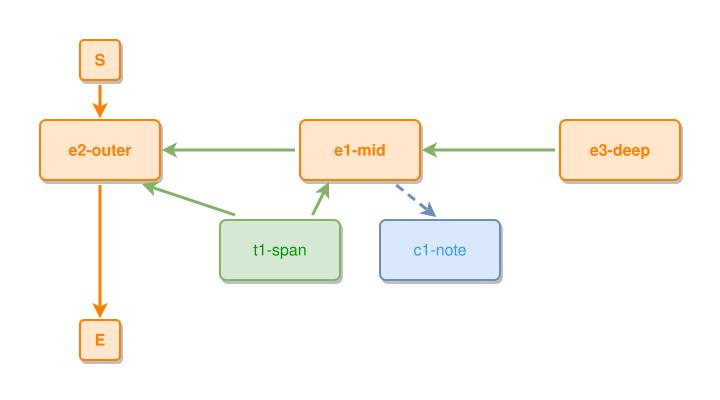

<!-- AUTO-GENERATED FILE - DO NOT EDIT -->
<!-- Generated by: gen-test-md -->
<!-- Command: go run ./cmd-dev/gen-test-md -->

# thing-connected-to-two-layers

> **⚠️ Warning:** This file is auto-generated. Manual changes will be lost when tests are regenerated.

**Source:** gl:docs/dev/layout-gen/layout-alg.md#L1359-L1364 | [docs/dev/layout-gen/layout-alg.md](../../docs/dev/layout-gen/layout-alg.md#thing-connected-to-two-layers)

## ipmt Content

```ipmt
e1-mid ::e --::P--> e2-outer ::e
e3-deep ::e --::P--> e1-mid
t1-span ::t --> e2-outer
t1-span --> e1-mid
e1-mid --> c1-note ::c
```

## Generated Files

- [thing-connected-to-two-layers.ipmt](thing-connected-to-two-layers.ipmt) - ipmt input
- [thing-connected-to-two-layers.json](thing-connected-to-two-layers.json) - Parsed structure
- [thing-connected-to-two-layers.layout.json](thing-connected-to-two-layers.layout.json) - Layout coordinates
- [thing-connected-to-two-layers.ipm.svg](thing-connected-to-two-layers.ipm.svg) - Rendered diagram

## Layout Validation Rules

Test line: 1359

✅ All 15 rules passed

- ✓ [Line 53](gl:docs/dev/layout-gen/layout-alg.md#L53): `each edge has max-bends=0` ([edges-run-straight-by-default.dsl](../layout-gen-rules/edges-run-straight-by-default.dsl))
- ✓ [Line 1382](gl:docs/dev/layout-gen/layout-alg.md#L1382): `each edge has max-bends=0` ([thing-connected-to-two-layers.dsl](../layout-gen-rules/thing-connected-to-two-layers.dsl))
- ✓ [Line 1383](gl:docs/dev/layout-gen/layout-alg.md#L1383): `#e2-outer,#e1-mid,#e3-deep have same y` ([thing-connected-to-two-layers-02.dsl](../layout-gen-rules/thing-connected-to-two-layers-02.dsl))
- ✓ [Line 1384](gl:docs/dev/layout-gen/layout-alg.md#L1384): `#t1-span,#c1-note have same y` ([thing-connected-to-two-layers-03.dsl](../layout-gen-rules/thing-connected-to-two-layers-03.dsl))
- ✓ [Line 1385](gl:docs/dev/layout-gen/layout-alg.md#L1385): `#t1-span is below #e1-mid with gap=40` ([thing-connected-to-two-layers-04.dsl](../layout-gen-rules/thing-connected-to-two-layers-04.dsl))
- ✓ [Line 1386](gl:docs/dev/layout-gen/layout-alg.md#L1386): `#t1-span is left-of #c1-note with gap=40` ([thing-connected-to-two-layers-05.dsl](../layout-gen-rules/thing-connected-to-two-layers-05.dsl))
- ✓ [Line 1387](gl:docs/dev/layout-gen/layout-alg.md#L1387): `#e1-mid is horizontally-centered-between #t1-span,#c1-note` ([thing-connected-to-two-layers-06.dsl](../layout-gen-rules/thing-connected-to-two-layers-06.dsl))
- ✓ [Line 1388](gl:docs/dev/layout-gen/layout-alg.md#L1388): `edge #t1-span,#e2-outer has visibility=visible` ([thing-connected-to-two-layers-07.dsl](../layout-gen-rules/thing-connected-to-two-layers-07.dsl))
- ✓ [Line 1389](gl:docs/dev/layout-gen/layout-alg.md#L1389): `edge #t1-span,#e1-mid has visibility=visible` ([thing-connected-to-two-layers-08.dsl](../layout-gen-rules/thing-connected-to-two-layers-08.dsl))
- ✓ [Line 1390](gl:docs/dev/layout-gen/layout-alg.md#L1390): `edge #t1-span,#e2-outer has source-side=top` ([thing-connected-to-two-layers-09.dsl](../layout-gen-rules/thing-connected-to-two-layers-09.dsl))
- ✓ [Line 1391](gl:docs/dev/layout-gen/layout-alg.md#L1391): `edge #t1-span,#e1-mid has source-side=top` ([thing-connected-to-two-layers-10.dsl](../layout-gen-rules/thing-connected-to-two-layers-10.dsl))
- ✓ [Line 1392](gl:docs/dev/layout-gen/layout-alg.md#L1392): `edge #t1-span,#e2-outer has target-side=bottom` ([thing-connected-to-two-layers-11.dsl](../layout-gen-rules/thing-connected-to-two-layers-11.dsl))
- ✓ [Line 1393](gl:docs/dev/layout-gen/layout-alg.md#L1393): `edge #t1-span,#e1-mid has target-side=bottom` ([thing-connected-to-two-layers-12.dsl](../layout-gen-rules/thing-connected-to-two-layers-12.dsl))
- ✓ [Line 1394](gl:docs/dev/layout-gen/layout-alg.md#L1394): `#S is above #e2-outer with gap=40` ([thing-connected-to-two-layers-13.dsl](../layout-gen-rules/thing-connected-to-two-layers-13.dsl))
- ✓ [Line 1395](gl:docs/dev/layout-gen/layout-alg.md#L1395): `#E is below #t1-span with gap=40` ([thing-connected-to-two-layers-14.dsl](../layout-gen-rules/thing-connected-to-two-layers-14.dsl))

## Rendered Diagram



This test case was automatically generated from the specification document.

The ipmt code block was extracted using [sync-test-cases](../../docs/dev/testing.md) and saved to [thing-connected-to-two-layers.ipmt](thing-connected-to-two-layers.ipmt), then parsed into the [JSON structure](thing-connected-to-two-layers.json) and laid out into [layout coordinates](thing-connected-to-two-layers.layout.json). The [SVG diagram](thing-connected-to-two-layers.ipm.svg) was rendered using [ipmsvg-gen](../../docs/ipmsvg-gen.md).
