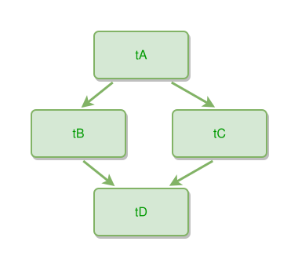

<!-- AUTO-GENERATED FILE - DO NOT EDIT -->
<!-- Generated by: gen-test-md -->
<!-- Command: go run ./cmd-dev/gen-test-md -->

# thing-hierarchy-diamond-pattern

> **⚠️ Warning:** This file is auto-generated. Manual changes will be lost when tests are regenerated.

**Source:** gl:docs/dev/layout-gen/layout-alg.md#L1622-L1626 | [docs/dev/layout-gen/layout-alg.md](../../docs/dev/layout-gen/layout-alg.md#thing-hierarchy-diamond-pattern)

## ipmt Content

```ipmt
tA --> tB
tA --> tC
tB --> tD
tC --> tD
```

## Generated Files

- [thing-hierarchy-diamond-pattern.ipmt](thing-hierarchy-diamond-pattern.ipmt) - ipmt input
- [thing-hierarchy-diamond-pattern.json](thing-hierarchy-diamond-pattern.json) - Parsed structure
- [thing-hierarchy-diamond-pattern.layout.json](thing-hierarchy-diamond-pattern.layout.json) - Layout coordinates
- [thing-hierarchy-diamond-pattern.ipm.svg](thing-hierarchy-diamond-pattern.ipm.svg) - Rendered diagram

## Layout Validation Rules

Test line: 1622

✅ All 5 rules passed

- ✓ [Line 53](gl:docs/dev/layout-gen/layout-alg.md#L53): `each edge has max-bends=0` ([edges-run-straight-by-default.dsl](../layout-gen-rules/edges-run-straight-by-default.dsl))
- ✓ [Line 1638](gl:docs/dev/layout-gen/layout-alg.md#L1638): `#tB,#tC have same y` ([thing-hierarchy-diamond-pattern.dsl](../layout-gen-rules/thing-hierarchy-diamond-pattern.dsl))
- ✓ [Line 1639](gl:docs/dev/layout-gen/layout-alg.md#L1639): `#tD is below #tB with gap=40` ([thing-hierarchy-diamond-pattern-02.dsl](../layout-gen-rules/thing-hierarchy-diamond-pattern-02.dsl))
- ✓ [Line 1640](gl:docs/dev/layout-gen/layout-alg.md#L1640): `#tA is above #tB with gap=40` ([thing-hierarchy-diamond-pattern-03.dsl](../layout-gen-rules/thing-hierarchy-diamond-pattern-03.dsl))
- ✓ [Line 1641](gl:docs/dev/layout-gen/layout-alg.md#L1641): `#tA,#tD have same center-x` ([thing-hierarchy-diamond-pattern-04.dsl](../layout-gen-rules/thing-hierarchy-diamond-pattern-04.dsl))

## Rendered Diagram



This test case was automatically generated from the specification document.

The ipmt code block was extracted using [sync-test-cases](../../docs/dev/testing.md) and saved to [thing-hierarchy-diamond-pattern.ipmt](thing-hierarchy-diamond-pattern.ipmt), then parsed into the [JSON structure](thing-hierarchy-diamond-pattern.json) and laid out into [layout coordinates](thing-hierarchy-diamond-pattern.layout.json). The [SVG diagram](thing-hierarchy-diamond-pattern.ipm.svg) was rendered using [ipmsvg-gen](../../docs/ipmsvg-gen.md).
