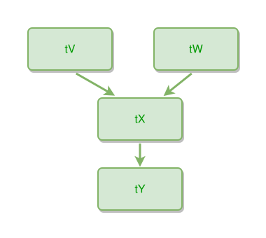

<!-- AUTO-GENERATED FILE - DO NOT EDIT -->
<!-- Generated by: gen-test-md -->
<!-- Command: go run ./cmd-dev/gen-test-md -->

# thing-hierarchy-multiple-roots

> **⚠️ Warning:** This file is auto-generated. Manual changes will be lost when tests are regenerated.

**Source:** gl:docs/dev/layout-gen/layout-alg.md#L1557-L1560 | [docs/dev/layout-gen/layout-alg.md](../../docs/dev/layout-gen/layout-alg.md#thing-hierarchy-multiple-roots)

## ipmt Content

```ipmt
tV --> tX
tW --> tX
tX --> tY
```

## Generated Files

- [thing-hierarchy-multiple-roots.ipmt](thing-hierarchy-multiple-roots.ipmt) - ipmt input
- [thing-hierarchy-multiple-roots.json](thing-hierarchy-multiple-roots.json) - Parsed structure
- [thing-hierarchy-multiple-roots.layout.json](thing-hierarchy-multiple-roots.layout.json) - Layout coordinates
- [thing-hierarchy-multiple-roots.ipm.svg](thing-hierarchy-multiple-roots.ipm.svg) - Rendered diagram

## Layout Validation Rules

Test line: 1557

✅ All 4 rules passed

- ✓ [Line 53](gl:docs/dev/layout-gen/layout-alg.md#L53): `each edge has max-bends=0` ([edges-run-straight-by-default.dsl](../layout-gen-rules/edges-run-straight-by-default.dsl))
- ✓ [Line 1572](gl:docs/dev/layout-gen/layout-alg.md#L1572): `#tV,#tW have same y` ([thing-hierarchy-multiple-roots.dsl](../layout-gen-rules/thing-hierarchy-multiple-roots.dsl))
- ✓ [Line 1573](gl:docs/dev/layout-gen/layout-alg.md#L1573): `#tX is below #tV with gap=40` ([thing-hierarchy-multiple-roots-02.dsl](../layout-gen-rules/thing-hierarchy-multiple-roots-02.dsl))
- ✓ [Line 1574](gl:docs/dev/layout-gen/layout-alg.md#L1574): `#tY is below #tX with gap=40` ([thing-hierarchy-multiple-roots-03.dsl](../layout-gen-rules/thing-hierarchy-multiple-roots-03.dsl))

## Rendered Diagram



This test case was automatically generated from the specification document.

The ipmt code block was extracted using [sync-test-cases](../../docs/dev/testing.md) and saved to [thing-hierarchy-multiple-roots.ipmt](thing-hierarchy-multiple-roots.ipmt), then parsed into the [JSON structure](thing-hierarchy-multiple-roots.json) and laid out into [layout coordinates](thing-hierarchy-multiple-roots.layout.json). The [SVG diagram](thing-hierarchy-multiple-roots.ipm.svg) was rendered using [ipmsvg-gen](../../docs/ipmsvg-gen.md).
