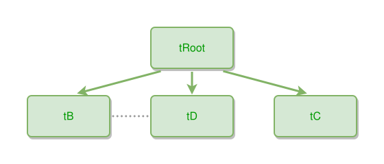

<!-- AUTO-GENERATED FILE - DO NOT EDIT -->
<!-- Generated by: gen-test-md -->
<!-- Command: go run ./cmd-dev/gen-test-md -->

# thing-hierarchy-sibling-near-to-clustering

> **⚠️ Warning:** This file is auto-generated. Manual changes will be lost when tests are regenerated.

**Source:** gl:docs/dev/layout-gen/layout-alg.md#L1735-L1739 | [docs/dev/layout-gen/layout-alg.md](../../docs/dev/layout-gen/layout-alg.md#thing-hierarchy-sibling-near-to-clustering)

## ipmt Content

```ipmt
tRoot --> tB
tRoot --> tC
tRoot --> tD
tB --- tD
```

## Generated Files

- [thing-hierarchy-sibling-near-to-clustering.ipmt](thing-hierarchy-sibling-near-to-clustering.ipmt) - ipmt input
- [thing-hierarchy-sibling-near-to-clustering.json](thing-hierarchy-sibling-near-to-clustering.json) - Parsed structure
- [thing-hierarchy-sibling-near-to-clustering.layout.json](thing-hierarchy-sibling-near-to-clustering.layout.json) - Layout coordinates
- [thing-hierarchy-sibling-near-to-clustering.ipm.svg](thing-hierarchy-sibling-near-to-clustering.ipm.svg) - Rendered diagram

## Layout Validation Rules

Test line: 1735

✅ All 10 rules passed

- ✓ [Line 53](gl:docs/dev/layout-gen/layout-alg.md#L53): `each edge has max-bends=0` ([edges-run-straight-by-default.dsl](../layout-gen-rules/edges-run-straight-by-default.dsl))
- ✓ [Line 1757](gl:docs/dev/layout-gen/layout-alg.md#L1757): `#tB,#tC,#tD have same y` ([thing-hierarchy-sibling-near-to-clustering.dsl](../layout-gen-rules/thing-hierarchy-sibling-near-to-clustering.dsl))
- ✓ [Line 1758](gl:docs/dev/layout-gen/layout-alg.md#L1758): `edge #tRoot,#tB has target-side=top` ([thing-hierarchy-sibling-near-to-clustering-02.dsl](../layout-gen-rules/thing-hierarchy-sibling-near-to-clustering-02.dsl))
- ✓ [Line 1759](gl:docs/dev/layout-gen/layout-alg.md#L1759): `edge #tRoot,#tC has target-side=top` ([thing-hierarchy-sibling-near-to-clustering-03.dsl](../layout-gen-rules/thing-hierarchy-sibling-near-to-clustering-03.dsl))
- ✓ [Line 1760](gl:docs/dev/layout-gen/layout-alg.md#L1760): `edge #tRoot,#tD has target-side=top` ([thing-hierarchy-sibling-near-to-clustering-04.dsl](../layout-gen-rules/thing-hierarchy-sibling-near-to-clustering-04.dsl))
- ✓ [Line 1761](gl:docs/dev/layout-gen/layout-alg.md#L1761): `edge #tB,#tD is horizontal` ([thing-hierarchy-sibling-near-to-clustering-05.dsl](../layout-gen-rules/thing-hierarchy-sibling-near-to-clustering-05.dsl))
- ✓ [Line 1762](gl:docs/dev/layout-gen/layout-alg.md#L1762): `edge #tRoot,#tB does not cross edge #tB,#tD` ([thing-hierarchy-sibling-near-to-clustering-06.dsl](../layout-gen-rules/thing-hierarchy-sibling-near-to-clustering-06.dsl))
- ✓ [Line 1763](gl:docs/dev/layout-gen/layout-alg.md#L1763): `edge #tRoot,#tC does not cross edge #tB,#tD` ([thing-hierarchy-sibling-near-to-clustering-07.dsl](../layout-gen-rules/thing-hierarchy-sibling-near-to-clustering-07.dsl))
- ✓ [Line 1764](gl:docs/dev/layout-gen/layout-alg.md#L1764): `#tD is right-of #tB with gap=60` ([thing-hierarchy-sibling-near-to-clustering-08.dsl](../layout-gen-rules/thing-hierarchy-sibling-near-to-clustering-08.dsl))
- ✓ [Line 1765](gl:docs/dev/layout-gen/layout-alg.md#L1765): `#tC is right-of #tD with gap=60` ([thing-hierarchy-sibling-near-to-clustering-09.dsl](../layout-gen-rules/thing-hierarchy-sibling-near-to-clustering-09.dsl))

## Rendered Diagram



This test case was automatically generated from the specification document.

The ipmt code block was extracted using [sync-test-cases](../../docs/dev/testing.md) and saved to [thing-hierarchy-sibling-near-to-clustering.ipmt](thing-hierarchy-sibling-near-to-clustering.ipmt), then parsed into the [JSON structure](thing-hierarchy-sibling-near-to-clustering.json) and laid out into [layout coordinates](thing-hierarchy-sibling-near-to-clustering.layout.json). The [SVG diagram](thing-hierarchy-sibling-near-to-clustering.ipm.svg) was rendered using [ipmsvg-gen](../../docs/ipmsvg-gen.md).
