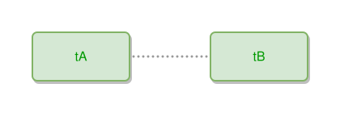

<!-- AUTO-GENERATED FILE - DO NOT EDIT -->
<!-- Generated by: gen-test-md -->
<!-- Command: go run ./cmd-dev/gen-test-md -->

# thing-near-to-thing

> **⚠️ Warning:** This file is auto-generated. Manual changes will be lost when tests are regenerated.

**Source:** gl:docs/dev/layout-gen/layout-alg.md#L2129-L2130 | [docs/dev/layout-gen/layout-alg.md](../../docs/dev/layout-gen/layout-alg.md#thing-near-to-thing)

## ipmt Content

```ipmt
tA --- tB
```

## Generated Files

- [thing-near-to-thing.ipmt](thing-near-to-thing.ipmt) - ipmt input
- [thing-near-to-thing.json](thing-near-to-thing.json) - Parsed structure
- [thing-near-to-thing.layout.json](thing-near-to-thing.layout.json) - Layout coordinates
- [thing-near-to-thing.ipm.svg](thing-near-to-thing.ipm.svg) - Rendered diagram

## Layout Validation Rules

Test line: 2129

✅ All 3 rules passed

- ✓ [Line 53](gl:docs/dev/layout-gen/layout-alg.md#L53): `each edge has max-bends=0` ([edges-run-straight-by-default.dsl](../layout-gen-rules/edges-run-straight-by-default.dsl))
- ✓ [Line 2146](gl:docs/dev/layout-gen/layout-alg.md#L2146): `#tA,#tB have same y` ([thing-near-to-thing.dsl](../layout-gen-rules/thing-near-to-thing.dsl))
- ✓ [Line 2147](gl:docs/dev/layout-gen/layout-alg.md#L2147): `#tB is right-of #tA with gap=100` ([thing-near-to-thing-02.dsl](../layout-gen-rules/thing-near-to-thing-02.dsl))

## Rendered Diagram



This test case was automatically generated from the specification document.

The ipmt code block was extracted using [sync-test-cases](../../docs/dev/testing.md) and saved to [thing-near-to-thing.ipmt](thing-near-to-thing.ipmt), then parsed into the [JSON structure](thing-near-to-thing.json) and laid out into [layout coordinates](thing-near-to-thing.layout.json). The [SVG diagram](thing-near-to-thing.ipm.svg) was rendered using [ipmsvg-gen](../../docs/ipmsvg-gen.md).
