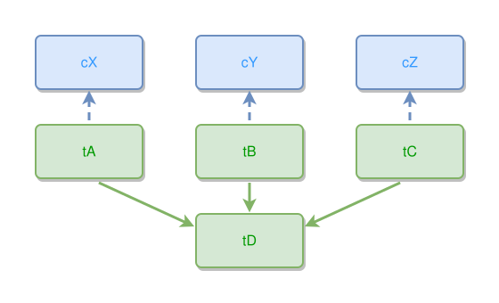

<!-- AUTO-GENERATED FILE - DO NOT EDIT -->
<!-- Generated by: gen-test-md -->
<!-- Command: go run ./cmd-dev/gen-test-md -->

# thing-parts-keep-their-own-concepts-above-the-join

> **⚠️ Warning:** This file is auto-generated. Manual changes will be lost when tests are regenerated.

**Source:** gl:docs/dev/layout-gen/layout-alg.md#L1706-L1710 | [docs/dev/layout-gen/layout-alg.md](../../docs/dev/layout-gen/layout-alg.md#thing-parts-keep-their-own-concepts-above-the-join)

## ipmt Content

```ipmt
tA, tB, tC --> tD
tA --> cX ::c
tB --> cY ::c
tC --> cZ ::c
```

## Generated Files

- [thing-parts-keep-their-own-concepts-above-the-join.ipmt](thing-parts-keep-their-own-concepts-above-the-join.ipmt) - ipmt input
- [thing-parts-keep-their-own-concepts-above-the-join.json](thing-parts-keep-their-own-concepts-above-the-join.json) - Parsed structure
- [thing-parts-keep-their-own-concepts-above-the-join.layout.json](thing-parts-keep-their-own-concepts-above-the-join.layout.json) - Layout coordinates
- [thing-parts-keep-their-own-concepts-above-the-join.ipm.svg](thing-parts-keep-their-own-concepts-above-the-join.ipm.svg) - Rendered diagram

## Layout Validation Rules

Test line: 1706

✅ All 10 rules passed

- ✓ [Line 53](gl:docs/dev/layout-gen/layout-alg.md#L53): `each edge has max-bends=0` ([edges-run-straight-by-default.dsl](../layout-gen-rules/edges-run-straight-by-default.dsl))
- ✓ [Line 1728](gl:docs/dev/layout-gen/layout-alg.md#L1728): `#cX,#cY,#cZ have same y` ([thing-parts-keep-their-own-concepts-above-the-join.dsl](../layout-gen-rules/thing-parts-keep-their-own-concepts-above-the-join.dsl))
- ✓ [Line 1729](gl:docs/dev/layout-gen/layout-alg.md#L1729): `#tA,#tB,#tC have same y` ([thing-parts-keep-their-own-concepts-above-the-join-02.dsl](../layout-gen-rules/thing-parts-keep-their-own-concepts-above-the-join-02.dsl))
- ✓ [Line 1730](gl:docs/dev/layout-gen/layout-alg.md#L1730): `#tA,#cX have same center-x` ([thing-parts-keep-their-own-concepts-above-the-join-03.dsl](../layout-gen-rules/thing-parts-keep-their-own-concepts-above-the-join-03.dsl))
- ✓ [Line 1731](gl:docs/dev/layout-gen/layout-alg.md#L1731): `#tB,#cY have same center-x` ([thing-parts-keep-their-own-concepts-above-the-join-04.dsl](../layout-gen-rules/thing-parts-keep-their-own-concepts-above-the-join-04.dsl))
- ✓ [Line 1732](gl:docs/dev/layout-gen/layout-alg.md#L1732): `#tC,#cZ have same center-x` ([thing-parts-keep-their-own-concepts-above-the-join-05.dsl](../layout-gen-rules/thing-parts-keep-their-own-concepts-above-the-join-05.dsl))
- ✓ [Line 1733](gl:docs/dev/layout-gen/layout-alg.md#L1733): `#cX is above #tA with gap=40` ([thing-parts-keep-their-own-concepts-above-the-join-06.dsl](../layout-gen-rules/thing-parts-keep-their-own-concepts-above-the-join-06.dsl))
- ✓ [Line 1734](gl:docs/dev/layout-gen/layout-alg.md#L1734): `#tD is below #tB with gap=40` ([thing-parts-keep-their-own-concepts-above-the-join-07.dsl](../layout-gen-rules/thing-parts-keep-their-own-concepts-above-the-join-07.dsl))
- ✓ [Line 1735](gl:docs/dev/layout-gen/layout-alg.md#L1735): `#tB,#tD have same center-x` ([thing-parts-keep-their-own-concepts-above-the-join-08.dsl](../layout-gen-rules/thing-parts-keep-their-own-concepts-above-the-join-08.dsl))
- ✓ [Line 1736](gl:docs/dev/layout-gen/layout-alg.md#L1736): `edge #tB,#tD is vertical` ([thing-parts-keep-their-own-concepts-above-the-join-09.dsl](../layout-gen-rules/thing-parts-keep-their-own-concepts-above-the-join-09.dsl))

## Rendered Diagram



This test case was automatically generated from the specification document.

The ipmt code block was extracted using [sync-test-cases](../../docs/dev/testing.md) and saved to [thing-parts-keep-their-own-concepts-above-the-join.ipmt](thing-parts-keep-their-own-concepts-above-the-join.ipmt), then parsed into the [JSON structure](thing-parts-keep-their-own-concepts-above-the-join.json) and laid out into [layout coordinates](thing-parts-keep-their-own-concepts-above-the-join.layout.json). The [SVG diagram](thing-parts-keep-their-own-concepts-above-the-join.ipm.svg) was rendered using [ipmsvg-gen](../../docs/ipmsvg-gen.md).
