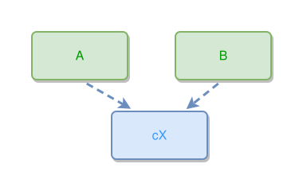

<!-- AUTO-GENERATED FILE - DO NOT EDIT -->
<!-- Generated by: gen-test-md -->
<!-- Command: go run ./cmd-dev/gen-test-md -->

# thing-to-concept-spacing

> **⚠️ Warning:** This file is auto-generated. Manual changes will be lost when tests are regenerated.

**Source:** gl:docs/dev/layout-gen/layout-alg.md#L2945-L2947 | [docs/dev/layout-gen/layout-alg.md](../../docs/dev/layout-gen/layout-alg.md#thing-to-concept-spacing)

## ipmt Content

```ipmt
A --> cX ::c
cX <-- B
```

## Generated Files

- [thing-to-concept-spacing.ipmt](thing-to-concept-spacing.ipmt) - ipmt input
- [thing-to-concept-spacing.json](thing-to-concept-spacing.json) - Parsed structure
- [thing-to-concept-spacing.layout.json](thing-to-concept-spacing.layout.json) - Layout coordinates
- [thing-to-concept-spacing.ipm.svg](thing-to-concept-spacing.ipm.svg) - Rendered diagram

## Layout Validation Rules

Test line: 2945

✅ All 8 rules passed

- ✓ [Line 53](gl:docs/dev/layout-gen/layout-alg.md#L53): `each edge has max-bends=0` ([edges-run-straight-by-default.dsl](../layout-gen-rules/edges-run-straight-by-default.dsl))
- ✓ [Line 2957](gl:docs/dev/layout-gen/layout-alg.md#L2957): `#cX is horizontally-centered-between #A,#B` ([thing-to-concept-spacing.dsl](../layout-gen-rules/thing-to-concept-spacing.dsl))
- ✓ [Line 2958](gl:docs/dev/layout-gen/layout-alg.md#L2958): `edge #A,#cX has target-side=top` ([thing-to-concept-spacing-02.dsl](../layout-gen-rules/thing-to-concept-spacing-02.dsl))
- ✓ [Line 2959](gl:docs/dev/layout-gen/layout-alg.md#L2959): `edge #A,#cX has target-position=0.25` ([thing-to-concept-spacing-03.dsl](../layout-gen-rules/thing-to-concept-spacing-03.dsl))
- ✓ [Line 2960](gl:docs/dev/layout-gen/layout-alg.md#L2960): `edge #B,#cX has target-side=top` ([thing-to-concept-spacing-04.dsl](../layout-gen-rules/thing-to-concept-spacing-04.dsl))
- ✓ [Line 2961](gl:docs/dev/layout-gen/layout-alg.md#L2961): `edge #B,#cX has target-position=0.75` ([thing-to-concept-spacing-05.dsl](../layout-gen-rules/thing-to-concept-spacing-05.dsl))
- ✓ [Line 2962](gl:docs/dev/layout-gen/layout-alg.md#L2962): `edge #A,#cX has max-bends=0` ([thing-to-concept-spacing-06.dsl](../layout-gen-rules/thing-to-concept-spacing-06.dsl))
- ✓ [Line 2963](gl:docs/dev/layout-gen/layout-alg.md#L2963): `edge #B,#cX has max-bends=0` ([thing-to-concept-spacing-07.dsl](../layout-gen-rules/thing-to-concept-spacing-07.dsl))

## Rendered Diagram



This test case was automatically generated from the specification document.

The ipmt code block was extracted using [sync-test-cases](../../docs/dev/testing.md) and saved to [thing-to-concept-spacing.ipmt](thing-to-concept-spacing.ipmt), then parsed into the [JSON structure](thing-to-concept-spacing.json) and laid out into [layout coordinates](thing-to-concept-spacing.layout.json). The [SVG diagram](thing-to-concept-spacing.ipm.svg) was rendered using [ipmsvg-gen](../../docs/ipmsvg-gen.md).
