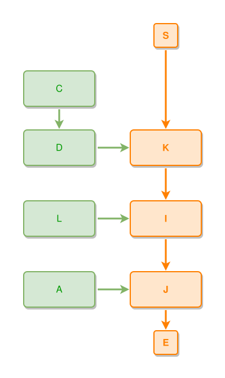

<!-- AUTO-GENERATED FILE - DO NOT EDIT -->
<!-- Generated by: gen-test-md -->
<!-- Command: go run ./cmd-dev/gen-test-md -->

# things-part-of-a-spine-stack-in-the-left-band

> **⚠️ Warning:** This file is auto-generated. Manual changes will be lost when tests are regenerated.

**Source:** gl:docs/dev/layout-gen/layout-alg.md#L2040-L2045 | [docs/dev/layout-gen/layout-alg.md](../../docs/dev/layout-gen/layout-alg.md#things-part-of-a-spine-stack-in-the-left-band)

## ipmt Content

```ipmt
A --> J ::e
I ::e --> J
K ::e --> I
C --> D --> K
L --::P--> I
```

## Generated Files

- [things-part-of-a-spine-stack-in-the-left-band.ipmt](things-part-of-a-spine-stack-in-the-left-band.ipmt) - ipmt input
- [things-part-of-a-spine-stack-in-the-left-band.json](things-part-of-a-spine-stack-in-the-left-band.json) - Parsed structure
- [things-part-of-a-spine-stack-in-the-left-band.layout.json](things-part-of-a-spine-stack-in-the-left-band.layout.json) - Layout coordinates
- [things-part-of-a-spine-stack-in-the-left-band.ipm.svg](things-part-of-a-spine-stack-in-the-left-band.ipm.svg) - Rendered diagram

## Layout Validation Rules

Test line: 2040

✅ All 1 rules passed

- ✓ [Line 53](gl:docs/dev/layout-gen/layout-alg.md#L53): `each edge has max-bends=0` ([edges-run-straight-by-default.dsl](../layout-gen-rules/edges-run-straight-by-default.dsl))

## Rendered Diagram



This test case was automatically generated from the specification document.

The ipmt code block was extracted using [sync-test-cases](../../docs/dev/testing.md) and saved to [things-part-of-a-spine-stack-in-the-left-band.ipmt](things-part-of-a-spine-stack-in-the-left-band.ipmt), then parsed into the [JSON structure](things-part-of-a-spine-stack-in-the-left-band.json) and laid out into [layout coordinates](things-part-of-a-spine-stack-in-the-left-band.layout.json). The [SVG diagram](things-part-of-a-spine-stack-in-the-left-band.ipm.svg) was rendered using [ipmsvg-gen](../../docs/ipmsvg-gen.md).
