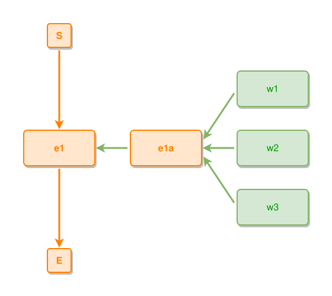

<!-- AUTO-GENERATED FILE - DO NOT EDIT -->
<!-- Generated by: gen-test-md -->
<!-- Command: go run ./cmd-dev/gen-test-md -->

# things-part-of-an-inner-event-stack-in-one-centred-column

> **⚠️ Warning:** This file is auto-generated. Manual changes will be lost when tests are regenerated.

**Source:** gl:docs/dev/layout-gen/layout-alg.md#L1954-L1957 | [docs/dev/layout-gen/layout-alg.md](../../docs/dev/layout-gen/layout-alg.md#things-part-of-an-inner-event-stack-in-one-centred-column)

## ipmt Content

```ipmt
e1 ::e
e1a ::e --::P--> e1
w1 ::t, w2 ::t, w3 ::t --> e1a
```

## Generated Files

- [things-part-of-an-inner-event-stack-in-one-centred-column.ipmt](things-part-of-an-inner-event-stack-in-one-centred-column.ipmt) - ipmt input
- [things-part-of-an-inner-event-stack-in-one-centred-column.json](things-part-of-an-inner-event-stack-in-one-centred-column.json) - Parsed structure
- [things-part-of-an-inner-event-stack-in-one-centred-column.layout.json](things-part-of-an-inner-event-stack-in-one-centred-column.layout.json) - Layout coordinates
- [things-part-of-an-inner-event-stack-in-one-centred-column.ipm.svg](things-part-of-an-inner-event-stack-in-one-centred-column.ipm.svg) - Rendered diagram

## Layout Validation Rules

Test line: 1954

✅ All 7 rules passed

- ✓ [Line 53](gl:docs/dev/layout-gen/layout-alg.md#L53): `each edge has max-bends=0` ([edges-run-straight-by-default.dsl](../layout-gen-rules/edges-run-straight-by-default.dsl))
- ✓ [Line 1974](gl:docs/dev/layout-gen/layout-alg.md#L1974): `#w1,#w2,#w3 have same center-x` ([things-part-of-an-inner-event-stack-in-one-centred-column.dsl](../layout-gen-rules/things-part-of-an-inner-event-stack-in-one-centred-column.dsl))
- ✓ [Line 1975](gl:docs/dev/layout-gen/layout-alg.md#L1975): `#w1 is right-of #e1a with gap=60` ([things-part-of-an-inner-event-stack-in-one-centred-column-02.dsl](../layout-gen-rules/things-part-of-an-inner-event-stack-in-one-centred-column-02.dsl))
- ✓ [Line 1976](gl:docs/dev/layout-gen/layout-alg.md#L1976): `#w2 is below #w1 with gap=40` ([things-part-of-an-inner-event-stack-in-one-centred-column-03.dsl](../layout-gen-rules/things-part-of-an-inner-event-stack-in-one-centred-column-03.dsl))
- ✓ [Line 1977](gl:docs/dev/layout-gen/layout-alg.md#L1977): `#w3 is below #w2 with gap=40` ([things-part-of-an-inner-event-stack-in-one-centred-column-04.dsl](../layout-gen-rules/things-part-of-an-inner-event-stack-in-one-centred-column-04.dsl))
- ✓ [Line 1978](gl:docs/dev/layout-gen/layout-alg.md#L1978): `#e1a is vertically-centered-between #w1,#w3` ([things-part-of-an-inner-event-stack-in-one-centred-column-05.dsl](../layout-gen-rules/things-part-of-an-inner-event-stack-in-one-centred-column-05.dsl))
- ✓ [Line 1979](gl:docs/dev/layout-gen/layout-alg.md#L1979): `#e1a,#w2 have same y` ([things-part-of-an-inner-event-stack-in-one-centred-column-06.dsl](../layout-gen-rules/things-part-of-an-inner-event-stack-in-one-centred-column-06.dsl))

## Rendered Diagram



This test case was automatically generated from the specification document.

The ipmt code block was extracted using [sync-test-cases](../../docs/dev/testing.md) and saved to [things-part-of-an-inner-event-stack-in-one-centred-column.ipmt](things-part-of-an-inner-event-stack-in-one-centred-column.ipmt), then parsed into the [JSON structure](things-part-of-an-inner-event-stack-in-one-centred-column.json) and laid out into [layout coordinates](things-part-of-an-inner-event-stack-in-one-centred-column.layout.json). The [SVG diagram](things-part-of-an-inner-event-stack-in-one-centred-column.ipm.svg) was rendered using [ipmsvg-gen](../../docs/ipmsvg-gen.md).
