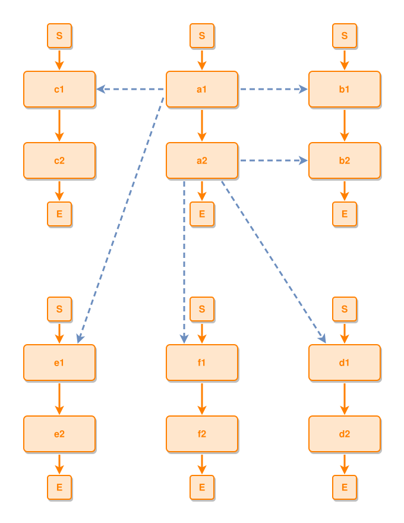

<!-- AUTO-GENERATED FILE - DO NOT EDIT -->
<!-- Generated by: gen-test-md -->
<!-- Command: go run ./cmd-dev/gen-test-md -->

# tied-components-ring-the-hub-on-every-side-onion

> **⚠️ Warning:** This file is auto-generated. Manual changes will be lost when tests are regenerated.

**Source:** gl:docs/dev/layout-gen/layout-alg.md#L2682-L2694 | [docs/dev/layout-gen/layout-alg.md](../../docs/dev/layout-gen/layout-alg.md#tied-components-ring-the-hub-on-every-side-onion)

## ipmt Content

```ipmt
a1 ::e --> a2 ::e
b1 ::e --> b2 ::e
c1 ::e --> c2 ::e
d1 ::e --> d2 ::e
e1 ::e --> e2 ::e
f1 ::e --> f2 ::e
a1 --::X--> b1
a2 --::X--> b2
a1 --::X--> c1
a2 --::X--> d1
a1 --::X--> e1
a2 --::X--> f1
```

## Generated Files

- [tied-components-ring-the-hub-on-every-side-onion.ipmt](tied-components-ring-the-hub-on-every-side-onion.ipmt) - ipmt input
- [tied-components-ring-the-hub-on-every-side-onion.json](tied-components-ring-the-hub-on-every-side-onion.json) - Parsed structure
- [tied-components-ring-the-hub-on-every-side-onion.layout.json](tied-components-ring-the-hub-on-every-side-onion.layout.json) - Layout coordinates
- [tied-components-ring-the-hub-on-every-side-onion.ipm.svg](tied-components-ring-the-hub-on-every-side-onion.ipm.svg) - Rendered diagram

## Layout Validation Rules

Test line: 2682

✅ All 20 rules passed

- ✓ [Line 53](gl:docs/dev/layout-gen/layout-alg.md#L53): `each edge has max-bends=0` ([edges-run-straight-by-default.dsl](../layout-gen-rules/edges-run-straight-by-default.dsl))
- ✓ [Line 2717](gl:docs/dev/layout-gen/layout-alg.md#L2717): `#c1,#a1,#b1 have same y` ([tied-components-ring-the-hub-on-every-side-onion.dsl](../layout-gen-rules/tied-components-ring-the-hub-on-every-side-onion.dsl))
- ✓ [Line 2718](gl:docs/dev/layout-gen/layout-alg.md#L2718): `#c1 is left-of #a1 with gap=120` ([tied-components-ring-the-hub-on-every-side-onion-02.dsl](../layout-gen-rules/tied-components-ring-the-hub-on-every-side-onion-02.dsl))
- ✓ [Line 2719](gl:docs/dev/layout-gen/layout-alg.md#L2719): `#a1 is left-of #b1 with gap=120` ([tied-components-ring-the-hub-on-every-side-onion-03.dsl](../layout-gen-rules/tied-components-ring-the-hub-on-every-side-onion-03.dsl))
- ✓ [Line 2720](gl:docs/dev/layout-gen/layout-alg.md#L2720): `#e1,#f1,#d1 have same y` ([tied-components-ring-the-hub-on-every-side-onion-04.dsl](../layout-gen-rules/tied-components-ring-the-hub-on-every-side-onion-04.dsl))
- ✓ [Line 2721](gl:docs/dev/layout-gen/layout-alg.md#L2721): `#e1 is left-of #f1 with gap=120` ([tied-components-ring-the-hub-on-every-side-onion-05.dsl](../layout-gen-rules/tied-components-ring-the-hub-on-every-side-onion-05.dsl))
- ✓ [Line 2722](gl:docs/dev/layout-gen/layout-alg.md#L2722): `#f1 is left-of #d1 with gap=120` ([tied-components-ring-the-hub-on-every-side-onion-06.dsl](../layout-gen-rules/tied-components-ring-the-hub-on-every-side-onion-06.dsl))
- ✓ [Line 2723](gl:docs/dev/layout-gen/layout-alg.md#L2723): `#a1,#a2,#f1,#f2 have same center-x` ([tied-components-ring-the-hub-on-every-side-onion-07.dsl](../layout-gen-rules/tied-components-ring-the-hub-on-every-side-onion-07.dsl))
- ✓ [Line 2724](gl:docs/dev/layout-gen/layout-alg.md#L2724): `#f1 is below #a2 with gap=280` ([tied-components-ring-the-hub-on-every-side-onion-08.dsl](../layout-gen-rules/tied-components-ring-the-hub-on-every-side-onion-08.dsl))
- ✓ [Line 2725](gl:docs/dev/layout-gen/layout-alg.md#L2725): `edge #a1,#b1 has max-bends=0` ([tied-components-ring-the-hub-on-every-side-onion-09.dsl](../layout-gen-rules/tied-components-ring-the-hub-on-every-side-onion-09.dsl))
- ✓ [Line 2726](gl:docs/dev/layout-gen/layout-alg.md#L2726): `edge #a1,#c1 has max-bends=0` ([tied-components-ring-the-hub-on-every-side-onion-10.dsl](../layout-gen-rules/tied-components-ring-the-hub-on-every-side-onion-10.dsl))
- ✓ [Line 2727](gl:docs/dev/layout-gen/layout-alg.md#L2727): `edge #a2,#d1 has max-bends=0` ([tied-components-ring-the-hub-on-every-side-onion-11.dsl](../layout-gen-rules/tied-components-ring-the-hub-on-every-side-onion-11.dsl))
- ✓ [Line 2728](gl:docs/dev/layout-gen/layout-alg.md#L2728): `edge #a2,#f1 has max-bends=0` ([tied-components-ring-the-hub-on-every-side-onion-12.dsl](../layout-gen-rules/tied-components-ring-the-hub-on-every-side-onion-12.dsl))
- ✓ [Line 2729](gl:docs/dev/layout-gen/layout-alg.md#L2729): `each edge has max-bends=0 except #a1,#e1` ([tied-components-ring-the-hub-on-every-side-onion-13.dsl](../layout-gen-rules/tied-components-ring-the-hub-on-every-side-onion-13.dsl))
- ✓ [Line 2730](gl:docs/dev/layout-gen/layout-alg.md#L2730): `edge #a1,#e1 has visibility=visible` ([tied-components-ring-the-hub-on-every-side-onion-14.dsl](../layout-gen-rules/tied-components-ring-the-hub-on-every-side-onion-14.dsl))
- ✓ [Line 2731](gl:docs/dev/layout-gen/layout-alg.md#L2731): `edge #a1,#e1 has max-bends=1` ([tied-components-ring-the-hub-on-every-side-onion-15.dsl](../layout-gen-rules/tied-components-ring-the-hub-on-every-side-onion-15.dsl))
- ✓ [Line 2732](gl:docs/dev/layout-gen/layout-alg.md#L2732): `edge #a1,#e1 has source-side=left` ([tied-components-ring-the-hub-on-every-side-onion-16.dsl](../layout-gen-rules/tied-components-ring-the-hub-on-every-side-onion-16.dsl))
- ✓ [Line 2733](gl:docs/dev/layout-gen/layout-alg.md#L2733): `edge #a1,#e1 has target-side=top` ([tied-components-ring-the-hub-on-every-side-onion-17.dsl](../layout-gen-rules/tied-components-ring-the-hub-on-every-side-onion-17.dsl))
- ✓ [Line 2734](gl:docs/dev/layout-gen/layout-alg.md#L2734): `edge #e1,#e2 is vertical` ([tied-components-ring-the-hub-on-every-side-onion-18.dsl](../layout-gen-rules/tied-components-ring-the-hub-on-every-side-onion-18.dsl))
- ✓ [Line 2735](gl:docs/dev/layout-gen/layout-alg.md#L2735): `edge #a1,#a2 is vertical` ([tied-components-ring-the-hub-on-every-side-onion-19.dsl](../layout-gen-rules/tied-components-ring-the-hub-on-every-side-onion-19.dsl))

## Rendered Diagram



This test case was automatically generated from the specification document.

The ipmt code block was extracted using [sync-test-cases](../../docs/dev/testing.md) and saved to [tied-components-ring-the-hub-on-every-side-onion.ipmt](tied-components-ring-the-hub-on-every-side-onion.ipmt), then parsed into the [JSON structure](tied-components-ring-the-hub-on-every-side-onion.json) and laid out into [layout coordinates](tied-components-ring-the-hub-on-every-side-onion.layout.json). The [SVG diagram](tied-components-ring-the-hub-on-every-side-onion.ipm.svg) was rendered using [ipmsvg-gen](../../docs/ipmsvg-gen.md).
