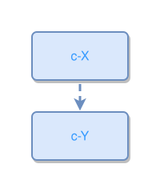

<!-- AUTO-GENERATED FILE - DO NOT EDIT -->
<!-- Generated by: gen-test-md -->
<!-- Command: go run ./cmd-dev/gen-test-md -->

# two-concepts-connected

> **⚠️ Warning:** This file is auto-generated. Manual changes will be lost when tests are regenerated.

**Source:** gl:docs/dev/layout-gen/layout-alg.md#L2007-L2008 | [docs/dev/layout-gen/layout-alg.md](../../docs/dev/layout-gen/layout-alg.md#two-concepts-connected)

## ipmt Content

```ipmt
c-X ::c --> c-Y ::c
```

## Generated Files

- [two-concepts-connected.ipmt](two-concepts-connected.ipmt) - ipmt input
- [two-concepts-connected.json](two-concepts-connected.json) - Parsed structure
- [two-concepts-connected.layout.json](two-concepts-connected.layout.json) - Layout coordinates
- [two-concepts-connected.ipm.svg](two-concepts-connected.ipm.svg) - Rendered diagram

## Layout Validation Rules

Test line: 2007

✅ All 3 rules passed

- ✓ [Line 53](gl:docs/dev/layout-gen/layout-alg.md#L53): `each edge has max-bends=0` ([edges-run-straight-by-default.dsl](../layout-gen-rules/edges-run-straight-by-default.dsl))
- ✓ [Line 2024](gl:docs/dev/layout-gen/layout-alg.md#L2024): `#c-Y is below #c-X with gap=40` ([two-concepts-connected.dsl](../layout-gen-rules/two-concepts-connected.dsl))
- ✓ [Line 2025](gl:docs/dev/layout-gen/layout-alg.md#L2025): `#c-X,#c-Y have same center-x` ([two-concepts-connected-02.dsl](../layout-gen-rules/two-concepts-connected-02.dsl))

## Rendered Diagram



This test case was automatically generated from the specification document.

The ipmt code block was extracted using [sync-test-cases](../../docs/dev/testing.md) and saved to [two-concepts-connected.ipmt](two-concepts-connected.ipmt), then parsed into the [JSON structure](two-concepts-connected.json) and laid out into [layout coordinates](two-concepts-connected.layout.json). The [SVG diagram](two-concepts-connected.ipm.svg) was rendered using [ipmsvg-gen](../../docs/ipmsvg-gen.md).
