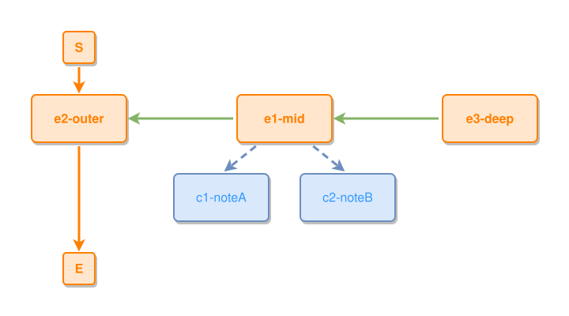

<!-- AUTO-GENERATED FILE - DO NOT EDIT -->
<!-- Generated by: gen-test-md -->
<!-- Command: go run ./cmd-dev/gen-test-md -->

# two-concepts-on-the-inner-layer

> **⚠️ Warning:** This file is auto-generated. Manual changes will be lost when tests are regenerated.

**Source:** gl:docs/dev/layout-gen/layout-alg.md#L1212-L1216 | [docs/dev/layout-gen/layout-alg.md](../../docs/dev/layout-gen/layout-alg.md#two-concepts-on-the-inner-layer)

## ipmt Content

```ipmt
e1-mid ::e --::P--> e2-outer ::e
e3-deep ::e --::P--> e1-mid
e1-mid --> c1-noteA ::c
e1-mid --> c2-noteB ::c
```

## Generated Files

- [two-concepts-on-the-inner-layer.ipmt](two-concepts-on-the-inner-layer.ipmt) - ipmt input
- [two-concepts-on-the-inner-layer.json](two-concepts-on-the-inner-layer.json) - Parsed structure
- [two-concepts-on-the-inner-layer.layout.json](two-concepts-on-the-inner-layer.layout.json) - Layout coordinates
- [two-concepts-on-the-inner-layer.ipm.svg](two-concepts-on-the-inner-layer.ipm.svg) - Rendered diagram

## Layout Validation Rules

Test line: 1212

✅ All 8 rules passed

- ✓ [Line 53](gl:docs/dev/layout-gen/layout-alg.md#L53): `each edge has max-bends=0` ([edges-run-straight-by-default.dsl](../layout-gen-rules/edges-run-straight-by-default.dsl))
- ✓ [Line 1229](gl:docs/dev/layout-gen/layout-alg.md#L1229): `each edge has max-bends=0` ([two-concepts-on-the-inner-layer.dsl](../layout-gen-rules/two-concepts-on-the-inner-layer.dsl))
- ✓ [Line 1230](gl:docs/dev/layout-gen/layout-alg.md#L1230): `#e2-outer,#e1-mid,#e3-deep have same y` ([two-concepts-on-the-inner-layer-02.dsl](../layout-gen-rules/two-concepts-on-the-inner-layer-02.dsl))
- ✓ [Line 1231](gl:docs/dev/layout-gen/layout-alg.md#L1231): `#e3-deep is right-of #c2-noteB with gap=60` ([two-concepts-on-the-inner-layer-03.dsl](../layout-gen-rules/two-concepts-on-the-inner-layer-03.dsl))
- ✓ [Line 1232](gl:docs/dev/layout-gen/layout-alg.md#L1232): `#c1-noteA,#c2-noteB have same y` ([two-concepts-on-the-inner-layer-04.dsl](../layout-gen-rules/two-concepts-on-the-inner-layer-04.dsl))
- ✓ [Line 1233](gl:docs/dev/layout-gen/layout-alg.md#L1233): `#c1-noteA is below #e1-mid with gap=40` ([two-concepts-on-the-inner-layer-05.dsl](../layout-gen-rules/two-concepts-on-the-inner-layer-05.dsl))
- ✓ [Line 1234](gl:docs/dev/layout-gen/layout-alg.md#L1234): `#c1-noteA is left-of #c2-noteB with gap=40` ([two-concepts-on-the-inner-layer-06.dsl](../layout-gen-rules/two-concepts-on-the-inner-layer-06.dsl))
- ✓ [Line 1235](gl:docs/dev/layout-gen/layout-alg.md#L1235): `#e1-mid is horizontally-centered-between #c1-noteA,#c2-noteB` ([two-concepts-on-the-inner-layer-07.dsl](../layout-gen-rules/two-concepts-on-the-inner-layer-07.dsl))

## Rendered Diagram



This test case was automatically generated from the specification document.

The ipmt code block was extracted using [sync-test-cases](../../docs/dev/testing.md) and saved to [two-concepts-on-the-inner-layer.ipmt](two-concepts-on-the-inner-layer.ipmt), then parsed into the [JSON structure](two-concepts-on-the-inner-layer.json) and laid out into [layout coordinates](two-concepts-on-the-inner-layer.layout.json). The [SVG diagram](two-concepts-on-the-inner-layer.ipm.svg) was rendered using [ipmsvg-gen](../../docs/ipmsvg-gen.md).
