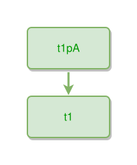

<!-- AUTO-GENERATED FILE - DO NOT EDIT -->
<!-- Generated by: gen-test-md -->
<!-- Command: go run ./cmd-dev/gen-test-md -->

# two-things-connected

> **⚠️ Warning:** This file is auto-generated. Manual changes will be lost when tests are regenerated.

**Source:** gl:docs/dev/layout-gen/layout-alg.md#L1478-L1479 | [docs/dev/layout-gen/layout-alg.md](../../docs/dev/layout-gen/layout-alg.md#two-things-connected)

## ipmt Content

```ipmt
t1pA --> t1
```

## Generated Files

- [two-things-connected.ipmt](two-things-connected.ipmt) - ipmt input
- [two-things-connected.json](two-things-connected.json) - Parsed structure
- [two-things-connected.layout.json](two-things-connected.layout.json) - Layout coordinates
- [two-things-connected.ipm.svg](two-things-connected.ipm.svg) - Rendered diagram

## Layout Validation Rules

Test line: 1478

✅ All 3 rules passed

- ✓ [Line 53](gl:docs/dev/layout-gen/layout-alg.md#L53): `each edge has max-bends=0` ([edges-run-straight-by-default.dsl](../layout-gen-rules/edges-run-straight-by-default.dsl))
- ✓ [Line 1494](gl:docs/dev/layout-gen/layout-alg.md#L1494): `#t1pA is above #t1 with gap=40` ([two-things-connected.dsl](../layout-gen-rules/two-things-connected.dsl))
- ✓ [Line 1495](gl:docs/dev/layout-gen/layout-alg.md#L1495): `#t1pA,#t1 have same center-x` ([two-things-connected-02.dsl](../layout-gen-rules/two-things-connected-02.dsl))

## Rendered Diagram



This test case was automatically generated from the specification document.

The ipmt code block was extracted using [sync-test-cases](../../docs/dev/testing.md) and saved to [two-things-connected.ipmt](two-things-connected.ipmt), then parsed into the [JSON structure](two-things-connected.json) and laid out into [layout coordinates](two-things-connected.layout.json). The [SVG diagram](two-things-connected.ipm.svg) was rendered using [ipmsvg-gen](../../docs/ipmsvg-gen.md).
