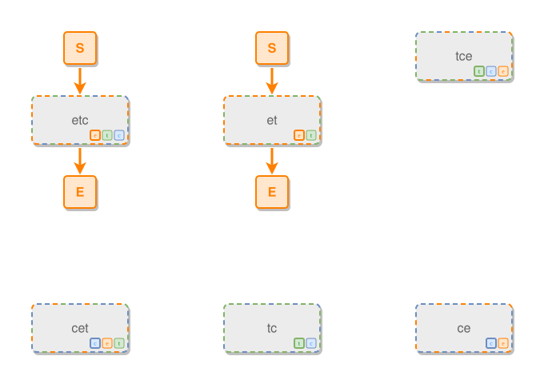

<!-- AUTO-GENERATED FILE - DO NOT EDIT -->
<!-- Generated by: gen-test-md -->
<!-- Command: go run ./cmd-dev/gen-test-md -->

# undecided-borders-weight-the-primary-candidate

> **⚠️ Warning:** This file is auto-generated. Manual changes will be lost when tests are regenerated.

**Source:** gl:docs/dev/layout-gen/layout-alg.md#L2787-L2793 | [docs/dev/layout-gen/layout-alg.md](../../docs/dev/layout-gen/layout-alg.md#undecided-borders-weight-the-primary-candidate)

## ipmt Content

```ipmt
etc ::?etc
tce ::?tce
cet ::?cet
et ::?et
tc ::?tc
ce ::?ce
```

## Generated Files

- [undecided-borders-weight-the-primary-candidate.ipmt](undecided-borders-weight-the-primary-candidate.ipmt) - ipmt input
- [undecided-borders-weight-the-primary-candidate.json](undecided-borders-weight-the-primary-candidate.json) - Parsed structure
- [undecided-borders-weight-the-primary-candidate.layout.json](undecided-borders-weight-the-primary-candidate.layout.json) - Layout coordinates
- [undecided-borders-weight-the-primary-candidate.ipm.svg](undecided-borders-weight-the-primary-candidate.ipm.svg) - Rendered diagram

## Layout Validation Rules

Test line: 2787

✅ All 1 rules passed

- ✓ [Line 53](gl:docs/dev/layout-gen/layout-alg.md#L53): `each edge has max-bends=0` ([edges-run-straight-by-default.dsl](../layout-gen-rules/edges-run-straight-by-default.dsl))

## Rendered Diagram



This test case was automatically generated from the specification document.

The ipmt code block was extracted using [sync-test-cases](../../docs/dev/testing.md) and saved to [undecided-borders-weight-the-primary-candidate.ipmt](undecided-borders-weight-the-primary-candidate.ipmt), then parsed into the [JSON structure](undecided-borders-weight-the-primary-candidate.json) and laid out into [layout coordinates](undecided-borders-weight-the-primary-candidate.layout.json). The [SVG diagram](undecided-borders-weight-the-primary-candidate.ipm.svg) was rendered using [ipmsvg-gen](../../docs/ipmsvg-gen.md).
