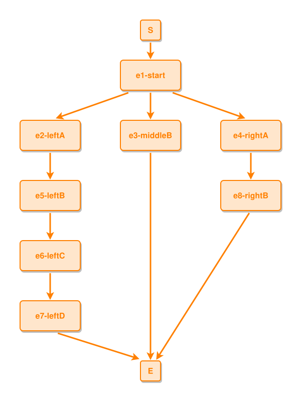

<!-- AUTO-GENERATED FILE - DO NOT EDIT -->
<!-- Generated by: gen-test-md -->
<!-- Command: go run ./cmd-dev/gen-test-md -->

# uneven-sibling-branches-keep-their-vertical-lanes

> **⚠️ Warning:** This file is auto-generated. Manual changes will be lost when tests are regenerated.

**Source:** gl:docs/dev/layout-gen/layout-alg.md#L501-L506 | [docs/dev/layout-gen/layout-alg.md](../../docs/dev/layout-gen/layout-alg.md#uneven-sibling-branches-keep-their-vertical-lanes)

## ipmt Content

```ipmt
e1-start ::e --> e2-leftA ::e
e1-start --> e3-middleB ::e
e1-start --> e4-rightA ::e
e2-leftA --> e5-leftB ::e --> e6-leftC ::e --> e7-leftD ::e
e4-rightA --> e8-rightB ::e
```

## Generated Files

- [uneven-sibling-branches-keep-their-vertical-lanes.ipmt](uneven-sibling-branches-keep-their-vertical-lanes.ipmt) - ipmt input
- [uneven-sibling-branches-keep-their-vertical-lanes.json](uneven-sibling-branches-keep-their-vertical-lanes.json) - Parsed structure
- [uneven-sibling-branches-keep-their-vertical-lanes.layout.json](uneven-sibling-branches-keep-their-vertical-lanes.layout.json) - Layout coordinates
- [uneven-sibling-branches-keep-their-vertical-lanes.ipm.svg](uneven-sibling-branches-keep-their-vertical-lanes.ipm.svg) - Rendered diagram

## Layout Validation Rules

Test line: 501

✅ All 10 rules passed

- ✓ [Line 53](gl:docs/dev/layout-gen/layout-alg.md#L53): `each edge has max-bends=0` ([edges-run-straight-by-default.dsl](../layout-gen-rules/edges-run-straight-by-default.dsl))
- ✓ [Line 82](gl:docs/dev/layout-gen/layout-alg.md#L82): `type=event has width=120` ([one-event.dsl](../layout-gen-rules/one-event.dsl))
- ✓ [Line 83](gl:docs/dev/layout-gen/layout-alg.md#L83): `type=event has min-gap-to-others>=10` ([one-event-02.dsl](../layout-gen-rules/one-event-02.dsl))
- ✓ [Line 84](gl:docs/dev/layout-gen/layout-alg.md#L84): `type=boundary has size=40x40` ([one-event-03.dsl](../layout-gen-rules/one-event-03.dsl))
- ✓ [Line 528](gl:docs/dev/layout-gen/layout-alg.md#L528): `#S,#e1-start,#e3-middleB have same center-x` ([uneven-sibling-branches-keep-their-vertical-lanes.dsl](../layout-gen-rules/uneven-sibling-branches-keep-their-vertical-lanes.dsl))
- ✓ [Line 529](gl:docs/dev/layout-gen/layout-alg.md#L529): `#e2-leftA,#e5-leftB,#e6-leftC,#e7-leftD have same center-x` ([uneven-sibling-branches-keep-their-vertical-lanes-02.dsl](../layout-gen-rules/uneven-sibling-branches-keep-their-vertical-lanes-02.dsl))
- ✓ [Line 530](gl:docs/dev/layout-gen/layout-alg.md#L530): `#e4-rightA,#e8-rightB have same center-x` ([uneven-sibling-branches-keep-their-vertical-lanes-03.dsl](../layout-gen-rules/uneven-sibling-branches-keep-their-vertical-lanes-03.dsl))
- ✓ [Line 531](gl:docs/dev/layout-gen/layout-alg.md#L531): `#e2-leftA,#e3-middleB,#e4-rightA have same y` ([uneven-sibling-branches-keep-their-vertical-lanes-04.dsl](../layout-gen-rules/uneven-sibling-branches-keep-their-vertical-lanes-04.dsl))
- ✓ [Line 532](gl:docs/dev/layout-gen/layout-alg.md#L532): `#e2-leftA is left-of #e3-middleB with gap=80` ([uneven-sibling-branches-keep-their-vertical-lanes-05.dsl](../layout-gen-rules/uneven-sibling-branches-keep-their-vertical-lanes-05.dsl))
- ✓ [Line 533](gl:docs/dev/layout-gen/layout-alg.md#L533): `#e3-middleB is left-of #e4-rightA with gap=80` ([uneven-sibling-branches-keep-their-vertical-lanes-06.dsl](../layout-gen-rules/uneven-sibling-branches-keep-their-vertical-lanes-06.dsl))

## Rendered Diagram



This test case was automatically generated from the specification document.

The ipmt code block was extracted using [sync-test-cases](../../docs/dev/testing.md) and saved to [uneven-sibling-branches-keep-their-vertical-lanes.ipmt](uneven-sibling-branches-keep-their-vertical-lanes.ipmt), then parsed into the [JSON structure](uneven-sibling-branches-keep-their-vertical-lanes.json) and laid out into [layout coordinates](uneven-sibling-branches-keep-their-vertical-lanes.layout.json). The [SVG diagram](uneven-sibling-branches-keep-their-vertical-lanes.ipm.svg) was rendered using [ipmsvg-gen](../../docs/ipmsvg-gen.md).
