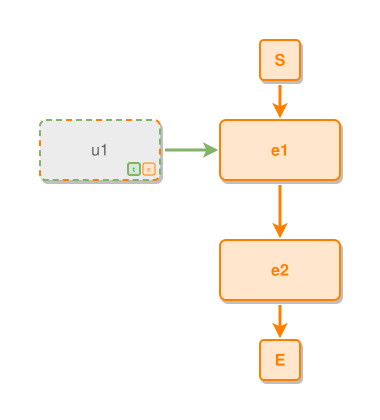

<!-- AUTO-GENERATED FILE - DO NOT EDIT -->
<!-- Generated by: gen-test-md -->
<!-- Command: go run ./cmd-dev/gen-test-md -->

# unresolved-node-lays-out-as-its-primary-candidate

> **⚠️ Warning:** This file is auto-generated. Manual changes will be lost when tests are regenerated.

**Source:** gl:docs/dev/layout-gen/layout-alg.md#L2765-L2767 | [docs/dev/layout-gen/layout-alg.md](../../docs/dev/layout-gen/layout-alg.md#unresolved-node-lays-out-as-its-primary-candidate)

## ipmt Content

```ipmt
e1 ::e --> e2 ::e
u1 ::?te --> e1
```

## Generated Files

- [unresolved-node-lays-out-as-its-primary-candidate.ipmt](unresolved-node-lays-out-as-its-primary-candidate.ipmt) - ipmt input
- [unresolved-node-lays-out-as-its-primary-candidate.json](unresolved-node-lays-out-as-its-primary-candidate.json) - Parsed structure
- [unresolved-node-lays-out-as-its-primary-candidate.layout.json](unresolved-node-lays-out-as-its-primary-candidate.layout.json) - Layout coordinates
- [unresolved-node-lays-out-as-its-primary-candidate.ipm.svg](unresolved-node-lays-out-as-its-primary-candidate.ipm.svg) - Rendered diagram

## Layout Validation Rules

Test line: 2765

✅ All 4 rules passed

- ✓ [Line 53](gl:docs/dev/layout-gen/layout-alg.md#L53): `each edge has max-bends=0` ([edges-run-straight-by-default.dsl](../layout-gen-rules/edges-run-straight-by-default.dsl))
- ✓ [Line 2779](gl:docs/dev/layout-gen/layout-alg.md#L2779): `type=unresolved has size=120x60` ([unresolved-node-lays-out-as-its-primary-candidate.dsl](../layout-gen-rules/unresolved-node-lays-out-as-its-primary-candidate.dsl))
- ✓ [Line 2780](gl:docs/dev/layout-gen/layout-alg.md#L2780): `#u1 is left-of #e1 with gap=60` ([unresolved-node-lays-out-as-its-primary-candidate-02.dsl](../layout-gen-rules/unresolved-node-lays-out-as-its-primary-candidate-02.dsl))
- ✓ [Line 2781](gl:docs/dev/layout-gen/layout-alg.md#L2781): `#e1,#u1 have same y` ([unresolved-node-lays-out-as-its-primary-candidate-03.dsl](../layout-gen-rules/unresolved-node-lays-out-as-its-primary-candidate-03.dsl))

## Rendered Diagram



This test case was automatically generated from the specification document.

The ipmt code block was extracted using [sync-test-cases](../../docs/dev/testing.md) and saved to [unresolved-node-lays-out-as-its-primary-candidate.ipmt](unresolved-node-lays-out-as-its-primary-candidate.ipmt), then parsed into the [JSON structure](unresolved-node-lays-out-as-its-primary-candidate.json) and laid out into [layout coordinates](unresolved-node-lays-out-as-its-primary-candidate.layout.json). The [SVG diagram](unresolved-node-lays-out-as-its-primary-candidate.ipm.svg) was rendered using [ipmsvg-gen](../../docs/ipmsvg-gen.md).
