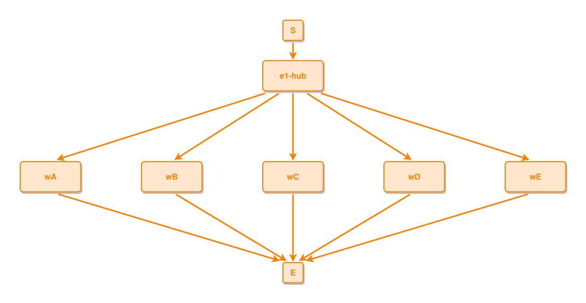

<!-- AUTO-GENERATED FILE - DO NOT EDIT -->
<!-- Generated by: gen-test-md -->
<!-- Command: go run ./cmd-dev/gen-test-md -->

# wide-fork-keeps-readable-edge-slopes

> **⚠️ Warning:** This file is auto-generated. Manual changes will be lost when tests are regenerated.

**Source:** gl:docs/dev/layout-gen/layout-alg.md#L243-L248 | [docs/dev/layout-gen/layout-alg.md](../../docs/dev/layout-gen/layout-alg.md#wide-fork-keeps-readable-edge-slopes)

## ipmt Content

```ipmt
e1-hub ::e --> wA ::e
e1-hub --> wB ::e
e1-hub --> wC ::e
e1-hub --> wD ::e
e1-hub --> wE ::e
```

## Generated Files

- [wide-fork-keeps-readable-edge-slopes.ipmt](wide-fork-keeps-readable-edge-slopes.ipmt) - ipmt input
- [wide-fork-keeps-readable-edge-slopes.json](wide-fork-keeps-readable-edge-slopes.json) - Parsed structure
- [wide-fork-keeps-readable-edge-slopes.layout.json](wide-fork-keeps-readable-edge-slopes.layout.json) - Layout coordinates
- [wide-fork-keeps-readable-edge-slopes.ipm.svg](wide-fork-keeps-readable-edge-slopes.ipm.svg) - Rendered diagram

## Layout Validation Rules

Test line: 243

✅ All 7 rules passed

- ✓ [Line 53](gl:docs/dev/layout-gen/layout-alg.md#L53): `each edge has max-bends=0` ([edges-run-straight-by-default.dsl](../layout-gen-rules/edges-run-straight-by-default.dsl))
- ✓ [Line 82](gl:docs/dev/layout-gen/layout-alg.md#L82): `type=event has width=120` ([one-event.dsl](../layout-gen-rules/one-event.dsl))
- ✓ [Line 83](gl:docs/dev/layout-gen/layout-alg.md#L83): `type=event has min-gap-to-others>=10` ([one-event-02.dsl](../layout-gen-rules/one-event-02.dsl))
- ✓ [Line 84](gl:docs/dev/layout-gen/layout-alg.md#L84): `type=boundary has size=40x40` ([one-event-03.dsl](../layout-gen-rules/one-event-03.dsl))
- ✓ [Line 263](gl:docs/dev/layout-gen/layout-alg.md#L263): `#wA,#wB,#wC,#wD,#wE have same y` ([wide-fork-keeps-readable-edge-slopes.dsl](../layout-gen-rules/wide-fork-keeps-readable-edge-slopes.dsl))
- ✓ [Line 264](gl:docs/dev/layout-gen/layout-alg.md#L264): `edge #e1-hub,#wA has min-slope=0.25` ([wide-fork-keeps-readable-edge-slopes-02.dsl](../layout-gen-rules/wide-fork-keeps-readable-edge-slopes-02.dsl))
- ✓ [Line 265](gl:docs/dev/layout-gen/layout-alg.md#L265): `edge #e1-hub,#wE has min-slope=0.25` ([wide-fork-keeps-readable-edge-slopes-03.dsl](../layout-gen-rules/wide-fork-keeps-readable-edge-slopes-03.dsl))

## Rendered Diagram



This test case was automatically generated from the specification document.

The ipmt code block was extracted using [sync-test-cases](../../docs/dev/testing.md) and saved to [wide-fork-keeps-readable-edge-slopes.ipmt](wide-fork-keeps-readable-edge-slopes.ipmt), then parsed into the [JSON structure](wide-fork-keeps-readable-edge-slopes.json) and laid out into [layout coordinates](wide-fork-keeps-readable-edge-slopes.layout.json). The [SVG diagram](wide-fork-keeps-readable-edge-slopes.ipm.svg) was rendered using [ipmsvg-gen](../../docs/ipmsvg-gen.md).
