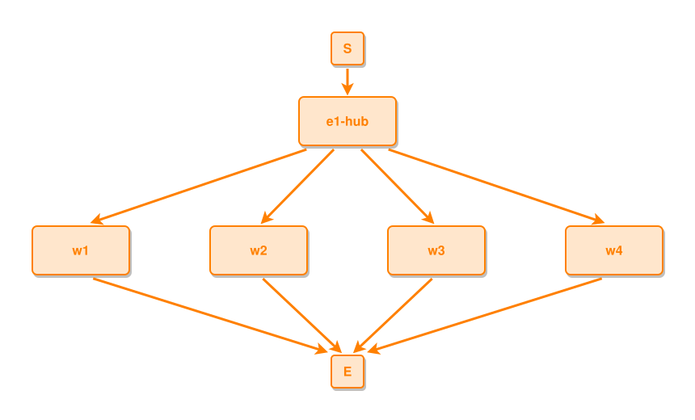

<!-- AUTO-GENERATED FILE - DO NOT EDIT -->
<!-- Generated by: gen-test-md -->
<!-- Command: go run ./cmd-dev/gen-test-md -->

# wide-forks-breathe-sibling-gaps-grow-with-the-fan

> **⚠️ Warning:** This file is auto-generated. Manual changes will be lost when tests are regenerated.

**Source:** gl:docs/dev/layout-gen/layout-alg.md#L2454-L2455 | [docs/dev/layout-gen/layout-alg.md](../../docs/dev/layout-gen/layout-alg.md#wide-forks-breathe-sibling-gaps-grow-with-the-fan)

## ipmt Content

```ipmt
e1-hub ::e --> w1 ::e, w2 ::e, w3 ::e, w4 ::e
```

## Generated Files

- [wide-forks-breathe-sibling-gaps-grow-with-the-fan.ipmt](wide-forks-breathe-sibling-gaps-grow-with-the-fan.ipmt) - ipmt input
- [wide-forks-breathe-sibling-gaps-grow-with-the-fan.json](wide-forks-breathe-sibling-gaps-grow-with-the-fan.json) - Parsed structure
- [wide-forks-breathe-sibling-gaps-grow-with-the-fan.layout.json](wide-forks-breathe-sibling-gaps-grow-with-the-fan.layout.json) - Layout coordinates
- [wide-forks-breathe-sibling-gaps-grow-with-the-fan.ipm.svg](wide-forks-breathe-sibling-gaps-grow-with-the-fan.ipm.svg) - Rendered diagram

## Layout Validation Rules

Test line: 2454

✅ All 6 rules passed

- ✓ [Line 53](gl:docs/dev/layout-gen/layout-alg.md#L53): `each edge has max-bends=0` ([edges-run-straight-by-default.dsl](../layout-gen-rules/edges-run-straight-by-default.dsl))
- ✓ [Line 2468](gl:docs/dev/layout-gen/layout-alg.md#L2468): `#w1,#w2,#w3,#w4 have same y` ([wide-forks-breathe-sibling-gaps-grow-with-the-fan.dsl](../layout-gen-rules/wide-forks-breathe-sibling-gaps-grow-with-the-fan.dsl))
- ✓ [Line 2469](gl:docs/dev/layout-gen/layout-alg.md#L2469): `#w2 is right-of #w1 with gap=100` ([wide-forks-breathe-sibling-gaps-grow-with-the-fan-02.dsl](../layout-gen-rules/wide-forks-breathe-sibling-gaps-grow-with-the-fan-02.dsl))
- ✓ [Line 2470](gl:docs/dev/layout-gen/layout-alg.md#L2470): `#w3 is right-of #w2 with gap=100` ([wide-forks-breathe-sibling-gaps-grow-with-the-fan-03.dsl](../layout-gen-rules/wide-forks-breathe-sibling-gaps-grow-with-the-fan-03.dsl))
- ✓ [Line 2471](gl:docs/dev/layout-gen/layout-alg.md#L2471): `#w4 is right-of #w3 with gap=100` ([wide-forks-breathe-sibling-gaps-grow-with-the-fan-04.dsl](../layout-gen-rules/wide-forks-breathe-sibling-gaps-grow-with-the-fan-04.dsl))
- ✓ [Line 2472](gl:docs/dev/layout-gen/layout-alg.md#L2472): `#e1-hub is horizontally-centered-between #w1,#w4` ([wide-forks-breathe-sibling-gaps-grow-with-the-fan-05.dsl](../layout-gen-rules/wide-forks-breathe-sibling-gaps-grow-with-the-fan-05.dsl))

## Rendered Diagram



This test case was automatically generated from the specification document.

The ipmt code block was extracted using [sync-test-cases](../../docs/dev/testing.md) and saved to [wide-forks-breathe-sibling-gaps-grow-with-the-fan.ipmt](wide-forks-breathe-sibling-gaps-grow-with-the-fan.ipmt), then parsed into the [JSON structure](wide-forks-breathe-sibling-gaps-grow-with-the-fan.json) and laid out into [layout coordinates](wide-forks-breathe-sibling-gaps-grow-with-the-fan.layout.json). The [SVG diagram](wide-forks-breathe-sibling-gaps-grow-with-the-fan.ipm.svg) was rendered using [ipmsvg-gen](../../docs/ipmsvg-gen.md).
